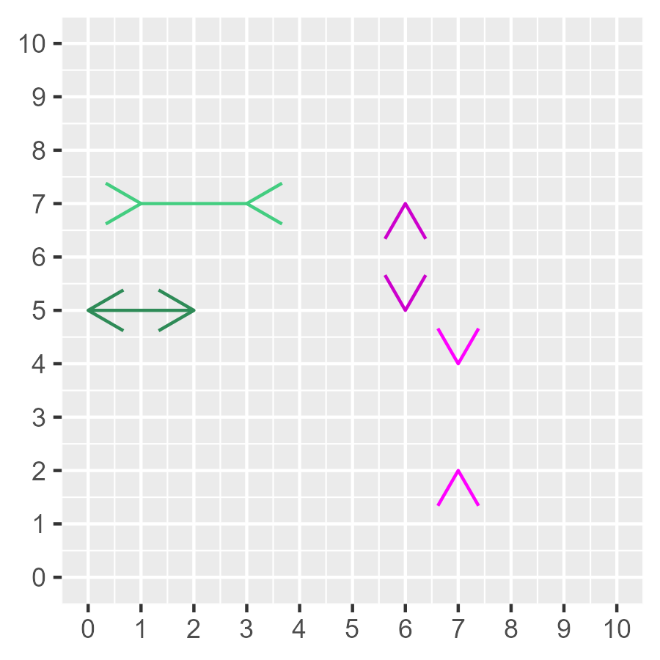

# Varför räkna? {#k1-1-4}

### Begrepp
*Inga begrepp i detta avsnitt.*
### Teori
Matematiken är ingen garanti för att våra resonemang om världen blir bättre. Men matematiken ger oss en möjlighet att förbättra våra resonemang på ett sätt som är omöjligt utan. Detta avsnitt går kort igenom några argument för varför avsaknaden av matematik riskerar att leda tanken fel.
### Vi ljuger för både oss själv och andra
Människor ser mönster i allt möjligt. Detta är centralt för vår överlevnad men leder ofta till felaktiga slutsatser. Till exempel finns det gott om historier om framgång och förutsägelser: "Här är 10 saker framgångsrika människor gör före frukost" och "Därför kommer politiker A vinna nästa val".
En stor mängd sådan litteratur bärs framåt av ett magiskt tänkande. Vi kan alla ha glädje av berättelser men många människor gör samma sak som framgångsrika kändisar utan liknande resultat. Många tvärsäkra uttalanden om politik och framtiden är rena fantasier.
Ett annat exempel på vilseledande slutsatser är sådana vi ofta ser i olika typer av diagram. Diagram är ett utmärkt sätt att illustrera information och skapa en översiktlig bild. Men diagram kan också ofta vilseleda oss. Företag använder diagram för att övertyga oss att köpa just deras produkter. Politiker och politiska aktivister vill visa att de har rätt.
Många gånger lurar vi oss själva med diagram. Ett sätt att illustrera hur lätt det blir fel ges i figur 1. I figuren syns åtta pilspetsar med fyra avstånd mellan varje par. Många människor uppfattar det som att avstånden mellan pilspetsarna skiljer sig. Men detta är felaktigt. Alla fyra avstånden mellan respektive par är lika långa.
I detta exempel kan du kontrollera avstånden mellan pilspetsarna genom att räkna antal rutor. Men många illustrationer av information kan innehålla mycket krångligare synvillor som är svårare att upptäcka. Ännu större risker för missförstånd uppstår när vi försöker studera stora mönster på samhällsnivå. Synvillan i figuren kallas för Müller-Lyer-illusionen, efter en tysk sociolog som forskade på fenomenet i slutet av 1800-talet.
Matematiken kan här hjälpa oss att göra det svårare för oss att ljuga för oss själva och andra. Genom att räkna mer noga på mönster och variationer i information har vi möjlighet att undvika missförstånd och risken för felaktiga slutsatser minskar.
**Figur 1. Vilka avstånd är lika långa?**
{style="width:3in;height:3in"}

::: {.fig-caption}
Förklaring: Bilden föreställer fyra pilspetsar. I varje par är avståndet mellan spetsarna lika långt. Men många människor uppfattar att avstånden skiljer sig. Exemplet ger ett enkelt exempel på att det är lätt att luras med information och diagram.
:::

### Två dimensioner är för lite
Diagrammet i figur 1 har två dimensioner: höjd och bredd. En kub har tre dimensioner: höjd, bredd och djup. I bilder är det ofta svårt att illustrera fler än två dimensioner. Men verkligheten är full av samband som är mer komplexa än vad som går att visa i diagram.
I våra egna liv kan vi hitta många exempel som är resultatet av tre eller fler faktorer. Men detta går sällan att illustrera enkelt och tydligt i bilder eller diagram. I dessa fall kan enkla illustrationer bli vilseledande.
Trots att det är svårt att i bilder illustrera komplexa samband är det relativt enkelt att resonera och räkna på mer komplexa samband med matematik.
I senare kapitel går vi igenom för- och nackdelarna med diagram och hur vi med hjälp av matematik kan jämföra relationer mellan flera fenomen samtidigt.
### Vetenskapen behövs
I samhällsvetenskap arbetar vi ofta med frågor nära ideologi, moral och värderingar. Det är ibland svårt för analytiker att hålla isär vad vi vet om världen och vad vi önskar att vi visste. Ibland kan det verka omöjligt att nå ut med ny kunskap när alla verkar redan ha bestämt sig för vad de tror om världen.
Det kan då vara lätt att misströsta användningen av mer tekniskt avancerade metoder. Men underskatta inte alla de förslag som hade fått större utrymme men som vi idag kan kväsa vid ritbordet med hjälp av analys. Sett till de mänskliga samhällenas historia är stora delar av den moderna samhällsvetenskapen ung. Håll ut!

::: {.ex-section-title}
Övningar
:::

