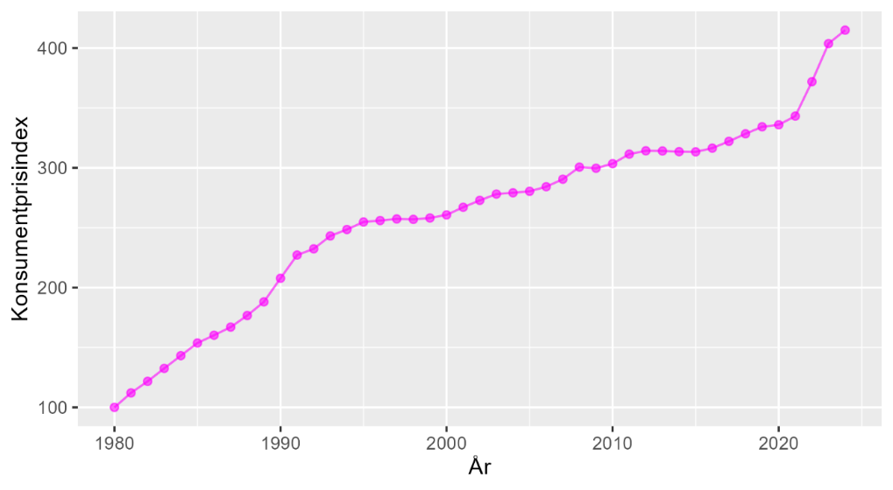
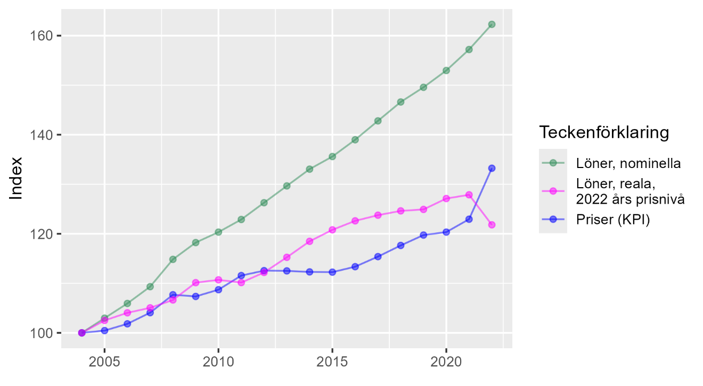

# Nominella och reala priser {#k1-2-2}

### Begrepp
- **Indexera:** Skapa ett index av en samling värden.
- **Befolkningsindex:** Index som beskriver antal invånare i ett land eller ett område.
- **Prisindex:** Index som beskriver utvecklingen av ett eller flera priser. Ett känt exempel är det konsumentprisindex (KPI) som SCB beräknar. KPI visar den genomsnittliga prisutvecklingen för en stor mängd varor och tjänster.
- **Nominellt pris:** Pris för en vara eller tjänst, som vi är vana att se priser.
- **Realt pris:** Pris justerat för den genomsnittliga prisutvecklingen för andra varor och tjänster i samhället. Realt pris är justerat för förändringar i pengars värde.
- **Reallön:** Lön justerad för prisutvecklingen i samhället.

### Teori
Ett [index](https://www.matteboken.se/lektioner/matte-1/statistik-och-sannolikhet/index#!/) används ofta för att jämföra den relativa utvecklingen av olika fenomen över tid. Säg att vi har data med ett värde per år. För att beräkna ett index väljer vi ett basår att jämföra mot. Därefter dividerar vi värdet för respektive år med värdet för basåret, och multiplicerar med 100:

$$Index_{t} = \frac{Värde_{t}}{Värde_{basår}}*100$$

där $Index_{t}$ är indexvärdet för valfritt år *t*. Multiplikation med 100 är valfritt men används ofta.
Tabell 1 visar ett exempel där vi jämför befolkningsmängden i Sverige och Frankrike mellan 1960 och 2020. Sveriges befolkning ökade under perioden från 7,49 miljoner invånare till 10,37 miljoner. Frankrikes befolkning ökade från 45,66 miljoner till 64,48.
I kolumnerna till höger ser vi resultatet i form av ett befolkningsindex per land. Den relativa ökningen var större i Frankrike, vilket vi kan se genom att jämföra index. Sveriges befolkning ökad med 38,4 procent medan Frankrikes ökade med 41,2 procent under samma period.

**Tabell 1: Befolkning och befolkningsindex i Sverige och Frankrike**

<table style="width:75%;">
<colgroup>
<col style="width: 14%" />
<col style="width: 13%" />
<col style="width: 16%" />
<col style="width: 13%" />
<col style="width: 16%" />
</colgroup>
<tbody>
<tr>
<td></td>
<td colspan="2" style="text-align: center;"><strong>Befolkning, 
miljoner invånare</strong></td>
<td colspan="2"
style="text-align: center;"><strong>Befolkningsindex, 
index 100 = år 1960</strong></td>
</tr>
<tr>
<td style="text-align: center;"><strong>År</strong></td>
<td style="text-align: center;"><strong>Sverige</strong></td>
<td style="text-align: center;"><strong>Frankrike</strong></td>
<td style="text-align: center;"><strong>Sverige</strong></td>
<td style="text-align: center;"><strong>Frankrike</strong></td>
</tr>
<tr>
<td style="text-align: right;"><strong>1960</strong></td>
<td style="text-align: right;">7,49</td>
<td style="text-align: right;">45,66</td>
<td style="text-align: right;">100,0</td>
<td style="text-align: right;">100,0</td>
</tr>
<tr>
<td style="text-align: right;"><strong>1970</strong></td>
<td style="text-align: right;">8,03</td>
<td style="text-align: right;">50,52</td>
<td style="text-align: right;">107,1</td>
<td style="text-align: right;">110,7</td>
</tr>
<tr>
<td style="text-align: right;"><strong>1980</strong></td>
<td style="text-align: right;">8,31</td>
<td style="text-align: right;">53,71</td>
<td style="text-align: right;">110,9</td>
<td style="text-align: right;">117,6</td>
</tr>
<tr>
<td style="text-align: right;"><strong>1990</strong></td>
<td style="text-align: right;">8,55</td>
<td style="text-align: right;">56,41</td>
<td style="text-align: right;">114,1</td>
<td style="text-align: right;">123,6</td>
</tr>
<tr>
<td style="text-align: right;"><strong>2000</strong></td>
<td style="text-align: right;">8,87</td>
<td style="text-align: right;">58,67</td>
<td style="text-align: right;">118,4</td>
<td style="text-align: right;">128,5</td>
</tr>
<tr>
<td style="text-align: right;"><strong>2010</strong></td>
<td style="text-align: right;">9,38</td>
<td style="text-align: right;">62,44</td>
<td style="text-align: right;">125,2</td>
<td style="text-align: right;">136,8</td>
</tr>
<tr>
<td style="text-align: right;"><strong>2020</strong></td>
<td style="text-align: right;">10,37</td>
<td style="text-align: right;">64,48</td>
<td style="text-align: right;">138,4</td>
<td style="text-align: right;">141,2</td>
</tr>
</tbody>
</table>

::: {.fig-caption}
Förklaring: Data från [Our World in Data](https://ourworldindata.org/grapher/population). Antal invånare i Sverige och Frankrike 1960---2020.
:::

### Inkomstindex
Statistiska centralbyrån (SCB) samlar varje år in uppgifter om hushållens inkomster och presenterar denna uppdelad på tiondelar av befolkningen, vilket kallas för decilgrupper.
Tabell 2 visar genomsnittlig inkomst räknat i 1 000-tals kronor för decilgrupp 1 och 10, för ett urval av år från 1995 till 2019. Decilgrupp 1 är den tiondel av befolkningen som har lägst inkomster. Decilgrupp 10 är den tiondel med högst inkomster.
Inkomsterna i tabellen är beskrivna i kronor per konsumtionsenhet. Kronor per konsumtionsenhet är ett sätt att mäta inkomst per person, justerat för det hushåll respektive person tillhör. Till exempel om en person tillhör en rik eller fattig familj. Många människor byter inkomstgrupp mellan åren, till exempel genom att gå från studier till arbete och från arbete till pension.

**Tabell 2: Inkomst per decilgrupp. 1 000-tals kr i 2019 års priser**

<table style="width:54%;">
<colgroup>
<col style="width: 12%" />
<col style="width: 20%" />
<col style="width: 20%" />
</colgroup>
<thead>
<tr>
<th style="text-align: right;"> </th>
<th style="text-align: center;"><strong>Decilgrupp 1</strong></th>
<th style="text-align: center;"><strong>Decilgrupp 10</strong></th>
</tr>
</thead>
<tbody>
<tr>
<td style="text-align: right;">1995</td>
<td style="text-align: center;">63,2</td>
<td style="text-align: center;">311,9</td>
</tr>
<tr>
<td style="text-align: right;">2000</td>
<td style="text-align: center;">74,4</td>
<td style="text-align: center;">519,3</td>
</tr>
<tr>
<td style="text-align: right;">2005</td>
<td style="text-align: center;">84,5</td>
<td style="text-align: center;">511,4</td>
</tr>
<tr>
<td style="text-align: right;">2010</td>
<td style="text-align: center;">83,3</td>
<td style="text-align: center;">619,3</td>
</tr>
<tr>
<td style="text-align: right;">2015</td>
<td style="text-align: center;">97,9</td>
<td style="text-align: center;">798,9</td>
</tr>
<tr>
<td style="text-align: right;">2019</td>
<td style="text-align: center;">99,6</td>
<td style="text-align: center;">803,3</td>
</tr>
</tbody>
</table>

::: {.fig-caption}
Förklaring: Data från [SCB](https://www.statistikdatabasen.scb.se/pxweb/sv/ssd/START__HE__HE0110__HE0110F/), genomsnittlig disponibel inkomst inklusive kapitalvinst per konsumtionsenhet. Decilgrupp 1 = den tiondel av befolkningen som respektive år hade lägst inkomster. Decilgrupp 10 = den tiondel av befolkningen som respektive år hade högst inkomster. Enskilda personer kan ha bytt decilgrupp mellan åren.
Decilgrupp 1 hade år 1995 i genomsnitt 63 200 kr. Decilgrupp 10 hade samma år en genomsnittlig inkomst på 311 900 kr. Nu ska vi skapa ett index vardera för de två decilgrupperna 1 och 10 med 1995 som basår. Indexvärdet för respektive grupp kommer år 1995 att bli 100.
Tabell 3 visar resultatet. Inkomsterna för decilgrupp 1 ökade med 57,6 % och för decilgrupp 10 med 157,6 %. Väljer vi ett annat basår blir resultaten annorlunda.
:::

**Tabell 3: Indexerad inkomstutveckling per decilgrupp**

<table style="width:72%;">
<colgroup>
<col style="width: 14%" />
<col style="width: 28%" />
<col style="width: 28%" />
</colgroup>
<thead>
<tr>
<th style="text-align: right;"> </th>
<th><strong>Decilgrupp 1</strong></th>
<th><strong>Decilgrupp 10</strong></th>
</tr>
</thead>
<tbody>
<tr>
<td style="text-align: right;"><strong>1995</strong></td>
<td>\[\frac{63,2}{63,2}*100 =
100\]</td>
<td>\[\frac{311,9}{311,9}*100 =
100\]</td>
</tr>
<tr>
<td style="text-align: right;"><strong>2000</strong></td>
<td style="text-align: right;">117,7</td>
<td style="text-align: right;">166,5</td>
</tr>
<tr>
<td style="text-align: right;"><strong>2005</strong></td>
<td style="text-align: right;">133,7</td>
<td style="text-align: right;">164</td>
</tr>
<tr>
<td style="text-align: right;"><strong>2010</strong></td>
<td style="text-align: right;">131,8</td>
<td style="text-align: right;">198,6</td>
</tr>
<tr>
<td style="text-align: right;"><strong>2015</strong></td>
<td style="text-align: right;">154,9</td>
<td style="text-align: right;">256,1</td>
</tr>
<tr>
<td style="text-align: right;"><strong>2019</strong></td>
<td>\[\frac{99,6}{63,2}*100 =
157,6\]</td>
<td>\[\frac{803,3}{311,9}*100 =
257,6\]</td>
</tr>
</tbody>
</table>

::: {.fig-caption}
Förklaring: Inkomstindex för decilgrupp 1 och 10, baserat på data presenterade ovan.
:::

### Prisindex och deflatering
Ett *prisindex* visar den indexerade prisutvecklingen för en eller flera varor eller tjänster. Ett prisindex som ofta används är [Konsumentprisindex](https://www.scb.se/hitta-statistik/statistik-efter-amne/priser-och-konsumtion/konsumentprisindex/konsumentprisindex-kpi/) (KPI) som Statistiska centralbyrån (SCB) beräknar. För att räkna ut KPI samlar SCB in information om pris och andra egenskaper på en stor mängd olika varor och tjänster. Därefter beräknar SCB ett medelvärde för en hypotetisk varukorg. Varukorgen är baserad på vad människor i Sverige spenderar pengar på.
Om varorna och tjänsterna ändras, till exempel om en ny mobiltelefon lanseras med ny kvalitet, så justeras KPI-beräkningen för detta. Idealiskt sett mäter därför KPI endast rena prisförändringar. Diagram 1 visar utvecklingen av KPI mellan 1980---2024. Diagrammet visar hur konsumentprisindex under denna period ökade med från nivå 100 till lite mer än 400. En ökning med över 300 procent.

**Diagram 1: Konsumentprisindex för Sverige 1980---2022**

::: {.fig-caption}
Förklaring: Data från [SCB](https://www.scb.se/hitta-statistik/statistik-efter-amne/priser-och-konsumtion/konsumentprisindex/konsumentprisindex-kpi/). Diagrammet visar konsumentprisindex för Sverige år 1980--2024. Index 100 är satt till år 1980. Diagrammet visar hur konsumentpriserna under perioden i genomsnitt ökade med lite mer än 300 %.
Säg att en vara kostar 100 kr år 1 och vi tjänar 100 kr i timmen. Året därpå har alla priser och löner fördubblats. År 2 kostar varan 200 kr och vi tjänar 200 kr i timmen.
Att i denna situation säga att varans pris har fördubblats är inte särskilt informativt om vi inte samtidigt tar hänsyn till att våra inkomster har fördubblats. Att vi har fått fördubblade inkomster säger ingenting om vår levnadsstandard om vi inte samtidigt tar hänsyn till prisutvecklingen.
En vanlig metod för att justera löner och priser för samhällets prisutveckling är att dividera med KPI. Detta kallas för att *deflatera*. Ett normalt, icke-justerat pris, kallas för *nominellt pris*. Ett deflaterat pris kallas för *realt pris*. Deflaterad nominell lön kallas för *reallön*.
Det prisindex som används för att dividera priserna med kallas för *deflator*. Det går även att använda andra typer av prisindex för att deflatera. Definitionen av ett realt pris för tidpunkt *t* är i detta fall:
:::

$$Realt\ pris_{t} = p_{t}\left( \frac{KPI_{bas}}{KPI_{t}} \right)$$

där $p_{t}$ är det nominella priset vi vill deflatera, till exempel priset på en vara eller tjänst. $KPI_{bas}$ är KPI-värdet för det år vi vill använda som basår och $KPI_{t}$ är KPI-värdet för samma år som det aktuella nominella priset vi deflaterar.
Om priset på en vara ökar långsammare än priset på andra saker har denna vara blivit billigare relativt andra saker. Varans reala pris har minskat. Om priset på de varor och tjänster vi köper ökar långsammare än våra löner säger vi att vår våra reallöner, och vår reala köpkraft, har ökat.

#### Inflation och löner historiskt
Diagram 2 visar tre tidsserier: den genomsnittliga prisnivån, genomsnittliga nominell månadslön och genomsnittlig real månadslön i Sverige mellan åren 2004 och 2022. Alla tre tidsserierna är indexerade och har värdet 100 för år 2004.
Sedan 2004 har lönerna ökat nominellt med lite mer än 60 procent, vilket vi kan se på den gröna linjen. Från indexvärde 100 till lite över 160. Priserna, den röda linjen har under samma period ökat med i genomsnitt cirka 35 procent, från 100 till 135. För att beräkna den reala lönenivån i 2022 års priser tar vi för varje år *t*:
Reallön år *t* = nominell lön år *t* * ( prisnivån 2022 / prisnivån år *t*)
Detta ger oss den blå linjen. Där kan vi se att reallönerna ökade lite mer än 20 procent under perioden. Med en nedgång 2022. Jämför vi längre tillbaka har både priser, löner och reallöner ökat mycket mer.

**Diagram 2: Priser och löner i Sverige år 2004---2022** 

::: {.fig-caption}
Förklaring: Data från [SCB](https://scb.se/). Priser = Konsumentprisindex (KPI). Nominell lön = genomsnittlig månadslön (SCB Lönestrukturstatistik). Reallön = nominell lön deflaterad med KPI. Under perioden ökade månadslönerna med i genomsnitt lite mer än 60 procent. Konsumentprisindex ökade med lite mer än 30 procent. Reallönerna ökade med i genomsnitt lite mer än 20 procent.
:::

::: {.ex-section-title}
Övningar
:::

---

::: {.next-section-link}
[→ Nästa avsnitt: **Ekonomiskt välstånd och relativa förändringar**](k1-2-3.html)
:::

