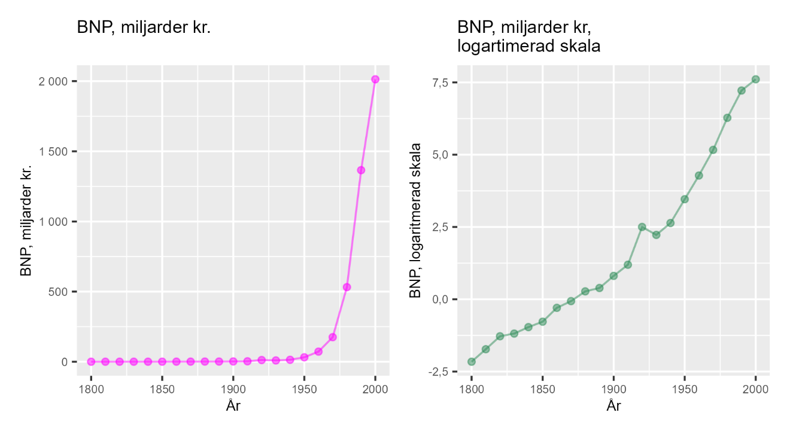

# Ekonomiskt välstånd och relativa förändringar {#k1-2-3}

### Begrepp
- **BNP**: Värdet av alla varor och tjänster som produceras under en avgränsad tidsperiod, till exempel ett år, och i ett avgränsat område, till exempel ett land.
- **Real BNP:** Nominell BNP justerad för rena prisförändringar.
- **Ekonomisk tillväxt:** Syftar ofta på BNP-tillväxt, förändring av BNP. Kan mätas som procentuell förändring av real BNP per år.
### Teori
Det finns flera sätt att mäta levnadsstandard, välstånd och rikedom. Ett vanligt mått är *Bruttonationalprodukt (BNP)*, vilket är värdet för alla varor och tjänster som produceras. Ofta anges BNP per land och år. År 2023 var Sveriges BNP ca 6 200 miljarder kronor. I Sverige [beräknas BNP av Statistiska centralbyrån](https://www.scb.se/hitta-statistik/sverige-i-siffror/samhallets-ekonomi/bnp-i-sverige/) (SCB).
*BNP per invånare* (BNP per capita) beräknas genom att dividera BNP med antal invånare. Ett annat mått som används ibland är BNP per arbetad timme, vilket är BNP dividerat med en uppskattning av den totala mängden arbetstimmar som utfördes i Sverige under ett år.
#### Real BNP
Säg att BNP ökade med 4 %, men att hälften av detta var rena prishöjningar. Värdet av mängden producerade varor och tjänster ökade i så fall med 2 %.
För att justera BNP för prisförändringar använder man i regel en [BNP-deflator](https://en.wikipedia.org/wiki/GDP_deflator), vilket är ett annat prisindex än konsumentprisindex (KPI). För att mäta mängden produktion justeras BNP för prisförändringar, deflateras ([här](https://www.scb.se/hitta-statistik/statistik-efter-amne/nationalrakenskaper/nationalrakenskaper/nationalrakenskaper-kvartals-och-arsberakningar/produktrelaterat/Fordjupad-information/vanliga-fragor--nationalrakenskaper/) kan du läsa mer om hur BNP deflateras).
BNP är ett sätt att mäta inkomsterna i ett land. BNP per invånare är därför ett grovt mått på befolkningens genomsnittliga levnadsstandard. För att jämföra över tid använder vi real BNP, vilket är nominell BNP justerad (deflaterad) för rena prisförändringar. BNP per arbetstimme är ett grovt mått på produktivitet, det vill säga hur mycket som produceras (räknat i pengar) per arbetstimme.
#### Sveriges ekonomiska tillväxt
Under åren 2010---2019 ökade Sveriges reala BNP per capita från 444,8 tusen kr till 488,8 tusen kr, se tabell 1. Vi börjar med att räkna ut den procentuella förändringen av BNP per capita per år. Vi skriver BNP per capita år *t* som $y_{t}$. Vi kan beräkna årlig procentuell förändringstakt som:
BNP-tillväxt $= \frac{y_{t}\ --y_{t - 1}}{y_{t\ - 1}}$
För år 2010 får vi:

$$\frac{\left( y_{2010}--\ y_{2009} \right)}{y_{2009}} = \frac{444\ 800 - 423\ 400}{423400} = 5,1\%\ $$

Detta och resultaten för övriga årtal visas i tabell 1. Som syns i tabellen varierar tillväxten en del mellan de olika åren. Genom att beräkna ett medelvärde jämnar vi ut förändringarna. Den genomsnittliga tillväxten under hela perioden är 1,5 %.

**Tabell 1: Sveriges BNP år 2010---2019**
  ------------------------------------------------------------------------------------
  År      BNP per capita, 2019 års priser     År      BNP per capita, 2019 års priser
  ------ --------------------------------- -- ------ ---------------------------------
  2009                423 400                 2015                474 000
  2010                444 800                 2016                477 800
  2011                455 600                 2017                483 500
  2012                449 600                 2018                487 300
  2013                451 100                 2019                488 800
  2014                458 500                        
  ------------------------------------------------------------------------------------

::: {.fig-caption}
Förklaring: Data från SCB. BNP deflaterad med BNP-deflatorn, omräknad till 2019 års priser.
:::

#### Genomsnittlig tillväxttakt
Ett sätt att jämföra olika tidsperioder är att beräkna genomsnittlig BNP-tillväxt för fem år i taget. Ett medelvärde för BNP-tillväxten år 2010--2014 och ett medelvärde för åren 2015--2019. Vi betecknar dessa två medelvärden som $\overline{\Delta y_{1}\ }$ för perioden 2010--2014 och $\overline{\Delta y_{2}\ }$ för perioden 2015--2019. Dessa beräknas på följande sätt:

$$\overline{\Delta y_{1}\ } = \frac{5,1\% + 2,4\% + ( - 1,3\%) + 0,3\% + 1,6\%}{5} = 1,62\%$$

$$\overline{\Delta y_{2}\ } = \frac{3,4\% + 0,8\% + 1,2\% + 0,8\% + 0,3\%}{5} = 1,3\%$$

#### Logaritmera BNP
Repetition: [logaritmen](https://www.matteboken.se/lektioner/matte-2/logaritmer#!/) av talet *a* är lika med det värde som talet *b* måste höjas till (exponent *x*), för att bli lika med *a*:

$$a = b^{x}$$

[Tiologaritmen](https://www.matteboken.se/lektioner/matte-2/logaritmer/tiologaritmer#!/) syftar på logaritm med bas 10. [Naturliga logaritmen](https://www.matteboken.se/lektioner/matte-3/derivata/den-naturliga-logaritmen#!/) har basen $e \approx 2,718$, [Eulers tal](https://www.matteboken.se/lektioner/matte-3/derivata/talet-e#!/).
Nu ska vi använda naturliga logaritmen för att jämföra BNP över tid. Tabell 2 visar Sveriges BNP i miljoner kronor år 1800--2000. Den tredje kolumnen visar [naturliga logaritmen](https://www.matteboken.se/lektioner/matte-3/derivata/den-naturliga-logaritmen#!/) av BNP. Första talet är 115 och $\ln(115) \approx 4,7$, vilket innebär att $e^{4,7} \approx 115$.
I tabellen kan vi se hur en lika stor relativ förändring i $ln(BNP)$ motsvaras av samma absoluta förändring av den naturliga logaritmen. Varje gång BNP fördubblas, oavsett från vilken nivå, är förändringen i $ln(BNP)$ cirka 0,7. Varje gång BNP tredubblas ökar $\ln(BNP)$ med cirka 1,1. När BNP tiodubblas ökar $ln(BNP)$ med cirka 2,3.

**Tabell 2: BNP och naturliga logaritmen av BNP**
  --------------------------------------------------------------------------------
  År        BNP, miljoner kr   ln(BNP)      År        BNP, miljoner kr   ln(BNP)
  --------- ------------------ --------- -- --------- ------------------ ---------
  1800      115                4,7          1910      3 302              8,1
  1810      178                5,2          1920      12 200             9,4
  1820      278                5,6          1930      9 271              9,1
  1830      306                5,7          1940      13 979             9,5
  1840      382                5,9          1950      31 827             10,4
  1850      461                6,1          1960      72 272             11,2
  1860      743                6,6          1970      175 222            12,1
  1870      938                6,8          1980      531 884            13,2
  1880      1 314              7,2          1990      1 365 700          14,1
  1890      1 477              7,3          2000      2 013 311          14,5
  1900      2 245              7,7                                       
  --------------------------------------------------------------------------------

::: {.fig-caption}
Förklaring: Data från [www.historia.se](http://www.historia.se). Ln(BNP) är naturliga logaritmen av talen i kolumnen med BNP räknat i miljoner kr.
Siffrorna från tabell 2 illustreras i figur 1 med två diagram: I det vänstra diagrammet visas en linje för BNP räknat i miljarder kronor. Under denna period ökade BNP exponentiellt. Från 115 miljoner kronor (0,115 miljarder) år 1800 till 2 013 311 miljoner kr (2 013 miljarder) år 2000. Det högra diagrammet visar samma sak i naturliga logaritmen, $ln(BNP)$, där linjen i stället är mer rak.
I det vänstra diagrammet jämför vi absoluta förändringar, medan det högra diagrammet kan användas för att jämföra relativa förändringar. I det högra diagrammet kan vi se att Sveriges ekonomi växte snabbare under 1900-talet jämfört med 1800-talet.
Om linjen i det högra diagrammet hade varit helt rät hade de inneburit att den relativa, procentuella, tillväxttakten på lång sikt hade varit konstant. Det finns inga enkla regler för vilket mått som är bäst. Vilket mått du bör använda beror på vad du vill mäta, jämföra eller visa. Men naturliga logaritmen används ofta för att just jämföra relativa skillnader och förändringar.
:::

**Figur 1: Sveriges BNP år 1800---2000, i miljarder kronor och uttryckt i naturliga logaritmen.**

{style="width:5.78165in;height:3.17857in"}

::: {.fig-caption}
Förklaring: Data från [www.historia.se](http://www.historia.se). BNP = Bruttonationalprodukt, värdet av alla varor och tjänster som produceras i Sverige under ett år. Diagrammet till vänster visar nominell BNP i miljarder kronor per år för utvalda årtal 1800---2000. Diagrammet till höger visar samma sak som diagrammet till vänster, men uttryckt i naturliga logaritmen.
:::

::: {.ex-section-title}
Övningar
:::

---

::: {.next-section-link}
[→ Nästa avsnitt: **Leder rikedom till lycka?**](k1-2-4.html)
:::

