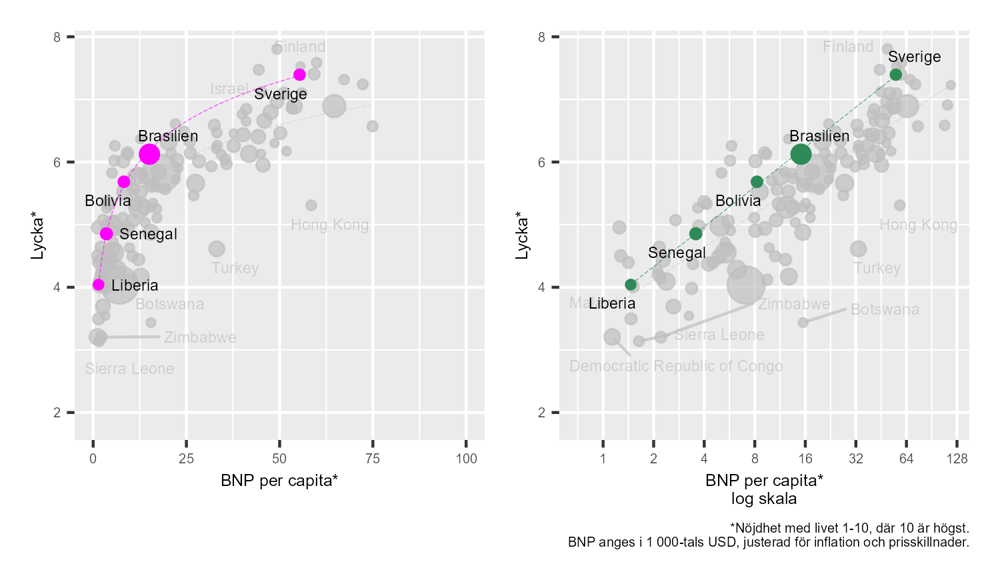

# Leder rikedom till lycka? {#k1-2-4}

### Begrepp
- **Logaritmering kan underlätta relativa jämförelser.** Detta eftersom det relativa avståndet mellan två värden motsvaras av samma differens mellan de två logaritmerade värdena.
- **Rikare länder är lyckligare.** Människor i länder med högre BNP per capita tenderar i större utsträckning att uppge att de är mer nöjda med livet. BNP per capita och nöjdhet med livet ("lycka") samvarierar på global nivå.
- **Samvariation är inte samma sak som ett orsakssamband.** För att kunna mäta vilken förändring ett fenomen orsakar i ett annat fenomen måste vi isolera denna effekt. Detta görs med vetenskapliga experiment eller experimentliknande metoder. Detta tankesätt är centralt för en stor mängd vetenskap och analys.
### Teori
Figur 1 illustrerar samvariationen mellan BNP per invånare och genomsnittlig nöjdhet med livet per land. Låt oss säga att "nöjdhet med livet" är ett mått på lycka. Varje prick representerar ett land eller område med ett kombinerat värde av lycka och BNP per capita (bruttonationalprodukt per invånare).
Det vänstra diagrammet visar ­BNP per capita på den horisontella axeln (x-axeln), räknat i amerikanska dollar, justerade för inflation och prisskillnader mellan länder. Justering för internationella prisskillnader kallas för att valutan är köpkraftsjusterad. I diagrammet till höger har vi tagit naturliga logaritmen av BNP per capita.
I båda diagrammen har vi ritat ut en trendlinje för att mönstret ska synas tydligare. De färgglada streckade linjerna visar trenden för de markerade länderna. Den mindre synliga grå linjen är trendlinjen för alla världens länder. Läs mer på [www.ourworldindata.org/grapher/gdp-vs-happiness](http://www.ourworldindata.org/grapher/gdp-vs-happiness).
I diagrammet till vänster kan vi se att rikare länder i genomsnitt är lyckligare än fattigare länder. Men lyckan är bara högre med högre inkomster upp till en viss inkomstnivå. För de rikaste länderna verkar det inte finnas någon särskilt tydlig samvariation mellan lycka och inkomst.
I det högra diagrammet, där vi använder logaritmerad BNP, är den genomsnittliga lyckan i genomsnitt högre med högre inkomst, både bland fattiga och rika länder. En stor del av länderna ligger nästan som på en rak linje från nedre vänstra hörnet upp till övre högra hörnet. Förenklat kan vi beskriva detta som att det finns en [positiv samvariation](https://www.matteboken.se/lektioner/matte-1/statistik-och-sannolikhet/korrelation-och-kausalitet#!/) mellan genomsnittlig inkomst och lycka.
**Figur 1: BNP och lycka i alla världens länder** {style="width:6.1076in;height:3.54071in"}
::: {.fig-caption}
Förklaring: Data från [www.ourworldindata.org](http://www.ourworldindata.org), hämtad 240930. Lycka mäts som ett enkätsvar på en skala från 1 till 10 där 10 är högsta nivå av nöjdhet med livet. BNP anges i 1 000-tals amerikanska dollar 2017 års priser, köpkraftsjusterad (justerat för prisskillnader mellan länder eller områden). Läs mer på [www.ourworldindata.org/grapher/gdp-vs-happiness](http://www.ourworldindata.org/grapher/gdp-vs-happiness). Varje prick representerar ett land eller område i världen med ett kombinerat värde av lycka och BNP per capita. I det högra diagrammet kan vi se hur lyckan ökar främst bland fattiga länder men planar ut när BNP per capita når en högre nivå. I det högra diagrammet jämför vi logaritmerad BNP per capita och ser då att relativa ökningar av BNP per capita samvarierar mer linjärt med förändringar i lycka.
:::

#### Varför ändras mönstret?
Om vi i stället för de faktiska nivåerna av BNP jämför logaritmerade värden kan vi enklare se en mer linjär samvariation mellan lycka och BNP per capita, som i det högra diagrammet i figur 1. Varför?
För att lyckan ska öka för den som redan har 1 miljon kronor, krävs en större inkomstökning, jämfört med vad som krävs för att öka lyckan för den som inte har några pengar alls. Även om sambandet är mer komplicerat än vad som ryms att diskutera här kan nog detta betraktas som ett grundläggande villkor för denna jämförelse.
Om vi godtar detta blir möjligen även mönstret i det högra diagrammet mer logiskt. Som vi såg i föregående kapitel kan logaritmering göra det lättare att jämföra relativa skillnader, eftersom differensen mellan logaritmerade värden är densamma för motsvarande relativa skillnader i absoluta värden. Till exempel:

$$\log_{10}(1) = 0.\ \ \log_{10}(2) = 0,3.\ \ \log_{10}{(4)} = 0,6.\ \ \log_{10}(8) = 0,9$$

En fördubbling från 1 till 2 till 4 till 8 motsvaras av differensen 0,3 mellan de logaritmerade värdena (så länge vi använder bas 10 för våra logartimer).
Tabell 1 visar värdena för länderna som är färgmarkerade i de båda diagrammen: Bolivia, Brasilien, Liberia, Senegal och Sverige. Brasilien har ungefär dubbelt så stort BNP per capita som Bolivia (cirka 15,1 respektive 8,2). Differensen mellan deras BNP-värden i logaritmerad form är cirka 0,3, vilket vi får om vi tar 1,2 -- 0,9.
Bolivia har i sin tur dubbelt så stor BNP per capita som Senegal (8,2 respektive 3,6). Differensen mellan deras BNP-värden i logaritmerad form: 0,9 -- 0,6 = 0,3. Som syns tydligt i diagrammen är det för dessa länder även så att ju högre BNP per capita landet har, desto mer nöjda med livet är invånarna.
**Tabell 1: Lycka och BNP i sex länder.**
  ---------------------------------------------------------------------------------------------------------------------------------------------------------------------------------
  **Land**          **Nöjdhet med livet**   **BNP per capita**   $\mathbf{lo}\mathbf{g}_{\mathbf{10}}\mathbf{(}\mathbf{BNP\ per\ capita}\mathbf{)}$
  ----------------- ----------------------- -------------------- ------------------------------------------------------------------------------------------------------------------
  Bolivia           5,7                     8,2                  0,9
  Brasilien         6,1                     15,1                 1,2
  Liberia           4                       1,5                  0,2
  Senegal           4,9                     3,6                  0,6
  Sverige           7,4                     55,4                 1,7
  ---------------------------------------------------------------------------------------------------------------------------------------------------------------------------------
::: {.fig-caption}
Förklaring: Data från [www.ourworldindata.org](http://www.ourworldindata.org). Logaritmer underlättar relativa jämförelser, som till exempel för att se hur en fördubbling av BNP per capita samvarierar med lycka i ett land.
:::

#### Tänkbara slutsatser
Vad kan vi lära oss av detta? Logaritmering underlättar relativa jämförelser och vi har en teori om varför vi får detta mönster. Att kunna jämföra linjära associationer mellan olika fenomen är extremt användbart inom analytiskt arbete och används inom många olika fält. Exemplet ovan är förenklat men beskriver hur vi kan båda jämföra faktiska data, som BNP, och teoretiska resonemang med hjälp av dessa metoder.
Observera dock att vår teori och mönstren i diagrammen är inget bevis för att högre BNP orsakar mer lycka. Som exempel: Betyder samvariationen mellan inkomst och lycka att lyckan i ett samhälle skulle öka om inkomster ökade -- oavsett hur inkomstökningen gick till? Det vill säga, att det inte spelar någon roll vilken typ av varor och tjänster som ett land producerar, så länge det produceras mycket av det. Troligen inte.
De flesta godtar nog att vår lycka hänger ihop med både hur stor vår inkomst är och hur vi kan använda våra pengar.
Vi vet dock inte exakt i detalj varför lycka samvarierar med inkomst. Livet i rika länder är i regel annorlunda på många sätt, jämfört med livet i fattiga länder. Rika länder har avancerad hälso- och sjukvård, renare luft och natur, avancerad infrastruktur och i regel mer välfungerande rättssystem och politiska organisationer. Denna typ av tillgångar bidrar också till högre livskvalitet.
#### Hur mäta ett orsakssamband?
Givet att vi vill uttala oss om ett orsakssamband, till exempel huruvida inkomst skapar lycka, och dessutom mäta detta, som till exempel "hur mycket lyckligare blir jag av att få 1 000 kr?", så måste detta studeras med särskilda metoder.
För att kunna mäta vilken förändring av lycka som en förändring av inkomsterna kan orsaka (mäta *effekten*), måste vi kunna isolera just detta samband. Inom samhällsvetenskap görs detta med hjälp av vetenskapliga experiment och experimentliknande metoder, vilket vi ska återkomma till längre fram.

::: {.ex-section-title}
Övningar
:::

---

::: {.next-section-link}
[→ Nästa avsnitt: **Banadödlighet och flyktingar**](k1-2-5.html)
:::

