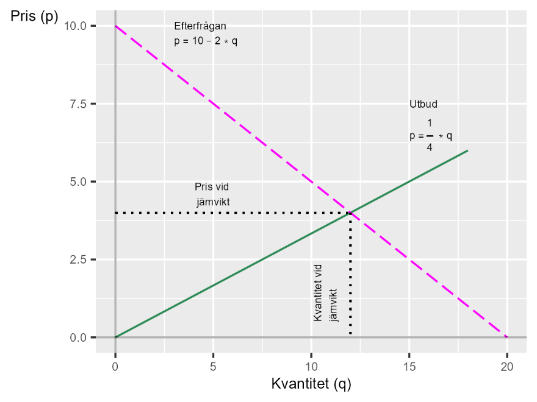
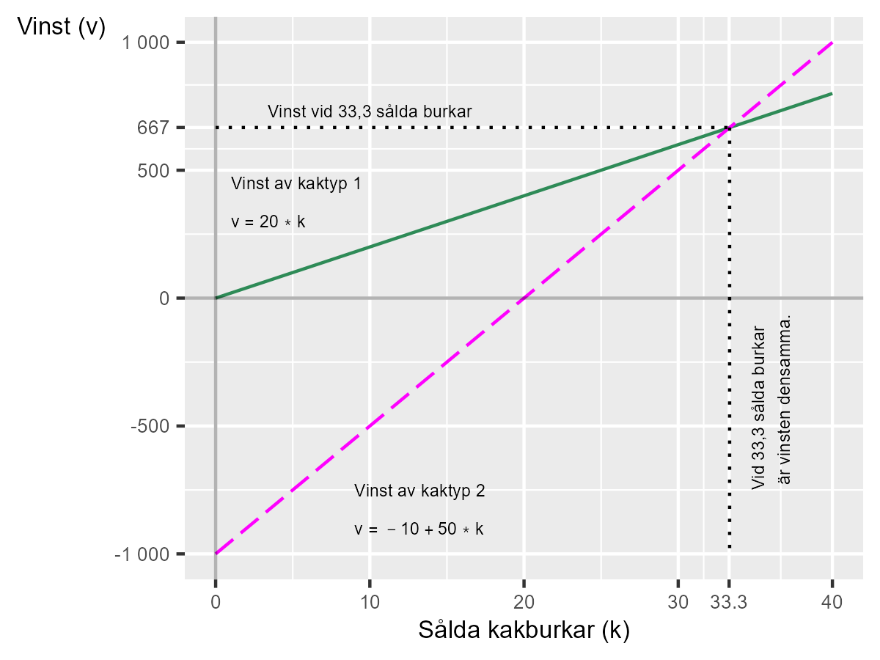

# Utbud, efterfrågan och kakor {#k1-3-1}

### Begrepp
- **Marknad:** Utbytet mellan säljare och köpare av varor eller tjänster. En marknad är inte nödvändigtvis en tydligt avgränsad plats. En marknad kan bestå av två restauranger bredvid varandra som konkurrerar om samma kunder (restaurangmarknaden på den gatan). En marknad kan även bestå av alla platser på internet där du kan beställa t-shirtar (t-shirtmarknaden på nätet), vilka i sin tur även konkurrerar med fysiska affärer (t-shirtmarknaden i Sverige).
- **Utbud:** Mängden varor eller tjänster som säljarna på en tänkt marknad vill sälja. Utifrån hur vi vet eller tror att säljarna på marknaden beter sig kan vi formulera en matematisk funktion som beskriver utbudet. Denna funktion kan vi kalla utbudsfunktionen, med vilken vi kan rita utbudskurvan i ett diagram.
- **Efterfrågan:** Mängden varor/tjänster som kunder/spekulanter på en marknad vill köpa. Med hjälp av matematik kan vi formulera efterfrågefunktionen, med vilken vi kan rita ut efterfrågekurvan i ett diagram.

### Teori
I [kapitel 1](https://www.dropbox.com/scl/fo/fv2fit971nmctypdeaa50/APZx8Ttw2hGbroWapyjK7lQ?rlkey=ybaos5j7bcdqd5rzgxe7rcfh6&dl=0) gick vi kort igenom att matematik kan användas för att beskriva idéer och teorier. Det tål att understryka att det inte finns några regler för exakt hur detta ska göras eller vilken typ av idéer som kan eller bör beskrivas med matematik.
I detta kapitel ska vi gå igenom några exempel. Vissa av dom är vanligt förekommande medan andra mer syftar till att inspirera och illustrera samhällsvetenskapens bredd.

#### Utbud och efterfrågan
Vi börjar med ett vanligt förekommande exempel: Hur påverkar villkoren för säljare och köpare priset på varor och tjänster?
Om vi tänker oss att det existerar en vara eller tjänst med en avgränsad marknad med många köpare och många säljare. Ingen enskild person eller aktör är tillräckligt mäktig för att själv kunna bestämma priset på marknaden. Däremot kan säljarna välja hur mycket de vill sälja.
Mängden som säljarna bjuder ut till försäljning beror helt och hållet på priset som de kan få. Ju högre pris, desto mer vill de sälja (eller desto fler personer kommer vilja bjuda ut sina varor/tjänster till försäljning). Säljarnas beteende kan nu beskrivas med följande ekvation:
$q_{\text{utbud}} = 3*p$ (1)
där *q* är mängden som säljarna vill sälja (utbudet) och *p* är priset på marknaden. Det vill säga, om priset ökar med 1, så ökar mängden varor/tjänster som är till salu.
Köparnas beteende kan i stället beskrivas som omvänt. De kan inte påverka priset men de kan välja hur mycket de vill köpa av varan eller tjänsten som säljs. Deras beteende kan beskrivas med följande ekvation:
$q_{\text{efterfrågan}} = 20 - 2p$ (2)
Vi har nu två linjära ekvationer för utbud respektive efterfrågan. Medan varje enskild säljare eller köpare inte kan påverka det genomsnittliga priset på hela marknaden (marknadspriset) så kan vi tänka oss att alla dessa människors beteende i längden är det som bestämmer hur mycket som säljs och till vilket pris.
För att resonera om detta kan vi använda de matematiska funktionerna i ekvation 1 och 2. Vi börjar med att sätta ihop dessa i ett [linjärt ekvationssystem](https://www.matteboken.se/lektioner/matte-2/linjara-ekvationssystem#!/):
$\left\{ \begin{array}{r} q_{\text{utbud}} = 3p \\ q_{\text{efterfrågan}} = 20 - 2p \end{array} \right.\ $ (3)
där *q* och *p* är våra variabler och siffrorna är våra koefficienter. Ekvationssystemet består av två definitioner av *q*: en mängd för utbud och en mängd för efterfrågan på marknaden. Våra koefficienter beskriver hur vi tänker oss att utbud och efterfrågan fungerar för en vara eller tjänst.

#### Jämviktspriset
Nu söker vi jämviktspriset, vilket är det värde för *p* som ger att $q_{\text{utbud}} = q_{\text{efterfrågan}}$. I denna situation är alltså utbud och efterfrågan lika och marknaden är i jämvikt.
Vi kan börja med att rita upp ekvationssystemet i ett diagram, se figur 1. I diagrammet har vi två linjer, en per ekvation i ekvationssystemet. Kurvan som lutar uppåt till höger är den första ekvationen i systemet, funktionen för $q_{\text{utbud}}$. Den andra linjen, som lutar ned åt höger i bilden, är funktionen för $q_{\text{efterfrågan}}$. I diagrammet möts linjerna vid en unik punkt, som definierar jämviktspriset $p^{*}$ och jämviktskvantiteten $q^{*}$.
Så länge beteendet hos säljare och köpare är konstant kommer jämviktspriset och jämviktsutbudet att vara detsamma. Om villkoren för köpare och säljare ändras, så ändras också marknadens pris och kvantitet.
Vi kan tänka på denna teoretiska figur som ett resonemang om var pris och såld kvantitet kommer att befinna sig i genomsnitt på lång sikt, så länge de mer långsiktiga villkoren för köpare och säljare inte ändras.

**Figur 1. Utbud, efterfrågan, jämviktspris och jämviktsutbud.**

{style="width:4in;height:3in"}

::: {.fig-caption}
Förklaring: Diagrammet illustrerar ett ekvationssystem med två funktioner och en linje i diagrammet per funktion. Linjerna för utbud och efterfrågan kallas ofta för utbudskurvan och efterfrågekurvan. Där linjerna möts är systemet i jämvikt. I detta fall har vi jämviktspris $p^{*} = 4$ och jämviktsutbud $q^{*} = 12$.
För att räkna ut jämviktspris sätter vi $q_{\text{utbud}}$ och $q_{\text{efterfrågan}}$ lika med varandra och löser för *p*:
$q_{\text{utbud}} = q_{\text{efterfrågan}}$ (4)
:::

$$3p = 20 - 2p$$

$$p^{*} = \frac{20}{5} = 4$$

Detta värde för $p^{*}$ sätter vi in i ekvationssystemet och löser för $q$, för att därigenom få jämviktsmängden för utbud och efterfrågan:
$q_{\text{utbud}} = 3p = 12$ (5)

$$q_{\text{efterfrågan}} = 20 - 2p = 12$$

Båda ekvationerna visar att $q^{*} = 12$, varför vi nu har systemets lösning. Vi kan kontrollera med hjälp av insättning, vilket vi lämnar till läsaren (alltså du).

#### Två sorters kakor
Linjära ekvationer kan även användas till att beskriva alternativ i en valsituation. Till exempel: Inför årets stora kakförsäljning ska lokala scoutföreningen välja strategi i det stora baket.
Den första strategin är att scouterna bakar riktiga kakor med dyra ingredienser. Kakorna kommer i så fall att bli utsökta, men dyra att tillverka. Vinsten per såld förpackning kommer vara 20 kr. Vi kan beskriva detta med följande ekvation:
$\text{vinst}_{1} = 20*\text{kakburk}_{1}$ (6)
Ett annat alternativ är att baka kakorna på vatten och den där stora säcken med gammalt mjöl som de hittade i containern bakom klubbhuset förra sommarn. Inga andra ingredienser. Eftersom dessa kakor är superbilliga att tillverka kommer vinsten nu bli 50 kr per kakburk.
Nackdelen är att föreningen kommer åka på böter på 1 000 kr för att ha förgiftat några av sina kunder. Den förväntade vinsten av detta alternativ kan vi beskriva i följande ekvation:
$\text{vinst}_{2} = 50*\text{kaburk}_{2} - 1\ 000$ (7)
Hur många kakburkar måste scouterna sälja för att den förväntade vinsten i alternativ 1 och 2 ska bli likvärdig? En likvärdig vinst innebär att de två ekvationerna ska ha samma värde. Vi kan således beräkna antalet kakburkar genom att sätta de två ekvationerna lika med varandra. Detta innebär att vi har ett linjärt ekvationssystem:
$\left\{ \begin{array}{r} \text{vinst}_{1} = 20*\text{kakburk}_{1} \\ \text{vinst}_{2} = 50*\text{kakburk}_{2} - 1\ 000 \end{array} \right.\ $ (8)
Vi vill veta för vilket antal sålda kakburkar som $\text{vinst}_{1} = \text{vinst}_{2}$. Vi skriver därför $\text{kakburk}_{1} = \text{kakburk}_{2} = \text{kakburk}$, sätter de två uttrycken för vinst lika med varandra och löser för $\text{kakburk}$:
$50*\text{kakburk} - 1000 = 20*\text{kakburk}$ (9)$ $

$${30*\text{kakburk} = 1000 }{\text{kakburk}^{*} = \frac{1000}{30} = \frac{100}{3} \approx 33,3}$$

Vid cirka 33,3 sålda kakburkar är de två alternativen likvärdiga. Vinsten blir då:
$\text{vinst}_{1}^{*} = 20*\frac{100}{3} \approx 667$ (10)$ $

$$\text{vinst}_{2}^{*} = 50*\frac{100}{3} - 1000 \approx 667$$

Detta illustreras i figur 2, där de två strategierna är utritade med varsin rak linje. Linjerna möts vid den punkt där de två strategierna ger likvärdig vinst: 33,3 sålda kakburkar och cirka 667 kr vinst.

**Figur 2. Vinst med hänsyn till antal sålda kakburkar enligt två strategier**

{style="width:4in;height:3in"}

::: {.fig-caption}
Förklaring: Diagrammet illustrerar vid vilken kvantitet sålda kakburkar (33,3 på horisontella x-axeln) som de två strategierna är likvärdiga. Vid denna nivå ger båda strategierna en vinst på 667 kr.
:::

::: {.ex-section-title}
Övningar
:::

---

::: {.next-section-link}
[→ Nästa avsnitt: **Hur hitta den rätta?**](k1-3-2.html)
:::

