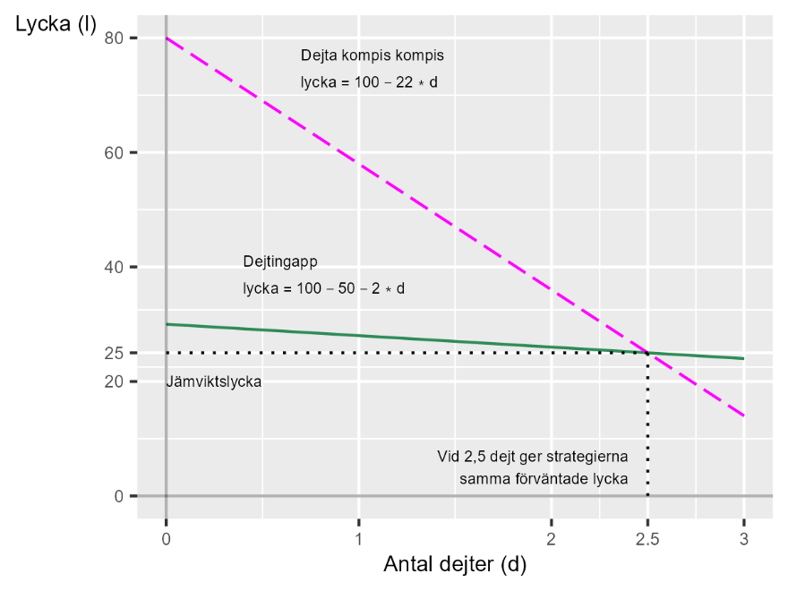

# Hur hitta den rätta? {#k1-3-2}

### Begrepp
*Inga nya matematiska begrepp i detta avsnitt.*
### Teori
Matematiken kan hjälpa oss att diskutera verkligheten även när vi är intresserade av fenomen som kan vara svåra eller omöjliga att sätta siffror på. Vi ska nu gå igenom ett exempel där vi vill resonera kring hur kul eller tråkigt något är. Vi börjar med att beskriva detta exempel med siffror, vilket möjligen kan vara enklare att förstå.
Därefter ska vi gå igenom hur vi kan arbeta med samma typ av teori utan siffror, vilket många gånger är minst lika användbart och ibland bättre. Poängen med detta är att illustrera hur matematiken kan hjälpa oss resonera, även om vi inte kan räkna ut exakta svar.
#### Två strategier för dejting
Kim vill gifta sig snarast möjligast och överväger olika strategiska alternativ för att träffa den rätta. Kim tänker inte hoppa mellan strategier och giftermålet måste ske i år. Det handlar således om att välja en strategi och hålla sig till den.
Kim uppskattar idag sin lycka till nivå 80 på en skala från 0 till 100, och hoppas kunna öka sin lycka till 100 genom att träffa en partner. Kim gillar dock inte att dejta och varje dejt drar ned Kims lycka lite.
**Kims strategi 1:** Använda en gratis dejtingapp. Bara att installera appen och börja gå igenom profilerna sänker Kims lycka med 50 procentenheter. För varje dejt Kim måste gå på sjunker Kims lycka med ytterligare två procentenheter. Låt oss beskriva detta i en ekvation:
$\text{lycka}_{1} = 80 - 2*\text{dejt}_{1} - 50$ (1)
där $\text{lycka}_{1}$ syftar på lycka som uppnås med dejtingstrategi 1. Ekvation 1 kan förenklas till: $\text{lycka}_{1} = 30 - 2*\text{dejt}_{1}$.
**Kims strategi 2:** Kims bästa vän har valt ut fyra kandidater som är redo för giftermål. Eftersom den sociala insatsen nu är lite högre sänker varje dejt Kims lycka med 22 procentenheter:
$\text{lycka}_{2} = 80 - 22*\text{dejt}_{2}$ (2)
Detta ger oss ett linjärt ekvationssystem med två ekvationer:
$\left\{ \begin{array}{r} \text{lycka}_{1} = 30 - 2*\text{dejt}_{1} \\ \text{lycka}_{2} = 80 - 22*\text{dejt}_{2} \end{array} \right.\ $ (3)
Nu undrar vi vid vilket antal dejter som de två strategierna kan betraktas som likvärdiga, samt vilken nivå av (o)lycka detta skulle medföra. Vi sätter de två ekvationerna lika med varandra:
$\text{lycka}_{1} = \text{lycka}_{2}$ (4)$ $

$$30 - 2*\text{dejt}_{1} = 80 - 22*\text{dejt}_{2}$$

Vi döper om variablerna $\text{dejt}_{1} = \text{dejt}_{2} = \text{dejt}$ och löser ut antal dejter:
$30 - 2*\text{dejt} = 80 - 22*\text{dejt}$ (5)$ $

$${22*\text{dejt} - 2*\text{dejt} = 80 - 30 }{20*\text{dejt} = 50 }{\text{dejt} = \frac{50}{20} }{\text{dejt}^{*} = 2,5}$$

Vid 2,5 dejter är de två strategierna likvärdiga. Vi prövar genom insättning i ekvationerna:
$\text{lycka}_{1}^{*} = 30 - 2*2,5 = 25$ (6)$ $

$$\text{lycka}_{2}^{*} = 80 - 22*2,5 = 25$$

Lösningen för systemet är $\text{dejt}^{*} = 2,5$ och $\text{lycka}^{*} = 25$. Figur 1 illustrerar de två strategierna som raka linjer med jämvikten som den punkt där de två linjerna möts. Vid denna punkt leder de två strategierna till samma nivå av lycka.
Nu är frågan om Kim tror sig kunna hitta den rätta på fler eller färre dejter än så. Om Kim tror det krävs färre dejter med kompisars kompisar är den strategin minst olycksframkallande. Om Kim tror det krävs fler är den andra strategin minst olycksframkallande.
**Figur 1. Två dejtingstrategier i ett diagram**
{style="width:4in;height:3in"}
::: {.fig-caption}
Förklaring: Den gröna linjen beskriver dejtingstrategi 1, med dejtingappen. Den rosa linjen beskriver dejtingstrategi 2, träffa kompisens kompisar. Vid 2,5 dejter möts de två linjerna, varpå Kims lycka är nere på 25.
:::

#### Samma exempel utan siffror
Att mäta lycka på en skala från 0 till 100 är lite klumpigt. Genom att ställa upp ekvationer kan vi diskutera vilka villkor som måste vara uppfyllda för att en teori eller ett samband ska gälla.
För att illustrera denna poäng ska vi nu göra om föregående övning men endast använda bokstäver i ekvationssystemet i stället för siffror. Ekvationssystemet kan nu skrivas så här:
$\left\{ \begin{array}{r} \text{lycka} = m - ad_{1} - b \\ \text{lycka} = m - cd_{2} \end{array} \right.\ $ (7)
Bokstaven *m* är nuvarande nivå av lycka, de två typerna av dejter symboliseras av $d_{1}$ (appen) och $d_{2}$ (kompisens kompis), *a* och *c* är lutningskoefficienterna (kostnaden) för att gå på olika typer av dejter och *b* är den känslomässiga kostnaden för att starta dejtingappen. Lösningen kan nu formuleras:
$d^{*} = \frac{b}{c - a}$ (8)$ $

$$\text{lycka}^{*} = \frac{mc - ma - cb}{c - a} = \frac{m(c - a) - cb}{c - a}$$

Detta låter oss beskriva hur de olika variablerna hänger ihop och vad som krävs för att $d^{*}$ ska anta ett positivt värde. Givet att $b \> 0$ måste $c \> a$.
Det vill säga, för att strategierna ska kunna betraktas som likvärdiga vid någon mängd dejter överhuvudtaget, så krävs, givet att appen minskar lyckan (konstant *b*), att lyckominskningen för att gå på dejt med kompisens kompis (*c*) måste vara större än lyckominskningen per dejt via appen (*a*).
Hela exemplet i detta avsnitt är så klart kraftigt förenklat. Med mer invecklad matematik kan vi även föra mer invecklade resonemang. Men det kanske ändå fångar en typ av avvägning som vi alla ställs för då och då i livet. Det vill säga, de situationer då vi känner att vi behöver välja mellan två tråkiga alternativ och mest vill veta vilket som är minst tråkigt.

::: {.ex-section-title}
Övningar
:::

---

::: {.next-section-link}
[→ Nästa avsnitt: **En teori om arbete**](k1-3-3.html)
:::

