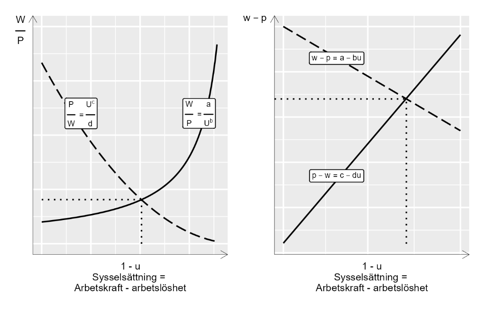

# En teori om arbete {#k1-3-3}

### Begrepp
*Inga nya matematiska begrepp i detta avsnitt.*
### Teori
I detta exempel ska vi beskriva arbetsmarknaden med ett linjärt ekvationssystem. Vårt ekvationssystem består av två ekvationer som ger en förenklad bild av hur vi kan tänka oss att löner $(W)$ och priser $(P)$ bestäms:
$\left\{ \begin{matrix} \frac{W}{P} = \frac{a}{U^{b}}, & b \> 0 \\ \frac{P}{W} = \frac{c}{U^{d}}, & c \> 0 \end{matrix} \right.\ $ (1)
Första ekvationen beskriver hur lönerna $W$ sätts med ett påslag, koefficienten $a$, över priser $P$. Så om arbetarna möter högre priser kräver de även högre löner.
Den andra ekvationen beskriver hur priser $P$ sätts med ett påslag $c$ på lönerna $W$. Om företagen möter högre löner sätter de högre priser. Arbetslöshet $U$ inverkar negativt både på löner och priser, och denna effekt bestäms av koefficienterna $b$ och $d$.
Bokstäverna $a,b,c$ och $d$ är konstanter som sammanfattar de fenomen som påverkar löner och priser. Exakt vad detta symboliserar bekymrar vi oss inte om här. Det kan exempelvis vara skatter, lagstiftning eller hur arbetstagare och arbetsgivare förhandlar löner och villkor via sina fackföreningar och arbetsgivarorganisationer.
Den första ekvationen $(W/P)$ kallas även för lönesättningskurvan, som kan beskrivas som en utbudskurva för arbetskraften. Den andra ekvationen $(P/W)$ kallas även för prissättningskurvan och kan beskrivas som en efterfrågekurva för arbetskraften.
Vi söker nu en lösning för variabeln $W/P$, reallön (se avsnitt 3.7), och $U$, procent arbetslöshet. Vi börjar med att skriva om den andra ekvationen och lösa för $W/P = U^{d}/c$. Vi sätter in detta i den första ekvationen:
$\begin{matrix} \frac{W}{P} & \ = \frac{a}{U^{b}} \\ \frac{U^{d}}{c} & \ = \frac{a}{U^{b}} \\ U^{d + b} & \ = ac \\ U^{*} & \ = (ac)^{\frac{1}{b + d}} \end{matrix}$ (2)
Lösningen för $U^{*}$ kan vi sedan använda för att lösa ut $(W/P)^{*}$. Vi sätter in $U^{*}$ i ekvationssystemet i ekvation 1:
$\begin{matrix} \left( \frac{W}{P} \right)^{*} & \ = \frac{a}{\left( U^{*} \right)^{b}} \\ & \ = \frac{a}{(ac)^{\frac{b}{b + d}}} \\ & \ = \frac{a^{1 - \frac{b}{b + d}}}{c^{\frac{b}{b + d}}} \\ & \ = a^{\frac{d + b - b}{b + d}}c^{\frac{- b}{b + d}} \\ & \ = a^{\frac{d}{b + d}}c^{\frac{- b}{b + d}} \end{matrix}$ (3)
Eller så kan vi utgå från vänsterledet i ekvation 2 och sätta in $U^{*}$ där:
$\left( \frac{W}{P} \right)^{*} = \frac{\left( U^{*} \right)^{d}}{c} = \frac{(ac)^{\frac{d}{b + d}}}{c} = a^{\frac{d}{b + d}}c^{\frac{- b}{b + d}}$ (4)
Nu har vi lösningen för de två variablerna $U$ och $W/P$ :
$\left( U^{*},(W/P)^{*} \right) = \left( (ac)^{\frac{1}{b + d}},a^{\frac{d}{b + d}}c^{\frac{- b}{b + d}} \right)$ (5)
Parentesen i högerledet beskriver lösningarna för respektive variabel. $U^{*}$ är en definition av det som inom samhällsvetenskap kallas för jämviktsarbetslöshet.
#### Samma sak men i logaritmerad form
Detta är inte ett linjärt ekvationssystem men med hjälp av logaritmering kan vi göra det linjärt. Vi tar därför logaritmen av båda sidor av respektive ekvation 1:
$\begin{matrix} \left\{ \begin{matrix} log\left( \frac{W}{P} \right) = log\left( \frac{a}{U^{b}} \right), & b \> 0 \\ log\left( \frac{P}{W} \right) = log\left( \frac{c}{U^{d}} \right), & c \geq 0 \end{matrix} \right.\ \\ \left\{ \begin{matrix} logW - logP = loga - logU^{b} \\ logP - logW = logc - logU^{d} \end{matrix} \right.\ \\ \left\{ \begin{matrix} w - p = loga - bu \\ p - w = logc - du \end{matrix} \right.\ \end{matrix}$ (6)
där vi nu skriver $\text{log}\ W = w,\ \text{log}\ P = p,\ \text{log}\ U = u.$ I nedersta raden i ekvation 6 har vi därför att $w - p = log\left( \frac{W}{P} \right)$ och $\text{log}b*u = b*logU$. Bokstaven $u$ är logaritmen av procent arbetslöshet och $a,b,c$ och $d$ är koefficienter som definierar hur våra variabler hänger ihop.
Precis som ovan skriver vi om den andra ekvationen, sätter de två definitionerna av $w - p$ lika med varandra och löser för $u$. För att spara utrymme definierar vi nu även $\text{log}\ a = \alpha$ och $\text{log}\ c = \gamma$
$\begin{matrix} du - \gamma & \ = \alpha - bu \\ u(b + d) & \ = \alpha + \gamma \\ u^{*} & \ = \frac{\alpha + \gamma}{b + d} \end{matrix}$ (7)
Definitionen av $u^{*}$ är den logaritmerade versionen av lösningen i ekvation 5. För att räkna om till arbetslöshet i procent tar vi exponenten:
$\begin{matrix} exp\left( u^{*} \right) & \ = \frac{1}{b + d}exp(\alpha + \gamma) \\ U^{*} & \ = ac^{\frac{1}{b + d}} \end{matrix}$ (8)
#### Illustration i diagram
Figur 1 visar hur denna modell kan illustreras i diagram. Relationen mellan $W/P$ och $U$ beskrivs med de två funktionerna för utbud och efterfrågan, även kallat löne- och prissättningskurvan.
Läser vi x-axeln från vänster till höger mäter axeln procent av arbetskraften som har arbete, vilket kallas för sysselsättningsgrad. Sysselsättningsgrad kan definieras som $1 - U$, där $U$ anger procent arbetslösa. Lösningen för variablerna $U^{*}$ och $(W/P)^{*}$ är den punkt där linjerna möts.
I diagrammet till vänster visas hur linjerna ser ut i vanlig form, som i ekvation 1. I diagrammet till höger visas logaritmerade funktionerna, som i ekvation 6.
**Figur 1: Utbud och efterfrågan på arbetsmarknaden enligt vår teoretiska modell**
{style="width:4.69861in;height:3in"}'

::: {.fig-caption}
Förklaring: Diagrammet till vänster illustrerar ekvationssystemet i ekvation 1, när funktionerna skrivs i vanligt format. Diagrammet till höger illustrerar ekvationssystemet med logaritmerade funktioner, som i ekvation 6.
:::

::: {.ex-section-title}
Övningar
:::

---

::: {.next-section-link}
[→ Nästa avsnitt: **Externa effekter**](k1-3-4.html)
:::

