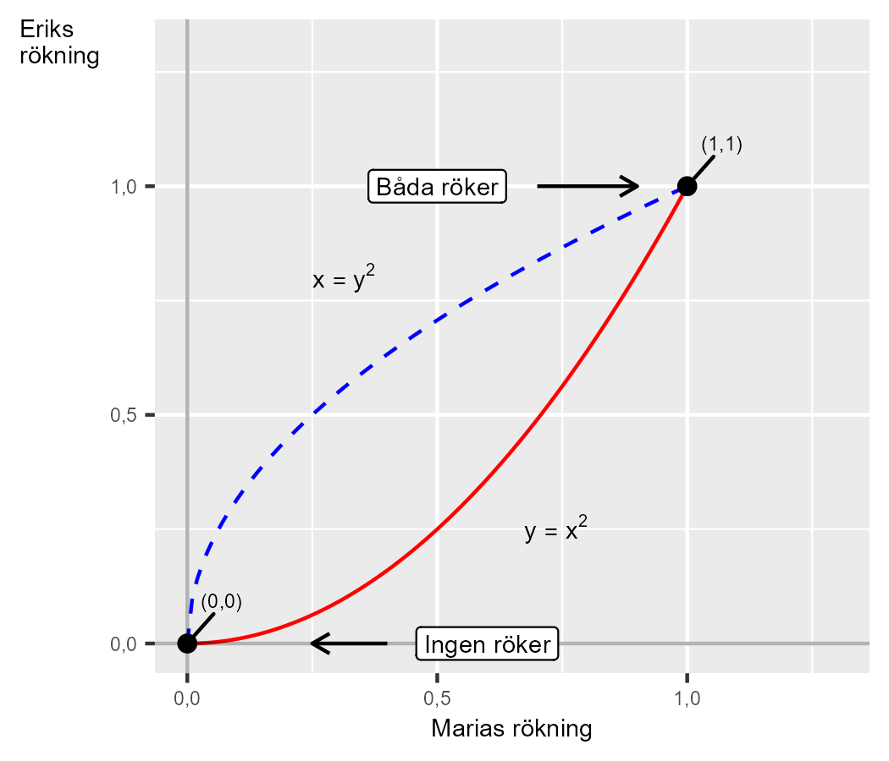

# Rökning {#k1-3-5}

### Pushtex
Detta avsnitt beskriver hur vi kan använda matematiken för att beskriva grupptryck och sociala samspel.

### Begrepp
*Inga nya matematiska begrepp i detta avsnitt.*

### Teori
Tidigare använde vi linjära ekvationssystem för att beskriva några exempel på samhällsvetenskapliga diskussioner. Även ickelinjära ekvationer och ekvationssystem förekommer rikligt i samhällsvetenskapen.
Här följer ett exempel där vi har två vänner, Erik och Maria, som gör allt tillsammans. Båda funderar på om de ska börja röka. Eriks relation till rökning kan beskrivas med följande funktion:

$$\ \text{Eriks rökning}\ = y = x^{2} \tag{1}$$

Bokstaven $x$ är en variabel som beskriver hur mycket Maria röker. Marias rökning kan i sin tur beskrivas med funktionen:

$$\ \text{Marias rökning}\ = x = y^{2} \tag{2}$$

där $y$ alltså är Eriks rökning. Vi har nu följande ekvationssystem:

$$\left\{ \begin{matrix} y = x^{2} & \forall x \in \lbrack 0,1\rbrack \\ x = y^{2} & \forall y \in \lbrack 0,1\rbrack \end{matrix} \right.\  \tag{3}$$

Systemet beskriver hur Eriks rökning är en positiv funktion av Marias rökning, vilket i sin tur är en positiv funktion av Eriks rökning. Båda ekvationerna är endast definierade för värden av $x$ och $y$ inom intervallet $\lbrack 0,1\rbrack$. Ett sätt att hitta systemets lösningar är att skriva om ekvation två till $y = x^{\frac{1}{2}}$ och sedan använda detta i den första ekvationen:

$$\begin{matrix} x^{2} & \ = x^{\frac{1}{2}} \\ x^{2} - x^{\frac{1}{2}} & \ = 0 \\ x^{\frac{1}{2}}\left( x^{\frac{3}{2}} - 1 \right) & \ = 0 \end{matrix} \tag{4}$$

Nu kan vi se att systemets lösningar ges av $x^{\frac{1}{2}} = 0$ och $\left( x^{\frac{3}{2}} - 1 \right) = 0$. För att $x^{\frac{1}{2}} = 0$ måste $x$ vara 0 , vilket är första lösningen: $x_{1} = 0$. För $\left( x^{\frac{3}{2}} - 1 \right)$ får vi:

$$\begin{matrix} x^{\frac{3}{2}} - 1 & \ = 0 \\ \left( x^{3} \right)^{\frac{1}{2}} & \ = 1 \\ x_{2} & \ = 1 \end{matrix} \tag{5}$$

Vi har lösningarna $x_{1} = 0$ och $x_{2} = 1$, vilket ger oss lösningarna för $y$ :

$$\begin{matrix} & y_{1}^{*}\left( x_{1}^{*} \right) = 0^{2} = 0 \\ & y_{2}^{*}\left( x_{2}^{*} \right) = 1^{2} = 1 \end{matrix} \tag{6}$$

Lösning 1 ger punkten $\left( x_{1},y_{1} \right) = (0,0)$ och lösning 2 ger punkten $\left( x_{2},y_{2} \right) =$ $(1,1)$. Lösningarna innebär att antingen röker ingen av vännerna $(0,0)$ eller röker båda dagligen (1, 1), där värdet 1 kan beskrivas som att de röker ett paket cigaretter per dag.
Om någon av vännerna prövar rökning med mindre än 1 paket per dag, som till exempel att röka ett halvt paket, går ekvationssystemet mot lösningen $(0,0)$. Säg till exempel att $x = 0,5$. Detta ger $y = (0,5)^{2} = 0,25$.
Det vill säga om den ena röker ett halvt paket så röker den andra endast ett fjärdedels paket. Eftersom båda vännerna tar efter varandra kommer vi nästa dag att få $x = (0,25)^{2} = 0,0625$, varpå $y = (0,0625)^{2} \approx 0,0039$ och så vidare allt närmare mot 0 i oändlighet. De två funktionerna och lösningarna illustreras i figur 1. Linjerna möts vid de två punkterna $(0,0)$ och $(1,1)$.

**Figur 1. Två vänners rökvanor**

::: {.fig-caption}
Förklaring: Den röda linjen beskriver Eriks rökning ($y$) som en funktion av Marias rökning ($x$). Den blå linjen beskriver Marias rökning som en funktion av Eriks rökning. Ekvationssystemet har två stabila jämvikter i punkterna (0, 0), där ingen röker, och i (1, 1) där båda röker.
:::

::: {.ex-section-title}
Övningar
:::

---

::: {.next-section-link}
[→ Nästa avsnitt: **Relationer**](k1-3-6.html)
:::

