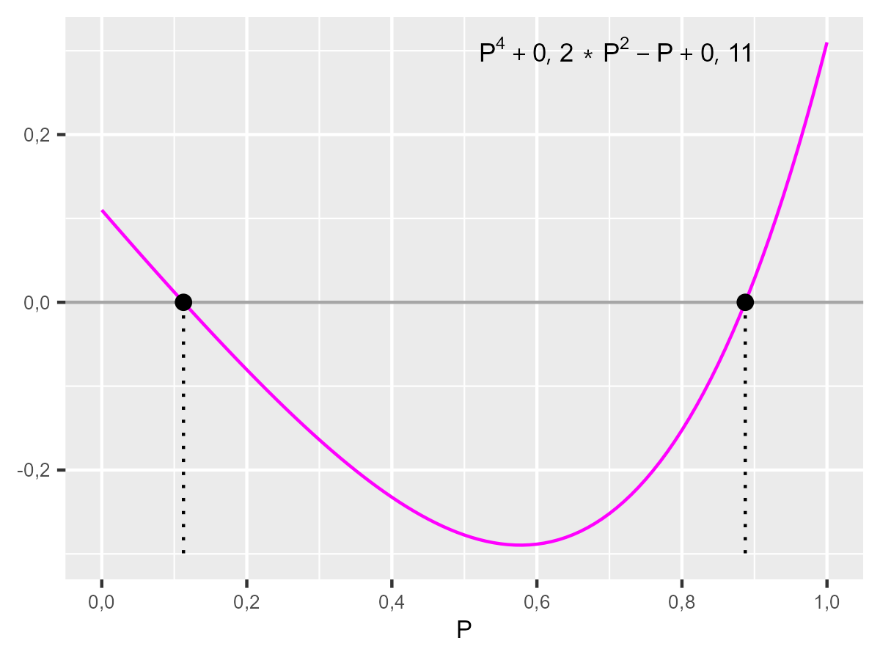
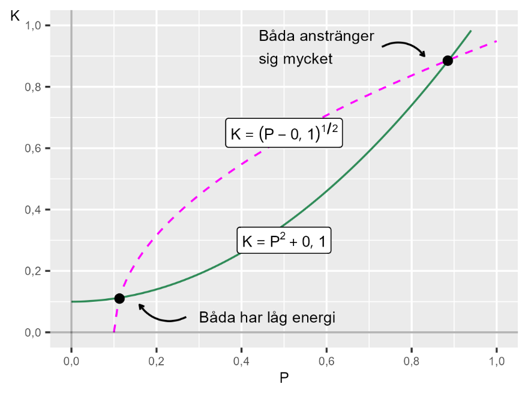

# Relationer {#k1-3-6}

### Pushtex
Detta avsnitt beskriver hur vi kan använda matematiken för att beskriva nära relationer.
### Begrepp
*Inga nya matematiska begrepp i detta avsnitt.*
### Teori
Säg nu att Kim (från [avsnitt 3.2](https://www.dropbox.com/scl/fi/chd3jmpg1wg7lygvgdf1r/3-2-Hur-hitta-den-r-tta.docx?rlkey=hpfajps1dzihyoqroxgxaawuh&dl=0))har hittat en partner och vill arbeta för att få sin relation att fungera. Men Kim vill inte lägga ned mer arbete på relationen än vad Kims partner gör. Partnern känner detsamma och vill inte heller engagera sig om inte Kim gör det. Detta kan vi beskriva med hjälp av ett ickelinjärt ekvationssystem:
$\left\{ \begin{array}{r} K = P^{2} + 0,1 \\ P = K^{2} + 0,1 \end{array} \right.\ $ , där $K,P \in \lbrack 0,1\rbrack$ (1)
där *K* och *P* symboliserar Kim och Kims partner och 0,1 är en konstant som symboliserar hur mycket arbete de är beredda att lägga ned oavsett hur mycket den andra anstränger sig. Både $K$ och $P$ måste vara inom intervallet \[0,1\].
Från den nedre ekvationen löser vi ett uttryck för $K = (P - 0,1)^{\frac{1}{2}}\ $. Nu har vi två definitioner av *K* som vi kan sätta lika med varandra:
$(P - 0,1)^{\frac{1}{2}} = P^{2} + 0,1$ (2)
$P - 0,1 = \left( P^{2} + 0,1 \right)^{2}$
$P - 0,1 = P^{4} + 2*0,1*P^{2} + (0,1)^{2}$
När vi kvadrerar båda sidor av en ekvation kan vi få falska rötter. Därför måste alla lösningar verifieras genom att sättas tillbaka i originalekvationen.
Vi har nu fått följande fjärdegradspolynom:
$P^{4} + 0,2P^{2} - P + 0,11 = 0$ (3)
Härifrån kan vi fortsätta med att pröva rationella rötter eller olika värden för *P* och se om vi kan hitta en första rot. Därefter kan vi arbeta vidare med polynomdivision. Vi prövar $P = 0$, $P = \frac{1}{2}$ samt $P = 1$:
För $P = 0:$ $0 + 0 - 0 + 0,11 = 0,11 \neq 0$
För $P = \frac{1}{2}:$ $\left( \frac{1}{2} \right)^{4} + 0,2\left( \frac{1}{2} \right)^{2} - \frac{1}{2} + 0,11 = - 0,2775 \neq 0$
För $P = 1:$ $1 + 0,2 - 1 + 0,11 = 0,31 \neq 0$
Ingen av dessa var en lösning, men notera hur resultaten för polynomet är positivt för $P = 0$ och $P = 1$, men negativt för $P = \frac{1}{2}$.
Detta innebär att det bör finnas ett eller flera värden för P mellan dessa värden som resulterar i att polynomet blir lika med 0. Det bör finnas en lösning för P mellan 0 och $\frac{1}{2}$ samt ytterligare en lösning mellan $\frac{1}{2}$ och 1.
#### Illustrerat med två diagram
En annan metod är att rita upp ett diagram för funktionerna i fråga, antingen för hand eller med hjälp av datorn. Figur 1 illustrerar linjen för fjärdegradspolynomet i ekvation 3. Linjen passerar 0 där *P* är strax över 0,1 och strax under 0,9. Detta illustrerar det vi såg i beräkningarna för $P = 0,\frac{1}{2}\ \text{och}\ 1$.
Samma nollpunkter syns i figur 2 där de två ekvationerna i ekvationssystemet i ekvation 1 är illustrerade. Det finns två lösningar till systemet: en lösning med relativt låga värden där både Kim och partnern anstränger sig relativt lite för att få att relationen att fungera, samt en lösning där båda anstränger sig mycket. Lösningarna på systemet är $K_{1} = P_{1} \approx 0,11$ och $K_{2} = P_{2} \approx 0,89$.
Vi kontrollerar att lösningarna uppfyller ekvationssystemet i ekvation 1 och ligger inom det tillåtna intervallet \[0, 1\]:
För P ≈ 0,11: K = (0,11)² + 0,1 = 0,0121 + 0,1 = 0,1121 ≈ 0,11
För P ≈ 0,89: K = (0,89)² + 0,1 = 0,7921 + 0,1 = 0,8921 ≈ 0,89

**Figur 1. Linjen för fjärdegradspolynomet i ekvation 3**

{style="width:4in;height:3in"}

**Figur 2. De två jämvikterna i Kims relation.**

{style="width:4in;height:3in"}

::: {.ex-section-title}
Övningar
:::

