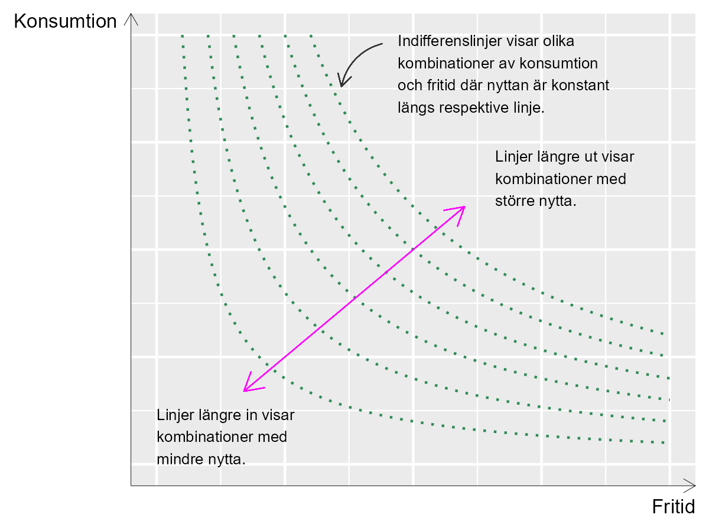
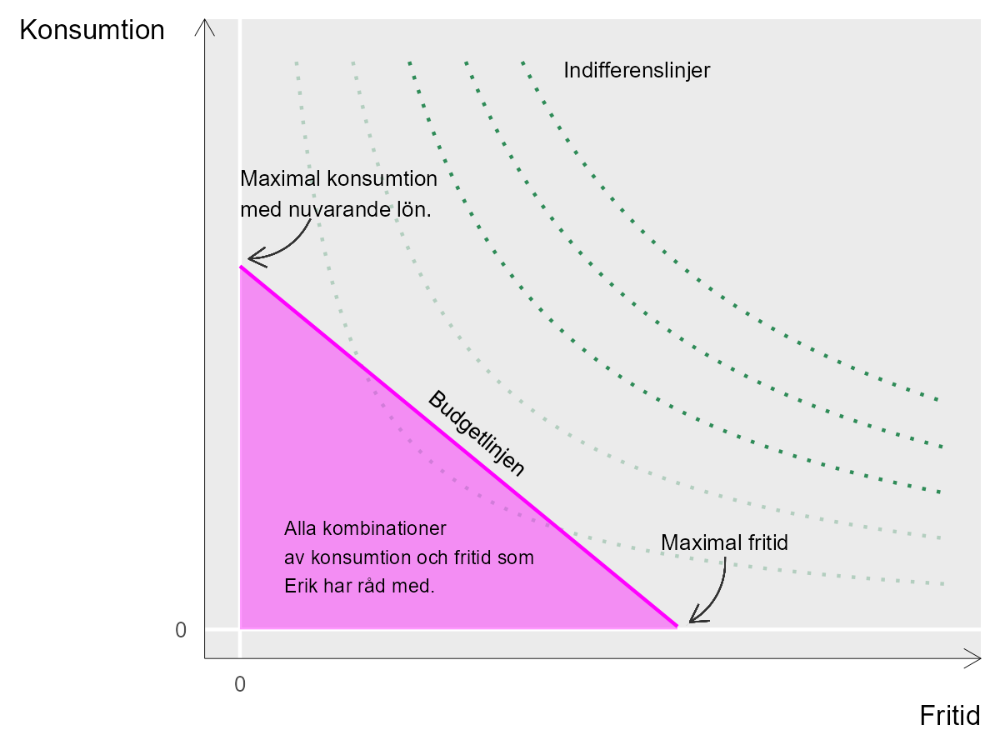

# Hur mycket jobb är lagom? {#k1-4-2}

### Begrepp
- **Nytta (engelska *utility*):** Betyder ungefär nöjdhet.
- **Nöjdhetsfunktion, nyttofunktion:** Matematisk funktion som beskriver hur en eller flera variabler påverkar en persons nöjdhet (nytta).
- **Budgetfunktion:** Beskriver tillgängliga resurser och avgränsar därigenom möjliga alternativ.
- **Indifferenslinje:** En linje som beskriver olika mängder av två produkter (variabler), där varje kombination ger samma nöjdhet för en aktör.
### Teori
Exemplet med tårta i föregående avsnitt är en abstrakt illustration av hur en individ måste välja rätt mängd av något för att få bästa möjliga resultat. Nu ska vi titta på ett liknande exempel men kanske med tydligare koppling till samhällsvetenskap.
### Nyttomaximering
Säg att Erik ska maximera sin *nöjdhet*, N (kallas på engelska för [*utility*](https://en.wikipedia.org/wiki/Utility), ungefär *nytta*). I detta exempel väljer vi att avgränsa oss till två fenomen som bestämmer *N* och dessutom står i motsättning till varandra, vilka båda påverkar hur nöjd Erik är. Eriks nöjdhet maximeras genom en avvägning av följande två fenomen:
1.  Eriks köp av varor och tjänster, vilket finansieras genom arbete. Detta fenomen kallar vi *C*.
2.  Eriks lediga tid, vilket vi betecknar *L*.
Eriks nyttomaximering kan därför beskrivas som ett val mellan arbete (*C*) och fritid (*L*). Vilken effekt *C* och *L* har på Eriks nöjdhet beskriver vi med följande funktion:
$N = u(C,L) = C^{\frac{1}{2}}L^{\frac{1}{2}},\ \ \ \ \text{där}\ C,L \> 0$ (1)
där nöjdheten *N* förklaras av nöjdhetsfunktionen $u\ (\ )$ med de ingående variablerna *C* och *L*. Båda variablerna kan enbart anta positiva värden, eftersom Erik inte kan ha negativ konsumtion eller fritid. Han måste åtminstone sova lite.
Exponenterna för *C* och *L*, bråket $\frac{1}{2}$ , beskriver hur mycket *N* ökar då respektive variabel förändras med en enhet. Alltså en krona extra konsumtion eller en extra timme ledigt.
### Maximal nöjdhet
Frågan är nu vid vilka mängder av *C* och *L* som Eriks nöjdhet *N* maximeras. För att bättre förstå nöjdhetsfunktionen (nyttofunktionen) kan vi börja med att illustrera det teoretiska sambandet, vilket visas i figur 1. Det tvådimensionella diagrammet visar tre variabler: *C*, *L* och *N*.
De två axlarna i diagrammet, horisontella och vertikala axeln, mäter konsumtion och fritid. Högre upp längs vertikala axeln = mer konsumtion. Längre till höger längs med horisontell axeln = mer fritid. Varje böjd linje representerar ett värde för *N*.
De böjda linjerna i diagrammet kallas för *indifferenslinjer*. Vid olika indifferenslinjer är mängden nytta olika. Men längs med varje indifferenslinje är nöjdheten densamma för olika kombinationer av *C* och *L*. Denna teori innebär att Erik är *indifferent* till exakt vilken kombination av C och L det blir, så länge vi är kvar på samma linje.
Erik kan acceptera mindre fritid så länge han kan kompensera med större konsumtion, uppe till vänster i diagrammet, och mindre konsumtion om han kan kompensera med mer fritid. Linjerna längre bort från nollpunkten, origo, representerar kombinationer av konsumtion och fritid som sammantaget resulterar i större nytta.
**Figur 1. Olika kombinationer av C, L och N.**{style="width:4.89431in;height:3.67073in"}
::: {.fig-caption}
Förklaring: Konsumtion mäts på vertikala axeln. Fritid mäts på horisontella axeln. Nere i vänstra hörnet är mängden konsumtion och fritid noll. Längre upp till höger i diagrammet är mängden konsumtion och fritid större. Indifferenslinjerna visar olika kombinationer av konsumtion och fritid, där mängden nytta för Erik är densamma längs respektive linje. Olika indifferenslinjer representerar olika mängd nytta. []{.mark}
:::

### Budgetfunktionen
Eriks konsumtion och fritid begränsas även av Eriks budget, som bestäms av dels hur mycket han väljer att arbeta, dels hans lön. Detta villkor kan beskrivas med följande *budgetfunktion*:
$C = w(T - L) = wT - wL$ (2)
där *w* är lön, *T* är totalt tillgänglig vaken tid och *L* är fortfarande ledig tid. Parentesen $(T - L)$ beskriver hur mycket ledig tid Erik avstår och i stället lägger på arbete och därigenom får lön. Ju högre lön, desto mindre fritid behöver offras för att konsumera samma mängd varor och tjänster.
Budgetfunktionen kan användas för att rita en rak linje i diagrammet med indifferenslinjerna. Figur 2 illustrerar budgetlinjen och indifferenslinjer. De två axlarna är konsumtion *C* och fritid *L*.
Om Erik spenderade all tillgänglig tid till arbete, $L = 0$, skulle $C = wT$, en punkt längs med den vertikala axeln, konsumtion. Detta är den maximala mängden konsumtion som Erik kan uppnå, givet nuvarande lön. Linjen lutar negativt ned mot horisontella axeln.
Vi kan tänka oss att budgetlinjen börjar på den horisontella axeln vid punkten för maximal fritid (noll konsumtion). Linjens lutning upp mot vertikala axeln bestäms av lönen *w*. Budgetfunktionen kan därför skrivas ut som ett rakt diagonalt streck. Högre lön ger en brantare linje och möjliggör större konsumtion (ett högre maxvärde på vertikala axeln).
**Figur 2. Budgetlinjen och indifferenslinjer**{style="width:4.98718in;height:3.74038in"}
::: {.fig-caption}
Förklaring: Indifferenslinjerna är fortfarande illustrationer av kombinationer av fritid och konsumtion som ger samma mängd nytta längs med respektive linje. Budgetlinjen illustrerar vad Erik har råd med för konsumtion och fritid. Alla kombinationer av konsumtion och fritid innanför budgetlinjen har Erik råd med.
:::

#### Budgetlinjens relation till indifferenskurvorna
Ju längre bort från origo (noll konsumtion och noll fritid) som budgetlinjen ligger, desto mer kan Erik konsumera. Alla kombinationer av konsumtion och fritid, *C* och *L*, innanför budgetlinjen har Erik råd med.
Givet att Erik vill maximera sin nöjdhet och denna fungerar på det sätt som den beskrivs i nöjdhetsfunktionen kommer Erik att välja en kombination av konsumtion och fritid där en av indifferenslinjerna precis *tangerar* budgetlinjen.
Så länge Erik har samma inkomst, samma budgetlinje, och Eriks nöjdhet kan beskrivas som den görs i nöjdhetsfunktionen, samma form på indifferenslinjerna, är detta det enda logiska resultatet.
**Varför väljer han inte en punkt innanför budgetlinjen?** Vid varje punkt innanför budgetlinjen, den gråa ytan i figur 2, finns det en annan punkt längre bort från origo där Erik kan få en större mängd nytta.
**Varför väljer han inte en annan punkt längs med budgetlinjen?** Vid varje punkt på budgetlinjen närmare vertikala eller horisontella axeln kommer Eriks nöjdhet i stället att definieras av en annan indifferenslinje som i sin tur är närmare origo, vilket därmed innebär mindre mängd total nytta.
### Maximeringsproblemet
Låt oss nu ställa upp Eriks maximeringsproblem:
$\max_{m.h.t\ \ C,L}{C^{\frac{1}{2}}L^{\frac{1}{2}}}$ (3)
under villkoret $C \leq w(T - L)$
Detta löser vi genom att ställa upp Lagrangefunktionen:
$\mathcal{L}(C,L):\ C^{\frac{1}{2}}L^{\frac{1}{2}} + \lambda(wT - wL - C)$ (4)
Vi tar derivatan av $\mathcal{L}$ med hänsyn till C respektive L:
> $\mathcal{L}_{C}\':\frac{1}{2}C^{- \frac{1}{2}}L^{\frac{1}{2}} - \lambda$ (5)
>
> $\mathcal{L}_{L}\':\frac{1}{2}C^{\frac{1}{2}}L^{- \frac{1}{2}} - \lambda w$
Från $\mathcal{L}_{L}\'$ löser vi för $\lambda$:
$\lambda = \frac{1}{w}\frac{1}{2}C^{\frac{1}{2}}L^{- \frac{1}{2}}$ (6)
Denna definition av $\lambda$ sätter vi in i förstagradsvillkoret vi fick från $\mathcal{L}_{C}\'$:
$\frac{1}{2}C^{- \frac{1}{2}}L^{\frac{1}{2}} = \frac{1}{w}\frac{1}{2}C^{\frac{1}{2}}L^{- \frac{1}{2}}$ (7)
$w = \frac{\frac{1}{2}C^{\frac{1}{2}}L^{- \frac{1}{2}}}{\frac{1}{2}C^{- \frac{1}{2}}L^{\frac{1}{2}}}$
Denna ekvation visar hur lön *w* hänger ihop med Eriks värdering av konsumtion *C* och fritid *L* vid den punkt som maximerar Eriks nöjdhet *N*. I täljaren har vi förstaderivatan av nöjdhetsfunktionen med hänsyn till *L*, det vill säga $u_{L}\'$.
I nämnaren har vi förstaderivatan av nöjdhetsfunktionen med hänsyn till *C*, vilket vi skriver som $u_{C}\'$. Vi kan därför skriva om denna ekvation till:
$w = \frac{u_{L}\'}{u_{C}\'}$ (8)
Detta innebär precis det vi gick igenom ovan, att den nyttomaximerande punkten på budgetlinjen är den där en av de böjda indifferenslinjerna tangerar budgetlinjen. I denna punkt är lutningen på budgetlinjen som bestäms av *w*, samma som lutningen på den indifferenslinje som tangerar budgetlinjen, vilken bestäms av nöjdhetsfunktionens form.

::: {.ex-section-title}
Övningar
:::

---

::: {.next-section-link}
[→ Nästa avsnitt: **Hur höga skatter vill vi ha?**](k1-4-3.html)
:::

