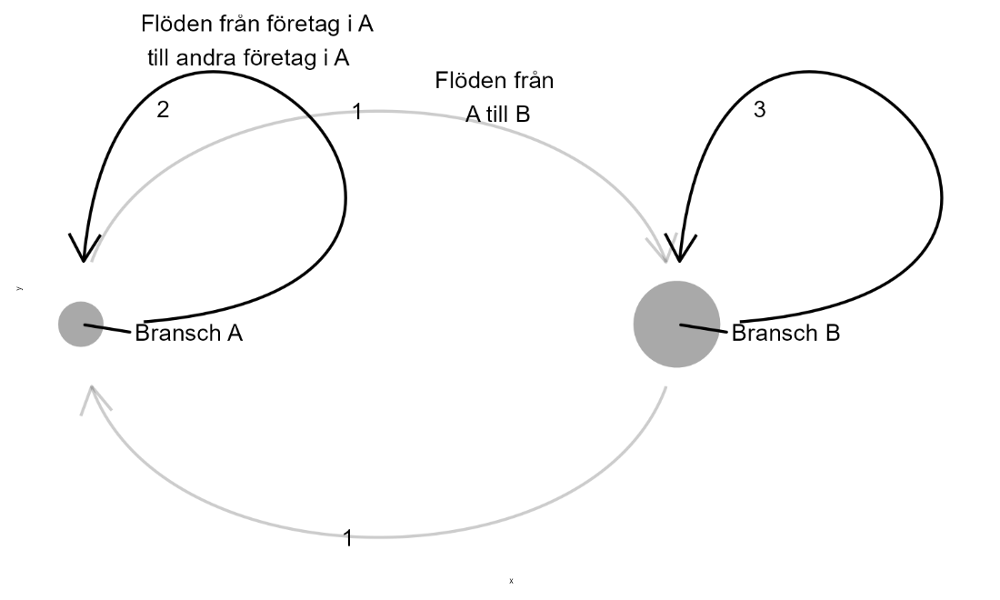

# Nätverksanalys {#k1-4-5}

### Begrepp
- **Nätverk:**
- **Input-output:**

### Teori
I detta avsnitt ska vi använda linjär algebra för att beskriva ett nätverk av företag i olika branscher som handlar med varandra. För detta kan vi använda det som kallas för [*input-output-*analys](https://en.wikipedia.org/wiki/Input%E2%80%93output_model) (IO).
IO-analys utgår från en beskrivning av in- och utflödet (input och output) av varor och tjänster mellan olika branscher. Samma matematiska metoder kan användas för att beskriva och resonera om andra typer av nätverk, som till exempel ett nätverk av vänner.
Vi kan även lägga till annan information till våra matriser och beräkna andra mekanismer. Input-output-analys används bland annat för att beskriva hur en produktionskedja påverkar och påverkas av andra delar av ekonomin.
Till exempel hur förändringar för företagen i en del av ekonomin kan påverka mängden jobb i andra branscher. Eller vilken klimatpåverkan som företagen i en bransch har indirekt genom deras handel med andra företag och branscher.
Dessa metoder har en lång historia men började framför allt spridas inom samhällsvetenskap under 1920-talet, tack vare bland andra nationalekonomen [Wassily Leontief](https://en.wikipedia.org/wiki/Wassily_Leontief).

#### Ett exempel med siffror
Tabell 1 visar ett exempel på en IO-tabell med de två branscherna A och B. Respektive bransch har en egen rad och en egen kolumn. Siffrorna i tabellen visar värdet av den produktion som levereras till respektive bransch samt till slutkonsumtion hos hushåll och offentlig sektor.
I raden för bransch A visar siffrorna värdet av den produktion som A säljer till andra företag i samma bransch (värdet 2) och till företag i bransch B (värdet 1). Den fjärde kolumnen beskriver mängden produktion till slutkonsumtion medan den femte kolumnen summerar kolumn 2--4.

**Tabell 1. Input och output från och till företagen i de två branscherna A och B.**

<table class="table table-bordered" style="width:82%;">
<colgroup>
<col style="width: 16%" />
<col style="width: 16%" />
<col style="width: 16%" />
<col style="width: 17%" />
<col style="width: 16%" />
</colgroup>
<thead>
<tr>
<th style="text-align: right;">
Till

Från
</th>
<th>Bransch A</th>
<th>Bransch B</th>
<th>Slutkonsumtion</th>
<th>Summa</th>
</tr>
</thead>
<tbody>
<tr>
<td>Bransch A</td>
<td>\(2\)</td>
<td>\(1\)</td>
<td>\(3\)</td>
<td>\(6\)</td>
</tr>
<tr>
<td>Bransch B</td>
<td>\(1\)</td>
<td>\(3\)</td>
<td>\(3\)</td>
<td>\(7\)</td>
</tr>
<tr>
<td>Summa</td>
<td>\(3\)</td>
<td>\(4\)</td>
<td>\(6\)</td>
<td>\(13\)</td>
</tr>
</tbody>
</table>

::: {.fig-caption}
Förklaring: På raden för bransch A ser vi mängden produktion av varor och tjänster från (output) företagen i bransch A till andra företag i bransch A, företag i bransch B samt till hushållen som står för slutkonsumtion. I kolumnen för bransch A ser vi mängden insatsvaror (input) som företagen i bransch A erhåller från andra företag i bransch A och B. I kolumnen längst till höger ser vi radsumma och i raden längst ned ser vi kolumnsumma.
Informationen i tabell 1 kan vi använda för att beräkna hur förändrad produktion i en del av samhällsekonomin påverkar övriga delar. Vi börjar med att placera tabellens värden i matriser. Vi samlar flödena till och från branscherna i en $2 \times 2$ matris Z (flödesmatrisen), slutkonsumtion i kolumnmatris C och summan i sista kolumnen i kolumnmatris S:
:::

$$Z = \begin{bmatrix} 2 & 1 \\ 1 & 3 \end{bmatrix},\ \ C = \begin{bmatrix} 3 \\ 3 \end{bmatrix},\ \ S = \begin{bmatrix} 6 \\ 7 \end{bmatrix} \tag{1}$$

Flödena till och från branscherna, som beskrivs i Z, kan vi dividera med respektive bransch totala produktion, matris S. Detta kan vi beskriva som:

$$a_{ij} = \frac{y_{ij}}{y_{j}} \tag{2}$$

där $y_{ij}$ är produktion från bransch *i* som levereras till bransch *j*, medan $y_{j}$ är den produktion som bransch *j* producerar. För varje värde i matris *Z* kan vi beräkna ett värde $a_{ij}$ och samla i en 2 × 2 matris A.

#### Räkna med matriser
För att göra denna beräkning med matriser beräknar vi först den multiplikativa inversen av varje element i S, det vill säga placerar värdena som nämnare i varsitt bråk med täljaren 1. Bransch A får $\frac{1}{6}$ och bransch B $\frac{1}{7}$. Dessa värden samlar vi i en kolumnmatris $S_{m}$ och placerar i en diagonalmatris, vilket vi kan beskriva som $diag(S_{m})$:

$$diag\left( S_{m} \right) = \begin{bmatrix} \frac{1}{6} & 0 \\ 0 & \frac{1}{7} \end{bmatrix} \tag{3}$$

För att beräkna A matrismultiplicerar vi nu Z med $diag\left( S_{m} \right)$:
$A = Z*diag\left( S_{m} \right)$ (4)$ $${= \begin{bmatrix} 2 & 1 \\ 1 & 3 \end{bmatrix}\begin{bmatrix} \frac{1}{6} & 0 \\ 0 & \frac{1}{7} \end{bmatrix} }{= \begin{bmatrix} \frac{2}{6} & \frac{1}{7} \\ \frac{1}{6} & \frac{3}{7} \end{bmatrix}}$
För varje bransch *j* kan vi definiera totalproduktion $y_{j}$ som summan av insatsproduktion till alla branscher plus produktion till slutkonsumtion, vilket i detta fall blir:

$$y_{j} = a_{j1}y_{y} + a_{j2}y_{2} + c_{j} \tag{5}$$

där $a$ är vikterna vi definierade i ekvation 2, $y_{1}$ är totalproduktionen från bransch 1 och $y_{2}$ är totalproduktion från bransch 2, eller bransch A och B som vi kallade dem.
Vi vet inte värdena för $y_{j}$ än men vi kan beräkna det med hjälp av matriserna. Vi samlar elementen av totalproduktion i kolumnmatris $Y$ och kan nu beskriva $Y$ som:
$Y = AY + C$ (6)$ $${Y - AY = C }{IY - AY = C }{(I - A)Y = C }{Y = (I - A)^{- 1}C}$
Identitetsmatris *I* har samma dimensioner som *A*. Kolumnmatris *Y* beskriver hur mycket produktion som krävs från respektive bransch till företagen i samma och andra branscher samt till slutkonsumtion:

$$Y = (I - A)^{- 1}C = \begin{bmatrix} \frac{8}{5} & \frac{2}{5} \\ \frac{7}{15} & \frac{28}{15} \end{bmatrix}\begin{bmatrix} 3 \\ 3 \end{bmatrix} \approx \begin{bmatrix} 6 \\ 7 \end{bmatrix} \tag{7}$$

Detta resultat är konsistent med tabell 1, där vi ser att bransch A producerar totalt 6 enheter och bransch B producerar totalt 7 enheter. Detta visar hur mycket bransch A och B måste producera totalt för insatsvaror och slutkonsumtion. Vi kallar den inverterade matrisen för $B = (I - A) - 1$. Matris *B* har samma dimensioner som matris *A*.

#### Produktions- och insatsmultiplikatorerna
Låt oss beräkna *B* med värdena från tabell 1:
$B = (I - A)^{- 1}$ (8)$ $${= \left( \begin{bmatrix} 1 & 0 \\ 0 & 1 \end{bmatrix} - \begin{bmatrix} \frac{2}{6} & \frac{1}{7} \\ \frac{1}{6} & \frac{3}{7} \end{bmatrix} \right)^{- 1} }{= \begin{bmatrix} \frac{4}{6} & - \frac{1}{7} \\ - \frac{1}{6} & \frac{4}{7} \end{bmatrix}^{- 1} }{= \begin{bmatrix} \frac{8}{5} & \frac{2}{5} \\ \frac{7}{15} & \frac{28}{15} \end{bmatrix}\ }$
Om vi nu i matris $B$ beräknar summan av en kolumn för en bransch $j$ får vi den totala mängden produktion för alla branscher som skulle krävas om slutkonsumtionen för bransch $j$ skulle öka med en enhet. Detta visar hur mycket andra branscher måste leverera i insatsvaror till branschen $j$. Detta mått kallas i det här sammanhanget för *produktionsmultiplikator*.
Om vi för matris $B$ beräknar summan av en rad för en bransch $j$ i matris $B$ får vi ett mått på hur mycket extra produktion totalt i samhället som möjliggörs om branschen $j$ ökar sin produktion av insatsvaror med en enhet. Detta kallas för *insatsmultiplikator*.

#### Illustrera nätverk i diagram
Figur 1 visar ett exempel på hur detta kan illustreras i ett *nätverksdiagram*. Punkterna beskriver de två branscherna A och B och pilarna beskriver flödena till och från de två branscherna. Värdena vid respektive pil representerar värdena i tabell 1.
Punkternas storlek representerar respektive branschs totala produktion, kolumnen längst till höger i tabellen. I diagrammet har vi inte tagit med någon illustration över den produktion som branscherna skickar till slutkonsumtion.

**Figur 1. Ett nätverk med de två branscherna A och B.**

::: {.fig-caption}
Förklaring: In- och utflöden från och till de två branscherna A och B. Flödena beskrivs i tabell 1.
:::

::: {.ex-section-title}
Övningar
:::

