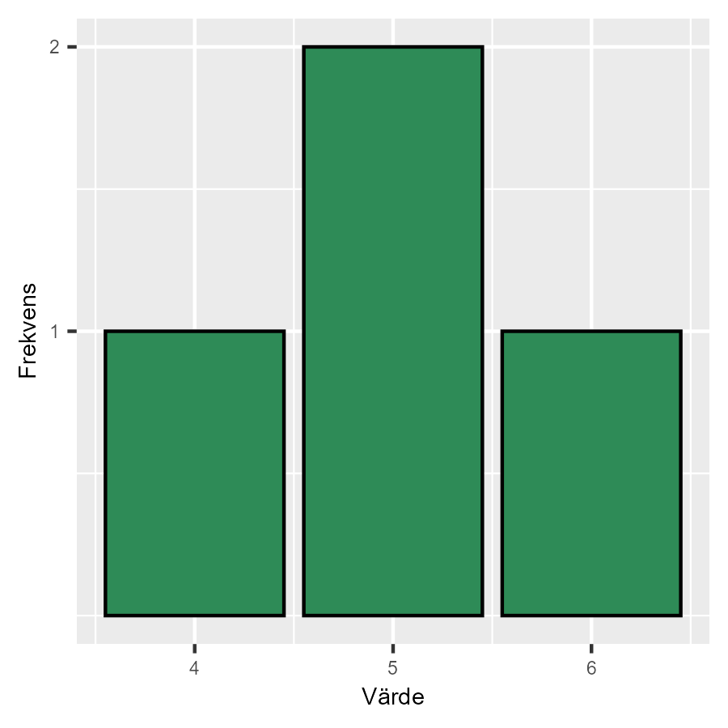
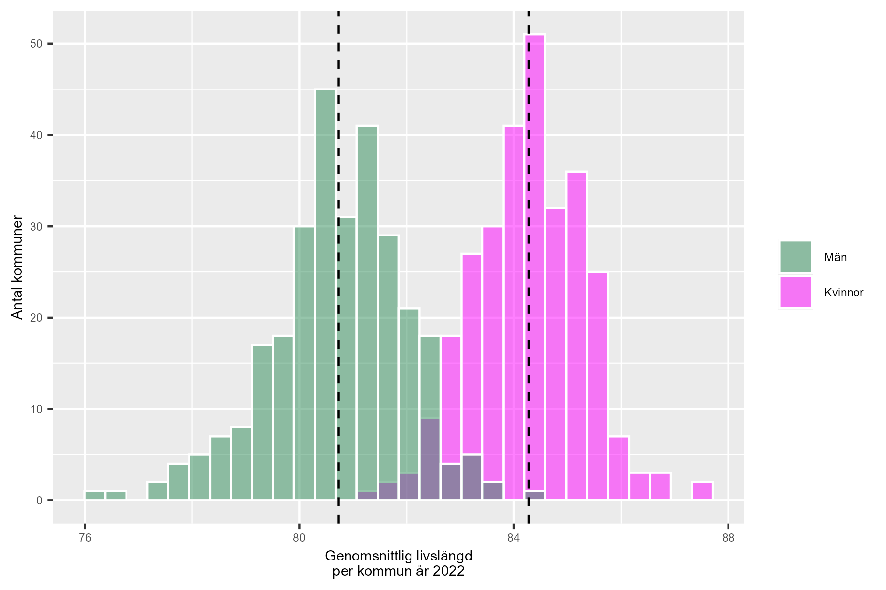

# Frekvens och fördelning {#k2-2-1}

### Begrepp
- **Frekvensfördelning:** Antal observationer (frekvens) som förekommer av varje unikt värde i ett material.
- **Stapeldiagram:** Diagram där staplar representerar värden, till exempel mängder.
- **Histogram:** En typ av stapeldiagram som ofta används för att redovisa spridning och fördelning. Varje stapel i ett histogram representerar ofta ett intervall av värden.
- **Populationens medelvärde:** Medelvärdet för populationen av variabeln *X* kan skrivas $\mu_{X}$. Detta värde kan vi endast vara säkra på att vi känner till om vi har tillgång till fullständigt korrekta data över hela populationen. I samhällsvetenskap arbetar vi i regel med urvalsdata.
- **Uppskattat medelvärde:** Det medelvärde vi kan beräkna med urvalsdata. Detta ger oss en uppskattning av populationens medelvärde. För en variabel *X* kan detta skrivas $\overline{X} = \sum_{i}^{}{x_{i}/n}$.

### Teori
I kapitel 1 i denna kurs introducerade vi kontrafaktisk analys som central metod för analytiskt arbete och vetenskap. Vi diskuterade begreppen population, urval och superpopulation. Och i [avsnitt 1.2](https://www.dropbox.com/scl/fi/9jy8vypqisanjkto7wr3v/1-2-Experiment-och-observationsstudie.docx?rlkey=4xhcwh8s17u66tholxgf5qdaa&dl=0) repeterade vi betydelsen av samvariation och hur detta är vad vi egentligen studerar när vi försöker fastställa om ett fenomen orsakar ett annat fenomen.

#### Frekvensfördelning
För att studera samvariation mellan variabler måste observationer ha olika värden, det måste förekomma variation inom variablerna. Säg att vi som exempel har tio observationer för variablerna x och y och alla observationerna har värdena $(x,\ y) = (5,\ 23)$. Det finns ingen variation inom vare sig x eller y. Variablerna kan därför inte heller samvariera.
Ett sätt att studera spridning av värden är att kartlägga *frekvensfördelningen* av en variabel. Säg att vi har följande fyra värden: 4, 5, 5 och 6. Siffran 5 förekommer två gånger. Se även Mattebokens lektioner om [lägesmått](https://www.matteboken.se/lektioner/matte-2/statistik/lagesmatt#!/) och [kvartiler](https://www.matteboken.se/lektioner/matte-2/statistik/kvartiler-och-ladagram#!/).
Ett sätt att visa spridningen i en samling värden är *stapeldiagram*, ett diagram där frekvensen av respektive värde redovisas med staplar. Figur 1 visar frekvensfördelningen för de fyra värdena.

**Figur 1: Stapeldiagram**

****

::: {.fig-caption}
Förklaring: På den horisontella axeln ser vi respektive värde i datamängden: 4, 5 och 6. Staplarna visar antal förekomster av respektive värde: en observation har värdet 4, två observationer har värdet 5 och en observation har värdet 6.
:::

#### Förväntad livslängd i Sveriges 290 kommuner
Ett histogram är en form av stapeldiagram där varje stapel representerar ett intervall av värden. Histogram används ofta för att ge en överblick över spridningen av värdena i en variabel. Se även Mattebokens introduktion till [histogram](https://www.matteboken.se/lektioner/matte-1/statistik-och-sannolikhet/tolka-diagram#!/).
Figur 2 visar ett histogram som illustrerar fördelningen av genomsnittlig livslängd för kvinnor respektive män i Sveriges kommuner år 2022, med ett genomsnittsvärde per kommun och kön. Det är 290 observationer för män samt 290 observationer för kvinnor. På den horisontella axeln visas ålder och på den vertikala axeln visas antal observationer.
Vi kan se i diagrammet att kvinnor i genomsnitt lever längre än män, eftersom staplarna för kvinnor befinner sig mer till höger i diagrammet. Stapeln längst till höger i diagrammet visar att det finns en kommun där den genomsnittliga livslängden för kvinnor detta år var cirka 87 år.
Stapeln längst till vänster i diagrammet visar att det finns två kommuner där den genomsnittliga livslängden för män är cirka 77 år.
De streckade vertikala linjerna visar genomsnitt för alla observationerna i respektive grupp. Dessa streckade linjer sammanfaller även med den högsta stapeln i respektive grupp. Detta illustrerar att det vanligaste värdet bland kommunerna är ett värde nära respektive medelvärde.
Diagrammet illustrerar att kön i någon utsträckning samvarierar med livslängd, eftersom kvinnor i genomsnitt lever längre. Diagrammet säger ingenting om varför det är så.

**Figur 2: Genomsnittlig livslängd i Sveriges kommuner**

::: {.fig-caption}
Förklaring: Data från [Kolada](https://www.kolada.se/). De gröna staplarna visar fördelningen av medellivslängd för män i respektive kommun i Sverige år 2022. De rosa staplarna visar för kvinnor. De streckade vertikala linjerna markerar medelvärden för respektive grupp.
:::

#### Uppskattat medelvärde
Medelvärde är en form av lägesmått. Se gärna Mattebokens introduktion till [lägesmått](https://www.matteboken.se/lektioner/matte-2/statistik/lagesmatt#!/), som medelvärde, median och typvärde. Nu ska vi börja beskriva hur vi kan tänka på medelvärde och andra mått med hänsyn till population och urval.
I tidigare avsnitt gick vi igenom hur populationen representerar den mängd vi vill studera. Urval är en mindre delmängd av populationen som vi har data på. Värdena för populationen är ofta okända, varför vi använder urvalsdata för att uppskatta dessa. Ordet "uppskattar" syftar på att vi använder metoder för att beräkna resultat, men att dessa resultat är mer eller mindre osäkra.
Om vi har tillgång till populationsdata för en variabel *X* är också så klart medelvärdet känt. För att markera detta brukar populationens medelvärde skrivas som $\mu_{X}$ (där $\mu$ är den grekiska bokstaven mu). Vi markerar $\mu$ med *X* eftersom det är medelvärdet för just denna variabel.
Men ofta arbetar vi med urvalsdata och det medelvärde vi då beräknar är, per definition, en uppskattning av populationens medelvärde. Vårt uppskattade medelvärde betecknas då  $\overline{X}$:

$$\overline{X} = \frac{\sum_{i}^{}x_{i}}{n} \tag{1}$$

där täljaren $\sum_{i}^{}x_{i}$ innebär summan av alla observerade värden (i vår urvalsdata) för variabeln *X*. Bokstaven *i* betyder observation nummer *i*. Bokstaven *n* syftar på antal observationer i vårt urval. Uttrycket i ekvation 1 kallas för medelvärdets *estimator*. En funktion för att estimera (uppskatta) medelvärdet.
Ett sätt att studera spridningen i en variabel är att beräkna avstånd från medelvärdet. I populationen skrivs differensen mellan observation $x_{i}$ och medelvärdet $\mu_{X}$ som $x_{i} - \mu_{X}$.
Med urvalsdata tar vi $x_{i} - \overline{X}$. Summan av alla [differenser](https://www.matteboken.se/lektioner/skolar-7/tal-och-de-fyra-raknesatten/de-fyra-raknesatten) från medelvärdet $\sum_{i}^{}\left( x_{i} - \overline{X} \right)$ är alltid noll. Ett sätt att visa detta är följande:

$$\sum_{i}^{}\left( x_{i} - \overline{X} \right)\ = \sum_{i}^{}x_{i} - \sum_{i}^{}\overline{X} \tag{2}$$

> $= \sum_{i}^{}{x_{i} - n\overline{X}}$
>
> $= \sum_{i}^{}{x_{i} - n\frac{1}{n}\sum_{i}^{}x_{i}}$
>
> $= \sum_{i}^{}x_{i} - \sum_{i}^{}x_{i}$
>
> $= 0$

::: {.ex-section-title}
Övningar
:::

---

::: {.next-section-link}
[→ Nästa avsnitt: **Avvikelse, varians och standardavvikelse**](k2-2-2.html)
:::

