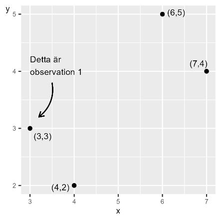

# Samvariation 1 {#k2-2-3}

### Begrepp
- **Kovarians:** Ett mått på linjär samvariation mellan två variabler.
- **Korrelationskoefficienten:** Även kallat Pearsons r. En standardiserad form av kovarians. Kan endast anta värden mellan 1 och -1, där värde 1 är stark positiv korrelation och -1 är starkt negativ korrelation.

### Teori
I kapitel 1 till denna kurs introducerade vi betydelsen av kontrafaktisk analys och hur vi genom att studera samvariation kan diskutera orsak och verkan. I tidigare avsnitt har vi gått igenom olika exempel på hur vi kan beskriva och jämföra spridning och variation i ett material. I detta avsnitt ska vi introducera två mått på linjär samvariation: *kovarians och korrelationskoefficient*.

#### Kovarians
Kovarians (engelska *covariance*) är ett mått på linjär samvariation mellan två variabler, till exempel $x$ och $y$. För populationsdata har vi:

$$cov(x,y) = \frac{1}{n}\sum_{i}^{n}{(x_{i} - \overline{x})(y_{i} - \overline{y})} \tag{1}$$

Vårt mål är att uppskatta samvariationen i en population och eventuellt en superpopulation. Från vår population kan vi hämta ett urval av observationer som vi kan använda för att uppskatta (estimera) samvariationen.
I tidigare exempel har vi arbetat med population för en variabel. Eftersom vi nu är intresserade av samvariation består vår population av två variabler. Kovariansen mellan $x$ och $y$ i en population betecknas $\sigma_{xy}$ (jämför beteckningen för populationens varians $\sigma_{x}$).
Positiv kovarians innebär positiv samvariation: högre värden av $x$ är associerade med högre värden av $y$. Negativ kovarians innebär negativ samvariation, att högre värden av $x$ är associerade med lägre värden av $y$ och vice versa. Om kovariansen är lika med noll så finns ingen linjär samvariation mellan variablerna.
Det spelar ingen roll i vilken ordning vi skriver variablerna i parentesen: $cov(x,y) = cov(y,x)$. Om vi tar kovariansen för $x$ och samma variabel $x$, får vi variansen av $x$:

$$\text{cov}(x,x) = \left( \frac{1}{n} \right)\sum_{i}^{n}{(x_{i} - \overline{x})(x_{i} - \overline{x})} = \left( \frac{1}{n} \right)\sum_{i}^{n}\left( x_{i} - \overline{x} \right)^{2} = \text{var}(x) \tag{2}$$

I föregående avsnitt använde vi Bessels korrigering $\left( \frac{1}{n - 1} \right)$ för att undvika att underskatta spridningen i populationen alltför mycket. Även här kan vi av samma skäl använda korrigeringen. Detta ger oss det som kallas för *urvalskovarians* (engelska *sample covariance*):
**Urvalskovarians:** $cov(x,y) = \left( \frac{1}{n - 1} \right)\sum_{i}^{}{(x_{i} - \overline{x})(y_{i} - \overline{y})}$ (3)

#### Räkneexempel
Figur 1 beskriver våra fyra observationer i en tabell till vänster och ett diagram till höger. I tabellen har vi en observation per rad och en variabel per kolumn. I diagrammet är varje observation representerad av en punkt. Punkten längst till vänster är observation 1: $(x,y) = (3,3)$. Punkten längst till höger är observation 4: $(x,y) = (4,7)$.
Rad 1 i tabellen består av första värdet för $x$ respektive $y$ och representerar värden som på något sätt hänger ihop. Om vi arbetar med observerade data, insamlad information, representerar varje observation en observationsenhet, till exempel uppgifter om en person eller kanske ett land. Våra fyra observationer skulle alltså kunna representera fyra personer, fyra länder eller något annat.

**Figur 1. Fyra observationer för att uppskatta kovarians**

  -------------------------------------------------------------------------------------
  Observation i    $x_{i}$   $y_{i}$
  --------------- ---------------------------------- ----------------------------------
  1                               3                                  3
  2                               4                                  2
  3                               6                                  5
  4                               7                                  4
  -------------------------------------------------------------------------------------
I tabell 1 har vi beräknat de delar vi behöver för att skatta kovariansen mellan $x$ och $y$ (ekvation 3):

$$cov(x,y) = \left( \frac{1}{n - 1} \right)\sum_{i}^{}{\left( x_{i} - \overline{x} \right)\left( y_{i} - \overline{y} \right)} = \left( \frac{1}{3} \right) \times 5 = \frac{5}{3} \tag{4}$$

Vi finner att $cov(x,y) = \frac{5}{3}$. Detta värde är över 0 och innebär en positiv samvariation. Kovarians är användbart för att få en uppskattning om samvariationen mellan två variabler är positiv eller negativ, men det är svårt att säga så mycket mer än så.
Det finns inte några begränsningar för vilka värden som kovarians kan anta. Kovariansens värde beror på vilken enhet variablernas värden har. Till exempel kommer vi att få olika resultat beroende på om vi använder en variabel som beskriver inkomst i kronor eller i tusentals kronor.

**Tabell 1. Beräkningar för kovariansen mellan** $\mathbf{x}$ **och** $\mathbf{y}$

  ----------------------------------------------------------------------------------------------------------------------------------------------------------------------------------------------------------------------------------------------------------------------
  Observation    $x_{i}$   $y_{i}$   $x_{i} - \overline{x}$   $y_{i} - \overline{y}$   $(x_{i} - \overline{x})(y_{i} - \overline{y})$
  ------------- ---------------------------------- ---------------------------------- -------------------------------------------------- -------------------------------------------------- ----------------------------------------------------------------------------
  1                             3                                  3                                          -2                                                -0,5                                                             1
  2                             4                                  2                                          -1                                                -1,5                                                            1,5
  3                             6                                  5                                          1                                                 1,5                                                             1,5
  4                             7                                  4                                          2                                                 0,5                                                              1
  Medelvärde                    5                                 3,5                                                                                                                       
  Summa                                                                                                                                                                                                                          5
  ----------------------------------------------------------------------------------------------------------------------------------------------------------------------------------------------------------------------------------------------------------------------

#### Korrelationskoefficienten
Ett annat mått på linjär samvariation är *Pearsons r*, även kallat *Pearsons korrelationskoefficient* eller *korrelationskoefficienten* (jämför [Matte 1](https://www.matteboken.se/lektioner/matte-1/statistik-och-sannolikhet/korrelation-och-kausalitet#!/)). Korrelationskoefficienten för variablerna $x$ och $y$ betecknas för population $\rho_{xy}$ (grekiska rho):
Korrelationskoefficienten: $\rho_{xy} = \frac{\sigma_{xy}}{\sigma_{x}\sigma_{y}}$ (5)
där $\sigma_{xy}$ är kovariansen mellan $x$ och $y$ i populationen, och $\sigma_{x}$ och $\sigma_{y}$ är standardavvikelse i populationen för respektive variabel. Ett annat sätt att beskriva detta är att korrelationskoefficienten är *standardiserad* *kovarians*.
Korrelationskoefficienten kan endast anta värden mellan $- 1$ och 1, där $- 1$ innebär perfekt negativ korrelation och 1 innebär perfekt positiv korrelation. Om korrelationskoefficienten är lika med 0 indikerar detta att det inte finns någon linjär samvariation mellan variablerna.
Eftersom alla resultat för korrelationskoefficienten är inom intervallet $\lbrack - 1,1\rbrack$ är olika korrelationskoefficienter jämförbara. Om vi till exempel beräknar två korrelationskoefficienter för två olika par av variabler så kan vi jämföra samvariationens styrka och riktning.
Om vi arbetar med urvalsdata betecknas korrelationskoefficienten $r_{xy}$ eller $corr(x,y)$, förkortning för engelska *correlation*:

$$r_{xy} = \frac{cov(x,y)}{s_{x}s_{y}} \tag{6}$$

där vi i stället har uppskattad kovarians i täljaren och uppskattad standard­avvikelse för de två variablerna i nämnaren. De olika delarna i denna ekvation har vi definierat tidigare i detta kapitel. Vi skriver ut ekvationerna och lägger till Bessels korrigering:

$$r_{xy} = \frac{cov(x,y)}{s_{x}s_{y}} \tag{7}$$

$= \frac{\left( \frac{1}{n - 1} \right)\sum_{i}^{}{\left( x_{i} - \overline{x} \right)\left( y_{i} - \overline{y} \right)}}{\left( \frac{\sum_{i}^{n}\left( x_{i} - \overline{x} \right)^{2}}{n - 1} \right)^{\frac{1}{2}}\left( \frac{\sum_{i}^{n}\left( y_{i} - \overline{y} \right)^{2}}{n - 1} \right)^{\frac{1}{2}}}$
$= \frac{(n - 1)^{- 1}\sum_{i}^{n}{\left( x_{i} - \overline{x} \right)\left( y_{i} - \overline{y} \right)}}{(n - 1)^{- 1}\left( \sum_{i}^{n}\left( x_{i} - \overline{x} \right)^{2} \right)^{\frac{1}{2}}\left( \sum_{i}^{n}\left( y_{i} - \overline{y} \right)^{2} \right)^{\frac{1}{2}}}$
$= \frac{\sum_{i}^{n}{\left( x_{i} - \overline{x} \right)\left( y_{i} - \overline{y} \right)}}{\left( \sum_{i}^{n}\left( x_{i} - \overline{x} \right)^{2} \right)^{\frac{1}{2}}\left( \sum_{i}^{n}\left( y_{i} - \overline{y} \right)^{2} \right)^{\frac{1}{2}}}$
Eftersom Bessels korrigering ingår i alla tre måtten kan vi i sista raden stryka $(n - 1)^{- 1}$ från både täljare och nämnare.
Låt oss återigen demonstrera genom att uppskatta $r_{xy}$ för de två variablerna *x* och *y* och deras fyra observationer från figur 1. Vi återanvänder resultaten för kovarians ovan samt standardavvikelse för $x$ och $y$, vilket vi beräknade i föregående avsnitt:

$$r_{xy} = \frac{cov(x,y)}{s_{x}s_{y}} \approx \frac{\frac{5}{3}}{\left( + \sqrt{\frac{10}{3}} \right)\left( + \sqrt{\frac{5}{3}} \right)} \approx 0,71 \tag{8}$$

Detta resultat indikerar en positiv korrelation. Höga värden av $x$ sammanfaller med höga värden av $y$ och låga värden av $x$ sammanfaller med låga värden av $y$. Olika korrelationskoefficienter kan jämföras men det är fortfarande svårt att tolka denna typ av resultat mer exakt.

::: {.ex-section-title}
Övningar
:::

---

::: {.next-section-link}
[→ Nästa avsnitt: **Samvariation 2**](k2-2-4.html)
:::

