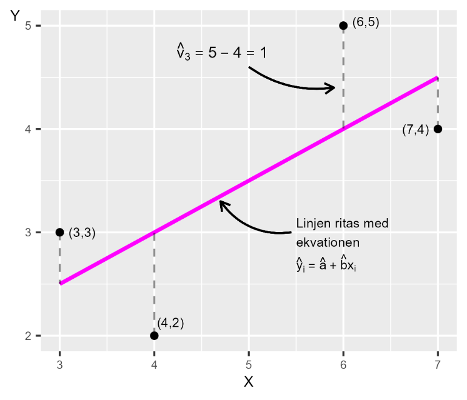

# Samvariation 2 {#k2-2-4}

### Begrepp
- **Regressionsanalys:** En statistisk metod för att studera samvariation mellan en beroende (förklarad) variabel och en eller flera oberoende (förklarande) variabler.
- **Regressionsmodell:** Matematisk modell som beskriver samvariationen (relationen) mellan en förklarad variabel och en eller flera förklarande variabler.
- **Minstakvadratmetoden:** En vanligt förekommande metod för linjär regressionsanalys. Genom att använda observerad data om variablerna kan minstakvadratmetoden användas för att skatta en regressionsmodells koefficienter.
- **Felterm:** Anger differenserna i populationen mellan respektive observations $Y$-värde och regressionslinjen.
- **Residual:** Uppskattade feltermerna, vilka vi skattar med våra urvalsdata.

### Teori
Under kurserna [Matte 1](https://www.matteboken.se/lektioner/matte-1/statistik-och-sannolikhet/korrelation-och-kausalitet#!/) och [Matte 2](https://www.matteboken.se/lektioner/matte-2/statistik/korrelation-och-regressionsanalys#!/) ges en kort introduktion till regressionsanalys. Regressionsanalys är centralt för en stor mängd analytiskt arbete och forskning inom olika fält.

Grundläggande kunskap om regressionsanalys kan även hjälpa oss förstå poängen med många vetenskapliga metoder. Vi kommer därför ägna mycket möda åt detta och gå igenom hur vi kan använda detta inom samhällsvetenskap. Bitvis kan denna genomgång kännas tekniskt verklighetsfrånvänd, men dess betydelse kan inte överskattas.

#### Minstakvadratmetoden
I detta avsnitt ger vi först en övergripande beskrivning av minstakvadratmetodens logik, som sedan utvecklas stegvis. Precis som i tidigare exempel där vi studerar samvariation söker vi uppgifterna för en population.

Populationens värden är okända, varför vi i stället är hänvisade till urvalsdata, som vi använder för att estimera samvariationen i populationen. Detta är förenat med osäkerhet.

Alla raka linjer i ett diagram kan beskrivas med en ekvation med formen $Y = a + bX$, det vill säga [räta linjens ekvation](https://www.matteboken.se/lektioner/matte-1/funktioner/rata-linjens-ekvation).

Konstanta koefficienten $a$ är linjens y-skärning eller intercept medan konstanta koefficienten $b$ är linjens lutning, eller lutningskoefficient. $Y$ och $X$ är i detta fall våra variabler.

Den linje vi ska rita ut kommer att ge oss en illustration över den genomsnittliga förändringen i variabel $Y$ då vi rör oss från relativt lägre till relativt högre värden på $X$.

Figur 1 visar de fyra punkterna vi använde i föregående avsnitt. I diagrammet syns även en rak linje som lutar snett uppåt i diagrammet. Linjen illustrerar en beräknad linjär samvariation mellan de fyra punkterna.

Minstakvadratmetoden låter oss använda information från värdena för $X$ och $Y$ (de fyra punkterna) för att hitta just de värden för koefficienterna $a$ och $b$ som låter oss rita ut den raka linje genom punkterna där summan av det vertikala kvadrerade avståndet mellan varje punkt och den raka linjen är så liten som möjligt. Vi ska återkomma till innebörden av detta.

I figurens diagram ges ett exempel på avståndet i form av ${\widehat{v}}_{3} = 5 - 4$. Varje annan rak linje skulle resultera i ett större summerat vertikalt avstånd mellan punkterna och linjen.

Om avståndet mellan en punkt och linjen är lika med 5 är det kvadrerade avståndet samma värde i kvadrat, $5^{2} = 25$. Punkter som ligger under linjen får ett negativt avstånd, till exempel −5, och det kvadrerade värdet blir då $( - 5)^{2} = 25$.

**Figur 1. En linje ritad med hjälp av minstakvadratmetoden**

::: {.fig-caption}
Förklaring: Linjen i diagrammet illustrerar den linjära samvariationen mellan variablerna $X$ och $Y$. Av alla raka linjer vi kan rita ut i diagrammet är det just denna linje vi ser i diagrammet som minimerar summan av det vertikala avståndet mellan en sådan linje och punkterna.
:::

#### Regressionsanalys
Minstakvadratmetoden är en av flera metoder för att studera samvariation inom det som kallas för *regressionsanalys*, vilket är ett samlingsnamn för olika statistiska metoder.

Vid regressionsanalys bestämmer vi den variabel vars variation vi ska kartlägga (*förklarad* eller *beroende variabel*) utifrån variationen i en eller flera andra variabler (*förklarande* eller *oberoende variabel*).

Regressionsanalys är en metod för att kartlägga mönster i data, som linjär samvariation. Dessa mönster kan vi sedan använda för att studera orsakssamband.

Men ett mönster är inget bevis för ett orsakssamband. Uttrycket "förklarande variabel" betyder därför inte att den ena variabeln nödvändigtvis orsakar den andra variabeln.

Oavsett analysens syfte söker vi värden som existerar i en population och i regel arbetar vi med urvalsdata. Vi börjar med att beskriva hur vi kan uppskatta samvariationen mellan två variabler och går sedan längre fram igenom hur vi kan inkludera flera förklarade variabler.

Vi ska nu utifrån minstakvadratmetoden uppskatta den linjära samvariation mellan variablerna $Y$ och $X$ där vi bestämmer att $Y$ är vår förklarade variabel och $X$ är vår förklarande variabel.

Hur vi bestämmer oss för detta beror på vilken idé som ligger till grund för vår analys, till exempel en samhällsvetenskaplig teori. Utifrån detta ställer vi upp följande *regressionsmodell*:

$$Y = a + bX + V \tag{1}$$

Eftersom variabel Y står till vänster om likhetstecknet i regressionsmodellen kan vi se att det är *den förklarade variabeln*. Variabel $X$, till höger om likhetstecknet, är *förklarande variabel*.

Denna regressionsmodell existerar i vår population, det är *populationsmodellen* eller *populationens regressionsmodell*.

Med regressionsanalys kan vi uppskatta både linjär och ickelinjär samvariation, men vi kommer här enbart ägna oss åt regressionsanalys för linjär samvariation med minstakvadratmetoden.

#### Koefficenterna $a$ och $b$
Bokstäverna $a$ och $b$ i regressionsmodellen i ekvation 1 är modellens *koefficienter* eller *parametrar*.

Lutningskoefficienten $b$ ska läsas som att en ökning i variabeln $X$ med en enhet (beroende på vad $X$ är för variabel) är associerad med en förändring i variabel $Y$ av storlek $b$. Koefficient $a$, konstanten, är linjens y-skärning.

Vi vet inte vilka värden $a$ och $b$ har i populationen. Det är det vi vill estimera med regressionsanalys.

De estimerade versionerna av koefficienternas populationsvärden $a$ och $b$ kan vi skriva som $\widehat{a}$ och $\widehat{b}$. Hattsymbolen $\left( \widehat{} \right)$ är estimerade värden, det vill säga våra skattningar med urvalsdata av populationsvärden (jämför figur 1). Bokstäver $a$ och $b$ utan hattsymbol syftar på deras populationsvärden.

#### Regressionslinjen
Linjen vi ska rita ut kallas för *regressionslinje* (redan utritad i figur 1). När vi har estimerat $\widehat{a}$ och $\widehat{b}$ kan vi med hjälp av observationerna i variabel $X$ även uppskatta nya värden för variabel $Y$. Den uppskattade versionen av $Y$ kallar vi $\widehat{Y}$, vilket är $Y$-värdet på regressionslinjen.

De estimerade koefficienterna $\widehat{a}$ och $\widehat{b}$ som vi söker i detta fall är konstanter, vilket innebär att de har samma värden oavsett vilka värden för variabel $X$ vi jämför mot.

Alltså: vi har en population med $N$ antal observationer. Vi hämtar $n$ antal observationer till vårt urval. Med urvalsobservationerna estimerar vi koefficienterna $\widehat{a}$ och $\widehat{b}$, och därefter $\widehat{Y}$.

#### Felterm och residual
I regressionsmodellen representerar bokstaven $V$ det som kallas för *felterm*. Regressionsanalysen syftar till att mäta i vilken utsträckning som variationer i den (de) förklarande variabeln (variablerna) sammanfaller med variationer i den förklarade variabeln $Y$.

Feltermen anger differensen mellan respektive observations $Y$-värde och regressionslinjen i populationen. Estimerade feltermer kallas för *residualer,* skrivs $\widehat{V}$, och är differensen mellan $Y$-värdena längs regressionslinjen, $\widehat{Y},$ och observerade *Y*:

$${\widehat{V}}_{i} = Y_{i} - \widehat{Y_{i}} \tag{2}$$

Om vi sätter in de estimerade koefficienterna, residualerna och variabeln $\widehat{Y}$ i regressionsmodellen i ekvation 1 kan vi skriva:

$$\widehat{Y} = \widehat{a} + \widehat{b}X + \widehat{V} \tag{3}$$

#### Regressionsmodell för observation $i$
Vår regressionsmodell $Y = a + bX + V$ kan även skrivas:

$$Y_{i} = a + bX_{i} + V_{i} \tag{4}$$

Bokstaven $i$ är ett index för observationsnummer. I detta fall använder vi fyra observationer varför $i = \{ 1,2,3,4\}$.

Om vi tar observation $i = 2$ har vi $Y_{2} = a + bX_{2} + V_{2}.$ De två värdena för koefficienterna $a$ och $b$ är konstanta för alla observationer och dessa har därför inte något index $i$.

Innan vi går igenom matematiken kring minstakvadratmetoden kan vi titta på ekvationen för regressionslinjen i figur 1.

Om variabeln $X$ ökar med 1 är detta associerat med ett i genomsnitt 0,5 högre värde på $Y$. Detta innebär att regressionslinjens lutningskoefficient $\widehat{b}$ i detta fall är:

$$\widehat{b} = 0,5 \tag{5}$$

Värdet för regressionsmodellens y-interceptet är $\widehat{a}$, vilket vi kan estimera genom att ta räta linjens ekvation $Y = a + bX$, men byta ut $a$ och $b$ mot estimerade $\widehat{a}$ och $\widehat{b}$ och flytta om lite:

$$Y = \widehat{a} + \widehat{b}X \tag{6}$$

$\widehat{a} = Y - \widehat{b}X$

Nu har vi en definition för $\widehat{a}$. I figur 1 kan vi se att regressionslinjen passerar punkten $(X,Y) = (3,\ \ 2,5)$. Om vi sätter in dessa värden för $X$ och $Y$ i ekvationen för $\widehat{a}$ får vi:

$$\widehat{a} = Y - \widehat{b}X = 2,5 - 0,5*3 = 1 \tag{7}$$

Nu har vi resultaten för $\widehat{a}$ och $\widehat{b}$ samt värdena för variabel $X$. Nu kan vi även estimera $\widehat{Y}$ och därigenom rita ut regressionslinjen:

$${\widehat{Y}}_{i} = \widehat{a} + \widehat{b}X_{i} \tag{8}$$

Tabell 1 visar våra beräkningar för att estimera $\widehat{Y}$ med de observerade värden för $X = \left\{ 3,4,6,7 \right\}$. Värdena i tabellen är samma som i figur 1.

Den punkt på den diagonala linjen som de vertikala streckade linjerna träffar är värdena för $\widehat{Y}$. Beräknar vi $\widehat{Y}$ för andra värden för $X$ får vi andra punkter längs med regressionslinjen. Pröva gärna detta själv.

**Tabell 1: Estimering av** $\widehat{\mathbf{Y}}$

<table class="table table-bordered" style="width:72%;">
<colgroup>
<col style="width: 16%" />
<col style="width: 10%" />
<col style="width: 12%" />
<col style="width: 32%" />
</colgroup>
<thead>
<tr>
<th>Observation <em>i</em></th>
<th style="text-align: center;">\(X\)</th>
<th style="text-align: center;">\(Y\)</th>
<th>\(\widehat{Y} = 1 + 0{,}5*X\)</th>
</tr>
</thead>
<tbody>
<tr>
<td>\(1\)</td>
<td style="text-align: center;">\(3\)</td>
<td style="text-align: center;">\(3\)</td>
<td>\(\widehat{Y} = 1 + 0{,}5*3 = 2{,}5\)</td>
</tr>
<tr>
<td>\(2\)</td>
<td style="text-align: center;">\(4\)</td>
<td style="text-align: center;">\(2\)</td>
<td>\(\widehat{Y} = 1 + 0{,}5*4 = 3\)</td>
</tr>
<tr>
<td>\(3\)</td>
<td style="text-align: center;">\(6\)</td>
<td style="text-align: center;">\(5\)</td>
<td>\(\widehat{Y} = 1 + 0{,}5*6 = 4\)</td>
</tr>
<tr>
<td>\(4\)</td>
<td style="text-align: center;">\(7\)</td>
<td style="text-align: center;">\(4\)</td>
<td>\(\widehat{Y} = 1 + 0{,}5*7 = 4{,}5\)</td>
</tr>
</tbody>
</table>

::: {.fig-caption}
Förklaring: Tabellen visar observationerna för variablerna $X$ och $Y$ samt estimerade $\widehat{Y}$, vilket vi får genom att estimera regressionsmodellen.
:::

#### Positiv och negativ samvariation
I figur 1 lutar linjen uppåt åt höger och $\widehat{b} > 0$, vilket innebär att vi har en *positiv samvariation* mellan variablerna $X$ och $Y$.

Om $\widehat{b} < 0$ har vi en *negativ samvariation*, varpå linjen skulle ha lutat nedåt åt höger i diagrammen. Större värden i $X$ samvarierar i så fall med i genomsnitt mindre värden i $Y$ och mindre värden i $X$ sammanfaller med i genomsnitt högre värden i $Y$.

Om $\widehat{b} = 0$ är linjen horisontell och saknar lutning, vilket i så fall indikerar att vi inte finner någon linjär samvariation mellan variablerna.

Estimerade $\widehat{Y}$ kallas även för *predikterade* $Y$. Ordet prediktion syftar på att förutspå framtida händelser utifrån historisk information.

I detta fall innebär det att vi kan estimera $\widehat{Y}$ för $X$-värden som inte återfinns i vårt material. Till exempel $X = 10$ ger $\widehat{Y} = 1 + 0,5*10 = 6$.

::: {.ex-section-title}
Övningar
:::

---

::: {.next-section-link}
[→ Nästa avsnitt: **Felterm, residual och ett räkneexempel**](k2-2-5.html)
:::

