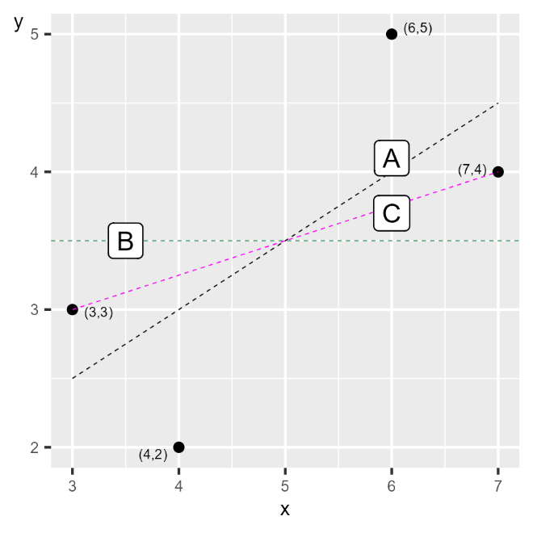

# Andra linjer {#k2-3-1}

### Begrepp
*Inga nya begrepp i detta avsnitt.*

### Teori
I föregående avsnitt lärde vi oss hur minstakvadratmetoden ger oss en specifik regressionslinje. Men varför just denna linje? Kunde vi inte bara ha valt en annan? I det här avsnittet ska vi visa varför regressionslinjen är unik och bättre än alla andra möjliga raka linjer.
Vi har regressionsmodellen:

$$Y = a + bX + V \tag{1}$$

där $Y$ och $X$ är variabler, $a$ och $b$ är koefficienter vi vill estimera med minstakvadratmetoden och $V$ är feltermen. Med hjälp av minstakvadratmetoden kan vi hitta den regressionslinje som minimerar summan av det vertikala avståndet mellan regressionslinjen och observationerna.
Alla andra raka linjer resulterar i ett större summerat värde för det kvadrerade avståndet mellan dessa linjer och punkterna.

#### Två exempel
Detta kan vi illustrera med hjälp av exempel där vi använder samma fyra observationer för $X$ och $Y$ i som vi använde i tidigare avsnitt, där $X = 3,\ 4,\ 6,\ 7$ och $Y = 3,\ 4,\ 5,\ 6$. Men i stället för regressionslinjen som vi skattade utifrån minstakvadratmetoden har vi nu en horisontell linje där $\widehat{Y} = 3,5$ för alla $Y_{i}$, vilket är samma som medelvärdet för Y i våra fyra observationer: $\overline{Y} = (3 + 4 + 5 + 6)\text{/}4 = 3,5$.
En horisontell linje har lutningskoefficient $b = 0$. Låt oss beräkna summan av de kvadrerade residualerna $\left( \sum_{i}^{}\widehat{{V_{i}}^{2}} \right)$ för denna linje:
$\sum_{i}^{}\widehat{{V_{i}}^{2}} = \sum_{i}^{}\left( Y_{i} - \widehat{Y_{i}} \right)^{2}$ (2)$ $${= (3 - 3,5)^{2} + (4 - 3,5)^{2} + (5 - 3,5)^{2} + (6 - 3,5)^{2} }{= 9}$
vilket är mer än 2,5. Regressionslinjen vi kunde rita utifrån vår regressionsmodell som vi skattade med minstakvadratmetoden är därför bättre om vi ska minimera det summerade vertikala avståndet.
Låt oss exemplifiera med en till linje, som passerar observation 1 och 4, det vill säga punkterna $(X,Y) = (3,3)$ och (7,4). Utifrån dessa värden för $X$ och $Y$ vet vi att då $X$ ökar från 3 till 7 är detta associerat med en genomsnittlig förändring i $Y$ från 3 till 4, varför linjens lutning är:

$$\widehat{b} = \frac{Y_{4} - Y_{1}}{X_{4} - X_{1}} = \frac{4 - 3}{7 - 3} = \frac{1}{4} \tag{3}$$

Den andra koefficienten ($\widehat{a}$) kan vi räkna ut med punkten $\left( X_{1},Y_{1} \right) = (3,3)$:

$$\widehat{a} = Y_{i} - \widehat{b}X_{i} = 3 - \frac{1}{4} \cdot 3 = \frac{9}{4} \tag{4}$$

Eftersom linjen passerar genom observation 1 och 4 vet vi att residualen för dessa två är $\widehat{V_{i}} = 0$. För observation 2 har vi att $X = 4$, vilket ger:

$$\widehat{Y_{2}} = \frac{9}{4} + \frac{1}{4} \cdot 4 = \frac{13}{4} \tag{5}$$

För observation 3 har vi $X = 6$ vilket ger:

$$\widehat{Y_{3}} = \frac{9}{4} + \frac{1}{4} \cdot 6 = \frac{15}{4} \tag{6}$$

För observation 2 och 3 har vi att $\left( Y_{2} = 2 \right)$ och $\left( Y_{3} = 5 \right)$:
$\sum_{i}^{}{\widehat{V}}_{i}\ = \sum_{i}^{}\left( Y_{i} - \widehat{Y_{i}} \right)^{2}$ (7)$ $${= \left( Y_{1} - \widehat{Y}1 \right)^{2} + \left( Y2 - \widehat{Y}2 \right)^{2} + \left( Y3 - \widehat{Y}3 \right)^{2} + \left( Y4 - \widehat{Y_{4}} \right)^{2} }{= 0 + \left( 2 - \frac{13}{4} \right)^{2} + \left( 5 - \frac{15}{4} \right)^{2} + 0 }{= 3,1875 \> 2,5}$
Figur 1 illustrerar de tre linjer vi nu har jämfört. Linje A i diagrammet är den vi skattade utifrån minstakvadratmetoden. Linje B är den horisontella linjen där $\widehat{Y} = \overline{Y} = 3,5$. Linje C ritas av funktionen $Y = 9\text{/}4 + \frac{1}{4}X$ och går igenom två av punkterna.

**Figur 1. Tre linjer, varav en är regressionslinjen**

::: {.fig-caption}
Förklaring: Diagrammet visar tre linjer. Linje A är regressionslinjen, beräknad med minstakvadratmetoden. Linje B är horisontell och linje C går igenom två av punkterna. Av de tre linjerna har linje A det minstas summerade vertikala avståndet mellan linjen och punkterna.
:::

::: {.ex-section-title}
Övningar
:::

---

::: {.next-section-link}
[→ Nästa avsnitt: **En modell till**](k2-3-2.html)
:::

