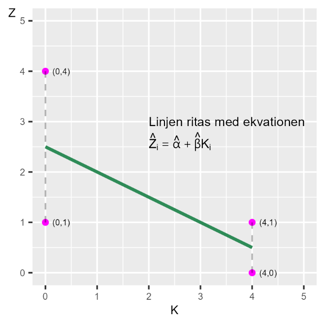
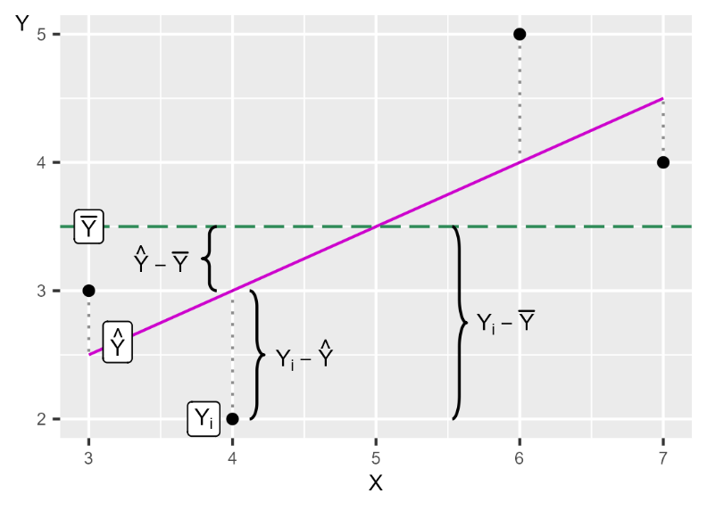

# En modell till {#k2-3-2}

### Begrepp
- Från regressionsmodellen $Y = a + bX + V$ kan vi beräkna följande:
- **Residualernas kvadratsumma** (engelska *residual sum of squares, SSR*):\
  $SSR = \sum_{i}^{n}\widehat{V_{i}^{2}} = \sum_{i}^{n}\left( Y_{i} - \widehat{Y_{i}} \right)^{2}$
- **Kvadratsumman av den förklarade variationen** (engelska *sum of squares explained*, SSE): $SSE = \sum_{i}^{n}\left( \widehat{Y_{i}} - \overline{Y_{i}} \right)^{2}$
- **Totalsumman av kvadrater** (engelska *total sum of squares*, SST): $SST = SSE + SSR$.
- **Determinationskoefficienten** (på engelska *coefficient of determination*), $R^{2}$: andel av variationen i $Y$ som kan förklaras av regressionsmodellen, det vill säga variationen i den förklarande variabeln $X$. $R^{2}$ antar värden mellan 0 och 1, där 0 = modellen förklarar ingenting och 1 = modellen förklarar all variation. $R^{2} = \frac{SSE}{SST} = \frac{SST - SSR}{SST}$.

### Teori
Vi har i tidigare avsnitt introducerat minstakvadratmetoden och gått igenom delar av matematiken bakom. Nu ska vi repetera vad vi lärt oss genom att räkna på en ny regressionsmodell.

#### En ny modell
Låt oss nu estimera följande regressionsmodell:

$$Z = \alpha + \beta K + \epsilon \tag{1}$$

där $Z$ och $K$ är variabler, $\alpha$ och $\beta$ är koefficienterna som vi ska estimera utifrån minstakvadratmetoden och $\epsilon$ är feltermen. En del av poängen här är att vi nu använder andra bokstäver men att matematiken ändå är densamma. Låt oss repetera vår metod:
1.  Vi har en idé om att $K$ samvarierar med $Z$. Detta är ett påstående om samvariation, inte en teori om ett orsakssamband. Samvariation kan i sin tur vara baserad på en teori om ett orsakssamband, vilket i så fall i regel brukar formuleras som att den förklarande variabeln $K$ orsakar förändringar i den förklarade variabeln $Z$.
2.  Vi formulerar vårt påstående om samvariation i form av en regressionsmodell i ekvation 1.
3.  Vi använder minstakvadratmetoden för att hitta estimatorerna (ekvationerna) för $\widehat{\alpha}$ och $\widehat{\beta}$. Hattsymbolen $\widehat{}$ indikerar att det är estimerade versioner av koefficienterna $\alpha$ och $\beta$ som finns i populationen.
4.  Efter att vi har estimerat koefficienterna kan vi estimera regressionslinjens ekvation $\widehat{Z} = \widehat{\alpha} + \widehat{\beta}K$ och rita ut regressionslinjen i ett diagram. Värdena för $\widehat{Z}$ anger regressionslinjens värden på den vertikala axeln.
5.  Residualen $\widehat{\epsilon} = Z - \widehat{Z}$ är det vertikala avståndet (y-axeln) mellan regressionslinjens $\widehat{Z}$ och respektive observation $Z$.

#### Estimera koefficienterna
Låt oss nu estimera koefficienterna $\alpha$ och $\beta$. Observationerna för variablerna $Z$ och $K$ beskrivs i tabell 1, tillsammans med beräkningarna vi behöver för våra beräkningar.

**Tabell 1. Underlag för att estimera koefficienterna** $\mathbf{\alpha}$ **och** $\mathbf{\beta}$**.**

<table class="table table-bordered" style="width:97%;">
<colgroup>
<col style="width: 17%" />
<col style="width: 7%" />
<col style="width: 7%" />
<col style="width: 14%" />
<col style="width: 12%" />
<col style="width: 26%" />
<col style="width: 14%" />
</colgroup>
<thead>
<tr>
<th>Observation i</th>
<th style="text-align: center;">\(Z_{i}\)</th>
<th style="text-align: center;">\(K_{i}\)</th>
<th style="text-align: center;">\(Z_{i} - \overline{Z}\)</th>
<th style="text-align: center;">\(K_{i} - \overline{K}\)</th>
<th style="text-align: center;">\(\left( Z_{i} - \overline{Z} \right)\left( K_{i} - \overline{K} \right)\)</th>
<th style="text-align: center;">\(\left( K_{i} - \overline{K} \right)^{2}\)</th>
</tr>
</thead>
<tbody>
<tr>
<td>\(1\)</td>
<td style="text-align: center;">\(1\)</td>
<td style="text-align: center;">\(0\)</td>
<td style="text-align: center;">\(-0{,}5\)</td>
<td style="text-align: center;">\(-2\)</td>
<td style="text-align: center;">\(1\)</td>
<td style="text-align: center;">\(4\)</td>
</tr>
<tr>
<td>\(2\)</td>
<td style="text-align: center;">\(4\)</td>
<td style="text-align: center;">\(0\)</td>
<td style="text-align: center;">\(2{,}5\)</td>
<td style="text-align: center;">\(-2\)</td>
<td style="text-align: center;">\(-5\)</td>
<td style="text-align: center;">\(4\)</td>
</tr>
<tr>
<td>\(3\)</td>
<td style="text-align: center;">\(0\)</td>
<td style="text-align: center;">\(4\)</td>
<td style="text-align: center;">\(-1{,}5\)</td>
<td style="text-align: center;">\(2\)</td>
<td style="text-align: center;">\(-3\)</td>
<td style="text-align: center;">\(4\)</td>
</tr>
<tr>
<td>\(4\)</td>
<td style="text-align: center;">\(1\)</td>
<td style="text-align: center;">\(4\)</td>
<td style="text-align: center;">\(-0{,}5\)</td>
<td style="text-align: center;">\(2\)</td>
<td style="text-align: center;">\(-1\)</td>
<td style="text-align: center;">\(4\)</td>
</tr>
<tr>
<td>Summa</td>
<td style="text-align: center;">\(6\)</td>
<td style="text-align: center;">\(8\)</td>
<td style="text-align: center;"></td>
<td style="text-align: center;"></td>
<td style="text-align: center;">\(-8\)</td>
<td style="text-align: center;">\(16\)</td>
</tr>
</tbody>
</table>
För lutningskoefficienten $\widehat{\beta}$ får vi:

$$\widehat{\beta} = \sum_{i}^{}{\frac{\left( K_{i} - \overline{K} \right)\left( Z_{i} - \overline{Z} \right)}{\sum_{i}^{}\left( K_{i} - \overline{K} \right)^{2}} = - \frac{8}{16} = - \frac{1}{2}} \tag{2}$$

För koefficienten $\widehat{\alpha}$:

$$\widehat{\alpha} = \overline{Z} - \widehat{\beta}\overline{K} = 1,5 - \left( - \frac{1}{2} \right)2 = 2,5 \tag{3}$$

Att $\widehat{\beta} \< 0$ betyder att regressionslinjens lutning är negativ och att vi har en negativ samvariation mellan de fyra observationerna för $Z$ och $K$. Vi kan nu ställa upp en ekvation för predikterade $\widehat{Z}$:

$$\widehat{Z_{i}} = \widehat{\alpha} + \widehat{\beta}K_{i} = 2,5 - \frac{1}{2}K_{i} \tag{4}$$

Med hjälp av denna och de observerade värdena för variabeln $K$ kan vi estimera fyra värden för predikterade $\widehat{Z}$, vilka beskrivs i tabell 2. Med $\widehat{Z}$ kan vi sedan estimera de fyra residualerna $\widehat{\epsilon}$, vilka beskrivs i samma tabell. De fyra observationerna och regressionslinjen som kan ritas med ekvation 4 illustreras i figur 1.

**Tabell 2. Beräkningar för att estimera** $\widehat{Z}$ **och** $\widehat{\epsilon}$

<table class="table table-bordered" style="width:97%;">
<colgroup>
<col style="width: 19%" />
<col style="width: 19%" />
<col style="width: 19%" />
<col style="width: 20%" />
<col style="width: 20%" />
</colgroup>
<thead>
<tr>
<th>Observation i</th>
<th style="text-align: center;">\(Z_{i}\)</th>
<th style="text-align: center;">\(K_{i}\)</th>
<th style="text-align: center;">\(\widehat{Z_{i}}\)</th>
<th style="text-align: center;">\(\widehat{\epsilon_{i}} = Z_{i} - \widehat{Z_{i}}\)</th>
</tr>
</thead>
<tbody>
<tr>
<td>\(1\)</td>
<td style="text-align: center;">\(1\)</td>
<td style="text-align: center;">\(0\)</td>
<td style="text-align: center;">\(2{,}5\)</td>
<td style="text-align: center;">\(-1{,}5\)</td>
</tr>
<tr>
<td>\(2\)</td>
<td style="text-align: center;">\(4\)</td>
<td style="text-align: center;">\(0\)</td>
<td style="text-align: center;">\(2{,}5\)</td>
<td style="text-align: center;">\(1{,}5\)</td>
</tr>
<tr>
<td>\(3\)</td>
<td style="text-align: center;">\(0\)</td>
<td style="text-align: center;">\(4\)</td>
<td style="text-align: center;">\(0{,}5\)</td>
<td style="text-align: center;">\(-0{,}5\)</td>
</tr>
<tr>
<td>\(4\)</td>
<td style="text-align: center;">\(1\)</td>
<td style="text-align: center;">\(4\)</td>
<td style="text-align: center;">\(0{,}5\)</td>
<td style="text-align: center;">\(0{,}5\)</td>
</tr>
</tbody>
</table>

**Figur 1. Regressionslinjen för modell** $Z = \alpha + \beta K + \epsilon$

::: {.fig-caption}
Förklaring: Vi har regressionsmodellen $Z = \alpha + \beta K + \epsilon$. Utifrån observationerna för variablerna $Z$ och $K$ och minstakvadratmetoden estimerar vi koefficienterna $\widehat{\alpha}$ och $\widehat{\beta}$. De estimerade koefficienterna och observationerna från variabel $K$ kan vi använda för att estimera $\widehat{Z}$, vilket ger värdena för denna variabel längs med regressionslinjen.
:::

#### Hur väl passar regressionsmodellen mot data?
För att jämföra hur väl en regressionsmodell passar de data den syftar till att beskriva mönstret för finns det flera metoder. En viktig del i detta är att jämföra residualerna, det vill säga avståndet mellan de data vi använt i vår förklarade variabel $Y$ och de predikterade värdena för samma variabel  $\widehat{Y}$.

Om vi har en regressionsmodell med förklarad variabel $Y$ och feltermen $V$ där residualen beräknas $\widehat{V} = Y - \widehat{Y}$ kan vi till exempel jämföra *residualernas kvadratsumma* (engelska *sum of squared residuals*, SSR):

$$SSR = \sum_{i}^{n}\widehat{V_{i}^{2}} = \sum_{i}^{n}\left( Y_{i} - \widehat{Y_{i}} \right)^{2} \tag{1}$$

Vi kan tänka på SSR som mängden variation i förklarade variabeln $Y$ som inte kan förklaras av regressionsmodellen.

Ett annat användbart mått är *kvadratsumman av den förklarade variationen* (engelska *sum of squares explained*, SSE):

$$SSE = \sum_{i}^{n}\left( \widehat{Y_{i}} - \overline{Y_{i}} \right)^{2} \tag{2}$$

SSE kan beskrivas som den variation i $Y$ som kan förklaras, eller tas bort, av regressionsmodellen. Begreppet "förklaras" innebär i detta sammanhang inte nödvändigtvis "kausal förklaring".

*Totalsumman av kvadrater* (engelska *total sum of squares*, SST) är summan av SSR och SSE. SST kan tolkas som mängden variation som förekommer i $Y$ innan regressionsmodellen estimeras. SST skrivas som summan av den kvadrerade differensen mellan observerade $Y_{i}$ och medelvärdet $\overline{Y}$:

$$SST = SSE + SSR \tag{3}$$

$\sum_{i}^{n}\left( Y_{i} - \overline{Y} \right)^{2} = \sum_{i}^{n}\left( \widehat{Y_{i}} - \overline{Y_{i}} \right)^{2} + \sum_{i}^{n}\left( Y_{i} - \widehat{Y_{i}} \right)^{2}$

#### Skillnaden mellan SSR, SSE och SST
Ett sätt att illustrera skillnaderna mellan SSR, SSE och SST ges i figur 2. Vi använder här återigen de fyra observationerna för $X = 3,4,6,7$ och $Y = 2,3,4,5$ som vi använde i vårt första exempel på regressionsanalys (se [avsnitt 2.4](https://www.dropbox.com/scl/fi/uzqiucdxx5eaka1hgni5z/2-4-Samvariation-2.docx?rlkey=1ru7jf53mujl9y82mfzzkf7b2&dl=0)). I diagrammet i figur 1 markerar vi residualerna med streckade vertikala linjer mellan $Y_{i}\ $ och regressionslinjens $\widehat{Y_{i}}$.

**Figur 2. Differenserna mellan** $\overline{Y}$, $\widehat{Y}$ och $Y_{i}$

::: {.fig-caption}
Förklaring: Figuren illustrerar hur avstånden i diagrammet motsvaras av differenser mellan värdena för observationerna $Y_{i}$, deras medelvärde $\overline{Y}$ och estimerade $\widehat{Y}$.
:::

#### Determinationskoefficienten, $R^{2}$
Utifrån kvadratsummorna kan vi skatta determinationskoefficienten (på engelska *coefficient of determination*), vilken brukar skrivas som $R^{2}$:

$$R^{2} = \frac{SSE}{SST} = \frac{SST - SSR}{SST} = 1 - \frac{SSR}{SST} = 1 - \frac{\sum_{i}^{n}\left( Y_{i} - \widehat{Y_{i}} \right)^{2}}{\sum_{i}^{n}\left( Y_{i} - \overline{Y} \right)^{2}} \tag{4}$$

$R^{2}$ mäter hur stor andel av variationen i den förklarade variabeln, till exempel $Y$, som kan förklaras av regressionsmodellen och variationen i den förklarande variabeln, till exempel $X$. $R^{2}$ kan anta värden mellan 0 och 1.

$R^{2} = 0$ betyder att ingenting av variationen i $Y$ kan förklaras av regressionsmodellen och variationen i $X$. $R^{2} = 1$ betyder att all variation i variabel $Y$ förklaras av regressionsmodellen och variationen i variabel $X$.

### Observera att förkortningar varierar ibland. Vi använder här SSR = Sum of Squared Residuals. Andra använder till exempel RSS = Residual Sum of Squares. Båda betyder samma sak. När du läser andra texter, kontrollera alltid vad en förkortning syftar på matematiskt.

::: {.ex-section-title}
Övningar
:::

---

::: {.next-section-link}
[→ Nästa avsnitt: **Hur väl passar modellerna mot data?**](k2-3-3.html)
:::

