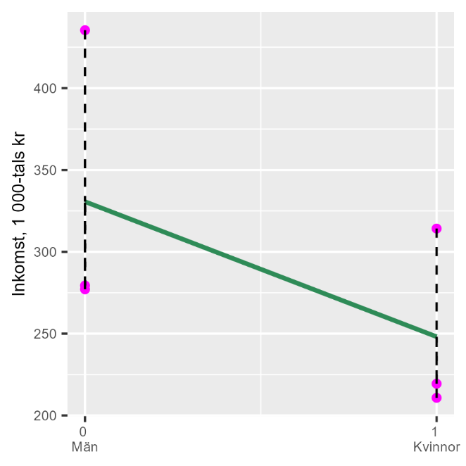

# Faktorvariabler {#k2-4-2}

### Begrepp
- **Faktorvariabel:** Kallas även kategoriska variabler. Variabler som beskriver grupper (kategorier), till exempel kön, kommuner, yrkesgrupper, utbildningsnivåer med mera.
- **Dummyvariabel:** Kallas även indikatorvariabel. Förklarande variabler som endast antar värdet 0 eller 1. Används ofta för att beskriva kategorier, som till exempel 0 för män och 1 för kvinnor.
### Teori
Regressionsanalys är en kvantitativ metod i den mening att vi använder kvantitativa data för att skapa kvantitativa resultat. Vi kan även använda *kvalitativa data* i vår analys, information som inte ursprungligen är angiven i siffror, så länge vi sätter siffror på denna.
Ett exempel på detta är *faktorvariabler*, även kallat *kategoriska variabler*. Faktorvariabler beskriver grupper (kategorier), som kön, kommuner, yrkesgrupper.
#### Faktorvariabler med två unika värden
Låt oss börja med faktorvariabler som endast antar två olika värden, till exempel om vi skickar ut en enkät och ber mottagarna svara "Ja" eller "Nej". En vanlig metod är då att ersätta det ena svarsalternativet med siffran 0 och det andra med siffran 1. Det spelar ingen roll vilket variabelvärde som får vilken siffra, så länge vi håller koll på vad som representerar vad när vi räknar.
Ett annat exempel är en variabel som anger om en rad i en tabell innehåller information om en man eller en kvinna, varpå variabeln kan anta värdet 0 för det ena könet och 1 för det andra könet.
En förklarande variabel i en regressionsmodell som endast antar värdena 0 eller 1 kallas för *dummyvariabel* eller *indikatorvariabel, kategorisk variabel*. Namnet \"dummyvariabel\" kommer från engelskans \"dummy\" som betyder \"ersättning\" eller \"ställföreträdare\". Vi ersätter kvalitativa kategorier (man/kvinna) med siffror (0/1) så att vi kan använda dem i regressionsanalys.
Data som endast kan anta två värden kallas för binär. Ofta används just 0 eller 1 för att beskriva informationen i en binär variabel, även om 0 och 1 symboliserar något annat, till exempel 0=män och 1=kvinnor.
#### Exempel på tre kommuner
Tabell 1 redovisar genomsnittlig årsinkomst för män respektive kvinnor i tre kommuner för år 2019, räknat i tusentals kronor.
**Tabell 1: Genomsnittlig inkomst 2019, 1 000-tals kr**
  -----------------------------------------------------------------------
  Kommun                  Män                     Kvinnor
  ----------------------- ----------------------- -----------------------
  Danderyd                435                     314
  Mörbylånga              277                     219
  Oskarshamn              279                     211
  -----------------------------------------------------------------------

::: {.fig-caption}
Förklaring: Data från [Kolada](http://www.kolada.se). Inkomst anges i 1 000-tals kronor, medianvärden per kommun och grupp.
Nu ska vi studera löneskillnaden mellan män och kvinnor genom att använda minstakvadratmetoden. Vi börjar med att formulera en regressionsmodell:
$W_{i} = a + bG_{i} + e_{i}$ (1)
där $W_{i}$ är medellön i kommun $i$ och $G_{i}$ är kön som har värdet 0 för män och 1 för kvinnor.
Vi kan estimera regressionsmodellen på samma sätt som tidigare, där koefficienterna ges av minstakvadratmetoden. Tabell 2 ger oss första delen av beräkningen:
$\widehat{b} = \frac{\sum_{}^{}{\left( G_{i} - \overline{G} \right)\left( W_{i} - \overline{W} \right)}}{\sum_{}^{}\left( G_{i} - \overline{G} \right)^{2}} = \frac{- 123,5}{1,5} = - 82,3$ (2)
:::

$$\widehat{a} = \overline{w} - \widehat{b\overline{k}} = 289,2 - ( - 82,3)0,5 = 330,3$$

Koefficienten $\widehat{b}$ är negativ, vilket innebär att kön $(G)$ har en negativ samvariation med lön $(W)$. Vi valde att definiera vår dummyvariabel $G = 1$ för kvinnor. Variabel W är associerat med ett 82,3 enheter lägre värde för kvinnor jämfört med män. Kvinnor har i genomsnitt 82 300 kr lägre inkomst än män i dessa tre kommuner.
Resultatet illustreras i figur 1. Diagrammet visar att när vi rör oss från män $(G = 0)$ till kvinnor $(G = 1)$ längs den horisontella axeln, går inkomsten nedåt längs den vertikala axeln. Därför är lutningen negativ. Detta betyder att kvinnor $(G = 1)$ har lägre genomsnittsinkomst än män $(G = 0)$ i dessa tre kommuner.
**Tabell 2. Beräkningar för regressionsanalysen**
  --------------------------------------------------------------------------------------------------------------------------------------------------------------------------------------------------------------------------------------------------------------------------------
  Kommun        

$$W_{i}$$

   

$$G_{i}$$

   

$$W_{i} - \overline{W_{i}}$$

   

$$G_{i} - \overline{G_{i}}$$

   

$$\left( G_{i} - \overline{G_{i}} \right)^{2}$$

  ------------ ---------------------------------- ---------------------------------- ------------------------------------------------------- ------------------------------------------------------- -----------------------------------------------------------------------------
  Danderyd                    435                                 0                                           145,8                                                   -0,5                                                               0,25
  Mörbylånga                  277                                 0                                           -12,2                                                   -0,5                                                               0,25
  Oskarshamn                  279                                 0                                           -10,2                                                   -0,5                                                               0,25
  Danderyd                    314                                 1                                           24,8                                                     0,5                                                               0,25
  Mörbylånga                  219                                 1                                           -70,2                                                    0,5                                                               0,25
  Oskarshamn                  211                                 1                                           -78,2                                                    0,5                                                               0,25
                                                                                                                                                                                                     
  Medelvärde                 289,2                               0,5                                                                                                                                 
  Summa                                                                                                                                                                                                                                   1,5
  --------------------------------------------------------------------------------------------------------------------------------------------------------------------------------------------------------------------------------------------------------------------------------

::: {.fig-caption}
Förklaring: Samma data som i tabell 1 och några beräkningar.
**Figur 1: Samvariationen mellan inkomst och kön**
{style="width:3.01282in;height:3.01282in"}
Förklaring: Regressionslinjen lutar nedåt vilket indikerar en negativ samvariation. I variabeln G har kvinnor värdet 1 och män värdet 0. Eftersom kvinnor har lägre inkomst i genomsnitt än män, uppstår en negativ samvariation.
:::

#### Faktorvariabler med flera värden
Ovan hade vi en dummyvariabel för två värden: män och kvinnor. Dummyvariabler kan även vara användbara för att kategorisera faktorvariabler med flera värdena än två. Låt oss återigen räkna på inkomstskillnader mellan de tre kommunerna i föregående exempel, men i stället för skillnad mellan kvinnor och män ska vi nu beräkna skillnaden i genomsnittlig inkomst mellan kommunerna.
Tabell 3 redovisar variablerna, där $Y_{i}$ nu anger medelinkomst för alla invånare per kommun. Variablerna $K_{\text{Mörbylånga}}$ och $K_{\text{Oskarshamn}}$ är två dummyvariabler för kommunerna i följande regressionsmodell:
$Y_{i} = a + bK_{\text{Mörbylånga}} + cK_{\text{Oskarshamn}} + e_{i}$ (3)
där $e$ är feltermen. Våra dummyvariabler representerar kommunerna Mörbylånga och Oskarshamn, en dummyvariabel mindre än antal kommuner. När båda dummyvariablerna i modellen är lika med 0 får vi estimaten för den tredje kommunen, Danderyd.
Om vi har 3 kommuner använder vi bara 2 dummyvariabler. Varför? Om både Mörbylånga-dummyn = 0 OCH Oskarshamn-dummyn = 0, vet vi automatiskt att det måste vara Danderyd. Den tredje kommunen blir \"referenskategori\", i detta fall den kommun vi jämför de andra kommunerna mot. Om vi hade använt 3 dummyvariabler skulle regressionen inte fungera (matematiskt kallas detta \"perfekt multikolinjäritet\"). Datorn kan inte skilja på vilken effekt som kommer från vilken dummy.
**Tabell 3: Genomsnittlig inkomst 2019, 1 000-tals kr**
  -------------------------------------------------------------------------------------------------------------------------------------------------------
  Kommun        

$$Y_{i}$$

   

$$K_{\text{Mörbylånga}}$$

   

$$K_{\text{Oskarshamn}}$$

  ------------ ---------------------------------- --------------------------------------------------- ---------------------------------------------------
  Danderyd                   364,9                                         0                                                   0
  Mörbylånga                 243,6                                         1                                                   0
  Oskarshamn                  246                                          0                                                   1
  -------------------------------------------------------------------------------------------------------------------------------------------------------

::: {.fig-caption}
Förklaring: Data från [Kolada](http://www.kolada.se). Inkomst anges i 1 000-tals kronor, medianvärden per kommun.
Vår regressionsmodell räknar ut samma sak som vi redan ser i datamaterialet. Syftet med denna övning är att förstå innebörden av dummyvariabler i en regressionsmodell. Vi estimerar regressionsmodellen i ekvation 3 utifrån minstakvadratmetoden:
$\widehat{Y} = \widehat{a} + \widehat{b}K_{\text{Mörbylånga}} + \widehat{c}K_{\text{Oskarshamn}} + e$ (4)
:::

$$= 364,9 - 121,3K_{\text{Mörbylånga}} - 118,9K_{\text{Oskarshamn}} + e$$

Detta innebär att den genomsnittliga inkomsten $(Y)$ i Danderyd är lika med 364 900 kronor. Detta är vad regressionsresultaten visar då $K_{\text{Mörbylånga}} = K_{\text{Oskarshamn}} = 0$, vilket stämmer med våra data.
Vi får $\widehat{b} = - 121,3$, vilket innebär att medelinkomsten i Mörbylånga är lika med $364,9 - 121,3 = 243,6$, vilket stämmer. Koefficient $\widehat{c} = - 118,9$ innebär att medelinkomsten i Oskarshamn är lika med $364,9 - 118,9 = 246$, vilket också stämmer.
När man har en regressionsmodell där en kategorisk variabel ingår, till exempel kommun, kan man ofta se formuleringar av regressionsmodeller med förkortningar för dummyvariabler. Säg till exempel att vi ska estimera regressionsmodellen i ekvation 3 med data på alla 290 kommuner och därför vill använda 289 dummyvariabler (antal kommuner minus 1).
Den sista kommunens resultat ges av att alla dummyvariablerna = 0. I dessa situationer kan man ibland se att regressionsmodellen beskrivs som ett exempel: $Y_{i} = c + bK_{i} + v$ där $K$ symboliserar en av de 289 dummyvariablerna. För varje enskild kommun är övriga 288 dummyvariabler lika med 0.

::: {.ex-section-title}
Övningar
:::

---

::: {.next-section-link}
[→ Nästa avsnitt: **Konstannhålla**](k2-4-3.html)
:::

