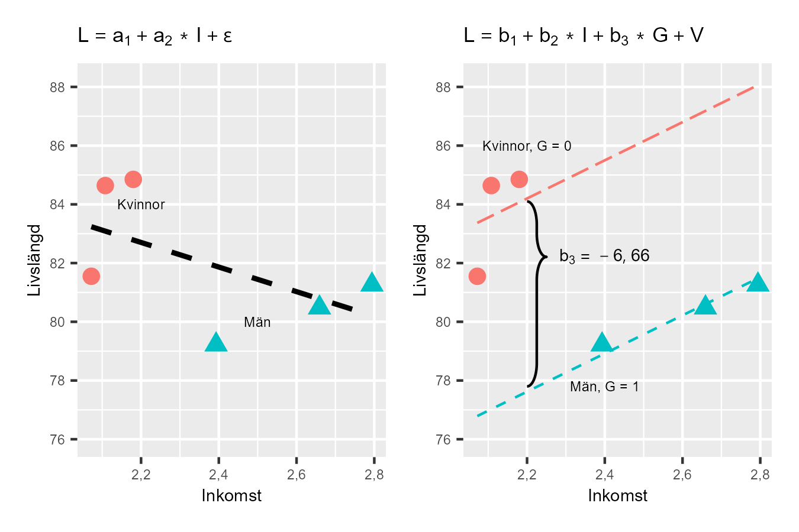

# Konstannhålla {#k2-4-3}

### Begrepp
- **Konstanthålla:** Regressionsanalys med modell $Y = a + bX + Z + \epsilon$ innebär att vi uppskattar samvariationen mellan X och Y, med hänsyn till variationer i Z. Detta kallas för att vi konstanthåller Z. När vi uppskattar samvariationen mellan Z och Y konstanthåller vi X.
### Teori
Regressionsanalys med flera förklarande variabler är ofta användbart för att få en korrekt bild av samvariationen mellan flera fenomen. I [avsnitt 4.1](https://www.dropbox.com/scl/fi/dkav9cmen93lfv9xnh5i1/4-1-Regressionsanalys-med-tre-variabler.docx?rlkey=womzymlqr70kjry66qltgkcph&dl=0) såg vi att om vi kontrollerar för flera variabler i vår regressionsmodell kan lutningskoefficienten för en annan variabel i modellen ändras. Detta kallas för att vi **konstanthåller** andra variabler.
Att konstanthålla en variabel betyder att vi studerar sambandet mellan X och Y med hänsyn till Z. Vi frågar: \"Om alla observationer hade samma värde på Z, hur skulle X och Y samvariera då?\"
Exempel: När vi studerar samvariationen mellan inkomst och livslängd med hänsyn till kön, frågar vi: \"Hur samvarierar inkomst och livslängd bland kvinnor?\" och \"Hur samvarierar inkomst och livslängd bland män?\" Detta är en av de centrala mekanismerna i regressionsanalys och i analytiskt arbete generellt.
#### Illustrera med lite data
Säg att vi har regressionsmodellen $Y = a + bX + cZ + V$, där $Y$, $X$ och $Z$ är variabler och $V$ är feltermen. Vi kan då beskriva detta som att vi håller variabeln $Z$ konstant när vi estimerar samvariationen mellan $Y$ och $X$. Och vi håller variabeln $X$ konstant när vi estimerar samvariationen mellan $Y$ och $Z$.
Vi ska nu illustrera detta med hjälp av lite data över genomsnittlig livslängd och inkomst för kvinnor respektive män i tre av Sveriges kommuner, vilket beskrivs i tabell 1. Kolumnen längst till höger beskriver en dummyvariabel $G$ för kön där kvinnor = 0 och män = 1.
**Tabell 1. Data över män och kvinnor i tre kommuner**
  -------------------------------------------------------------------------------------------------------------------------------------
  Kommun                 Livslängd $(L)\ $   Inkomst $(I)$   Kön $(G)$
  --------------------- ----------------------------------------- ------------------------------------ --------------------------------
  Jokkmokk, kvinnor                       81,6                                    2,07                                0
  Jokkmokk, män                           79,2                                    2,4                                 1
  Oskarshamn, kvinnor                     84,6                                    2,11                                0
  Oskarshamn, män                         81,3                                    2,79                                1
  Örebro, kvinnor                         84,8                                    2,18                                0
  Örebro, män                             80,5                                    2,66                                1
                                                                                                       
  Medelvärde                               82                                    2,368                               0,5
  -------------------------------------------------------------------------------------------------------------------------------------

::: {.fig-caption}
Förklaring:
:::

#### Vår första regressionsmodell
Låt oss börja med att estimera samvariation mellan livslängd och inkomst med följande regressionsmodell:
$L = a_{1} + a_{2}I + \epsilon$ (1)
där $L$ är livslängd, $I$ är inkomst, $a_{1}$ och $a_{2}$ är koefficienterna vi ska estimera med hjälp av minstakvadratmetoden och $\epsilon$ är feltermen. Lutningskoefficienten $a_{2}$ kan vi estimera till:
${\widehat{a}}_{2} = \frac{\sum_{i}^{}{\left( I_{i} - \overline{I} \right)\left( L_{i} - \overline{L} \right)}}{\sum_{i}^{}\left( I_{i} - \overline{I} \right)^{2}} \approx \frac{- 1,9}{0,455} \approx - 4,2$ (2)
Koefficienten $a_{1}$ kan vi estimera till:
${\widehat{a}}_{1} = \overline{L} - \widehat{b}\overline{I} \approx 82 - ( - 4,2)2,37 \approx 92$ (3)
Beräkningarna beskrivs inte här men kontrollräkna gärna på egen hand. Estimerade versionen av regressionsmodellen i ekvation 1 blir nu:
$L = \widehat{a} + \widehat{b}I = 92 - 4,2I$ (4)
Enligt denna beräkning finns det en negativ samvariation mellan livslängd $L$ och inkomst $I$, vilket innebär att människor med högre inkomst i genomsnitt lever kortare liv.
#### Lägger till variabeln $G$
Låt oss nu lägga till variabeln kön $G$ till vår regressionsmodell. I tabell 1 är detta en dummyvariabel som endast antar värdet 0 eller 1. Vi ska nu estimera följande regressionsmodell:
$L = b_{1} + b_{2}I + b_{3}G + V$ (5)
där $L,\ \ I$ och $G$ är våra variabler, $b_{1}$, $b_{2}$ och $b_{3}$ är koefficienterna vi ska estimera med hjälp av minstakvadratmetoden, och $V$ är feltermen. För att estimera lutningskoefficienterna använder vi nu estimatorerna för en regressionsmodell med tre koefficienter som vi introducerade i [avsnitt 4.1](https://www.dropbox.com/scl/fi/dkav9cmen93lfv9xnh5i1/4-1-Regressionsanalys-med-tre-variabler.docx?rlkey=womzymlqr70kjry66qltgkcph&dl=0). Vi börjar med lutningskoefficienten $b_{2}$:
${\widehat{b}}_{2} = \frac{\left( \sum_{}^{}{\widetilde{L_{i}}\widetilde{I_{i}}} \right)\left( \sum_{}^{}{\widetilde{G}}_{i}^{2} \right) - \left( \sum_{}^{}{\widetilde{L_{i}}\widetilde{G_{i}}} \right)\left( \sum_{}^{}{\widetilde{I_{i}}\widetilde{G_{i}}} \right)}{\left( \sum_{}^{}{\widetilde{I}}_{i}^{2} \right)\left( \sum_{}^{}{\widetilde{G}}_{i}^{2} \right) - \left( \sum_{}^{}{\widetilde{I_{i}}\widetilde{G_{i}}} \right)^{2}}$ (6)$ $

$$\approx \frac{( - 1,93)(0,46) - ( - 5,04)(0,75)}{(0,46)(1,5) - (0,75)^{2}} \approx 6,64$$

Tilde beskriver avvikelse från medelvärdet, som $\widetilde{G} = G_{i} - \overline{G}.$ För lutningskoefficient $b_{3}$ får vi:
${\widehat{b}}_{3} = \frac{\left( \sum_{}^{}{{\widetilde{L}}_{i}{\widetilde{G}}_{i}} \right)\left( \sum_{}^{}{\widetilde{I}}_{i}^{2} \right) - \left( \sum_{}^{}{\widetilde{L_{i}}\widetilde{I_{i}}} \right)\left( \sum_{}^{}{\widetilde{I_{i}}{\widetilde{G}}_{i}} \right)}{\left( \sum_{}^{}{\widetilde{I}}_{i}^{2} \right)\left( \sum_{}^{}{\widetilde{G}}_{i}^{2} \right) - \left( \sum_{}^{}{\widetilde{I_{i}}{\widetilde{G}}_{i}} \right)^{2}}$ (7)$ $

$$\approx \frac{( - 5,04)(0,46) - ( - 1,93)(0,75)}{(0,46)(1,5) - (0,75)^{2}} \approx - 6,66\ $$

Slutligen kan vi estimera koefficient $b_{1}$, konstanten:
${\widehat{b}}_{1} = \overline{L} - {\widehat{b}}_{2}\overline{I} - {\widehat{b}}_{3}\overline{G}$ (8)$ $

$${= 82 - 6,64*2,37 - ( - 6,66)*0,5 }{\approx 69,6}$$

Den estimerade versionen av regressionsmodellen i ekvation 5:
$L = {\widehat{b}}_{1} + {\widehat{b}}_{2}I + {\widehat{b}}_{3}G = 69,6 + 6,64I - 6,66G$ (9)
Resultatet indikerar nu en positiv samvariation mellan vår förklarade variabel livslängd $(L)$ och den förklarande variabeln inkomst $(I)$ med hänsyn till kön $(G)$. Människor med högre inkomst lever i genomsnitt längre liv. När vi estimerade regressionsmodellen i ekvation 1 fann vi att inkomst och livslängd samvarierade negativt.
Detta är ett exempel på något som kallas [Simpsons paradox](https://en.wikipedia.org/wiki/Simpson%27s_paradox): När vi studerar inkomst och livslängd utan att ta hänsyn till kön får vi negativ samvariation. Men när vi tar hänsyn till kön (konstanthåller kön) får vi positiv samvariation.
Varför? Kvinnor lever längre och har lägre inkomst. Män lever kortare och har högre inkomst. Om vi inte separerar könen ser det ut som att högre inkomst = kortare liv, vilket är felaktigt. Detta visar varför det är så viktigt att inkludera relevanta variabler i regressionsanalys. Det illustrerar även varför vi måste ta hänsyn till viktiga fenomen när vi vill förstå hur världen fungerar.
#### Illustration i diagram
Figur 1 illustrerar samvariationen mellan livslängd och inkomst i två diagram, varsitt för regressionsmodellerna i ekvation 1 och 5. I båda diagrammen har vi markerat vilka observationer som hör till män respektive kvinnor. Vi har tre prickar för män och tre för kvinnor, eftersom vi har tre kommuner med två observationer per kommun. Det vänstra diagrammet illustrerar resultatet i den första regressionsmodellen i ekvation 1 som vi estimerade till:
$L = \widehat{a_{1}} + \widehat{a_{2}}I = 92 - 4,2I$ (10)
med en negativ samvariation mellan livslängd och inkomst. I diagrammet illustreras regressionslinjen med en streckad linje. Det högra diagrammet illustrerar resultatet i den andra regressionsmodellen i ekvation 5 som vi estimerade till:
$L = \widehat{b_{1}} + \widehat{b_{2}}I + \widehat{b_{3}}G = 69,6 + 6,64I - 6,66G$ (11)
där $G$ är dummy för kön med $G = 0$ för kvinnor och $G = 1$ för män. I diagrammet har vi ritat ut två regressionslinjer för att illustrera betydelsen av denna dummyvariabel. De två regressionslinjerna är skattade med samma regressionsmodell, men illustrerar skillnaden mellan $G = 0$ och $G = 1$.
Om $G = 0$ får vi den övre regressionslinjen, som löper genom prickarna som illustrerar observationerna för kvinnor. Om dummyvariabeln $G = 1$ har vi i stället den nedre regressionslinjen, som löper genom de tre prickarna för män.
**Figur 1: Illustration av resultaten från de två regressionsmodellerna**\
{style="width:4.5in;height:3in"}

::: {.fig-caption}
Förklaring: I det vänstra diagrammet ser vi resultaten från den estimerade regressionsmodellen i ekvation 1. I det högra diagrammet är regressionsmodellen i ekvation 5 illustrerade för $G = 0$ respektive $G = 1$.
:::

::: {.ex-section-title}
Övningar
:::

---

::: {.next-section-link}
[→ Nästa avsnitt: **Regression med matriser**](k2-4-4.html)
:::

