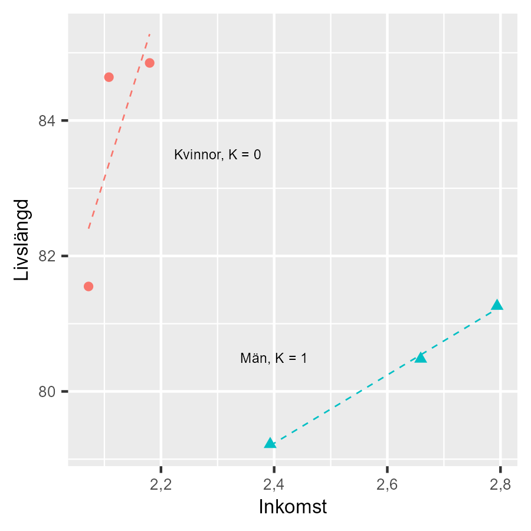

# Interaktion {#k2-4-6}

### Begrepp
- **Interaktionseffekt:** Analys av hur effekten av ett fenomen beror på tillståndet för ett annat fenomen.

### Teori
I detta avsnitt ska vi introducera interaktionseffekt. Hittills har vi antagit att effekten av $X$ på $Y$ är densamma oavsett värdet på $Z$. Samvariationen (lutningskoefficienten för $X$) är densamma oavsett om $Z$ har höga eller låga värden.
Men ibland påverkar andra fenomen (som $Z$) hur starkt $X$ samvarierar med $Y$. Detta kallas för interaktionseffekt. Exempel:
- Kanske samvarierar inkomst och livslängd olika starkt för män vs kvinnor
- Kanske har en medicin olika effekt beroende på patientens ålder
- Kanske påverkar utbildning inkomst olika mycket i olika länder
Matematiskt innebär interaktionseffekt att vi kombinerar två eller flera av de förklarande variablerna till en ny variabel, som att multiplicera $X$ och $Z$. Därigenom kan vi kontrollera om en förklarande variabels samvariation med den förklarade variabeln varierar beroende på värdena i en annan förklarande variabel.

#### Interaktionseffekten mellan x och z
Låt oss utgå från följande regressionsmodell:

$$y = a + bx + cz + \epsilon \tag{1}$$

Observera att variablerna inte är skrivna med matriser utan i vanlig form. Modellen består av följande: $x$ och $z$ är förklarande variabler och $y$ är förklarad variabel, $a$, $b$ och $c$ är koefficienter och $\epsilon$ är feltermen.
Vi tror att samvariationen mellan $y$ och $x$ kan bero på vilket värde variabeln $z$ har. Det vill säga, vi vill bland annat undersöka om samvariationen mellan $y$ och $x$ ser olika ut när den tredje variabeln $z$ har höga värden, jämfört med när $z$ har låga värden. Detta kallas för en interaktionseffekt. $z$ kan också samvariera med $y$ för sig.
Interaktionseffekt mellan $x$ och $z$ kan vi estimera genom att skapa en ny variabel $k = x*z$, där vi för respektive observation multiplicerar värdet i $x$ med värdet i $z$. Den nya variabeln $k$ lägger vi till i vår regressionsmodell med en egen lutningskoefficient:

$$y = a + bx + cz + dxz \tag{2}$$

$$= a + bx + cz + dk$$

Koefficient $a$, modellens intercept, är precis som tidigare det värde som $y$ antar då alla andra variabler är lika med noll $(x = z = k = 0)$. Koefficient $d$ som är multiplicerad med $k = xz$ mäter den genomsnittliga förändring i $y$ som är associerad med en ökning av variabel $k$ med en enhet.
Koefficient $b$ anger hur stor förändring i $y$ som är associerad med en enhet högre $x$. För att estimera den totala samvariationen mellan $x$ och $y$ adderar vi koefficient $b$ med $d*z$, eftersom variabel $z$ ingår som multiplikator i variabeln $k$. Den totala samvariationen mellan $x$ och $y$ är:

$$\frac{\Delta y}{\Delta x} = b + d*z \tag{3}$$

där $\Delta y$ betyder förändring i variabeln $y$ och $\Delta x$ är förändring i variabeln $x$. Bokstäverna $b$, $d$ och $z$ har samma innebörd som i regressionsmodellen. För de värden då $z = 0$ anger $b$ den förändring i $y$ som är associerad med en ökning av $x$ med en enhet.
På motsvarande sätt får vi den totala samvariationen mellan variabel $z$ och $y$ genom följande uttryck:

$$\frac{\Delta y}{\Delta z} = c + d*x \tag{4}$$

För värdena $x = 0$ anger lutningskoefficienten $c$ hur mycket $y$ ökar då $z$ ökar med 1. Låt oss illustrera interaktionseffekten med hjälp av data.

#### Ett exempel med data
I [avsnitt 4.3](https://www.dropbox.com/scl/fi/r78jsccc1j8axt3qqcn3c/4-3-Konstanth-lla.docx?rlkey=saxn8mtkh28j4s7xr13tryyy3&dl=0) estimerade vi samvariationen mellan livslängd och inkomst för män och kvinnor i tre av Sveriges kommuner. Nu ska vi använda samma data igen men denna gång lägga till en interaktionseffekt.
Tabell 1 beskriver våra variabler (samma som i [avsnitt 4.3](https://www.dropbox.com/scl/fi/r78jsccc1j8axt3qqcn3c/4-3-Konstanth-lla.docx?rlkey=saxn8mtkh28j4s7xr13tryyy3&dl=0)). Vi har nu en variabel som skapas genom att multiplicera de två variablerna inkomst $I$ och kön $K$. Den nya variabeln har rubriken "Interaktion: $I*K$". Eftersom $K$ är en dummy där tre av sex observationer har värdet 0 får även den nya variabeln värdet 0 i tre av sex fall.

**Tabell 1: Variablerna** $\mathbf{L}$**,** $\mathbf{I}$**,** $\mathbf{K}$ **och** $\mathbf{KI}$

  ----------------------------------------------------------------------------------------------------------------------------------------------------------------
  Kommun, kön           Livslängd, $L$   Inkomst, $I$   Kön, $K$   $K*I$
  --------------------- ------------------------------------- ----------------------------------- ------------------------------- --------------------------------
  Jokkmokk, kvinnor     81,55                                 2,07                                0                               0
  Jokkmokk, män         79,22                                 2,40                                1                               2,40
  Oskarshamn, kvinnor   84,64                                 2,11                                0                               0
  Oskarshamn, män       81,26                                 2,79                                1                               2,79
  Örebro, kvinnor       84,85                                 2,18                                0                               0
  Örebro, män           80,48                                 2,66                                1                               2,66
  ----------------------------------------------------------------------------------------------------------------------------------------------------------------

::: {.fig-caption}
Förklaring: Data från [www.kolada.se](http://www.kolada.se). Medianinkomst i 100 000-tals kr. Förväntad medellivslängd. Alla siffror avser 2019.
I [avsnitt 4.3](https://www.dropbox.com/scl/fi/r78jsccc1j8axt3qqcn3c/4-3-Konstanth-lla.docx?rlkey=saxn8mtkh28j4s7xr13tryyy3&dl=0) estimerade vi två regressionsmodeller. Först en modell för samvariationen mellan livslängd och inkomst, med följande resultat:
:::

$$L = \widehat{a_{1}} + \widehat{a_{2}}I = 92 - 4,2*I \tag{5}$$

Den andra modellen inkluderade även dummyvariabeln kön G:

$$L = \widehat{b_{1}} + \widehat{b_{2}}I + \widehat{b_{3}}G = 69,6 + 6,64I - 6,66G \tag{6}$$

Nu ska vi estimera följande regressionsmodell:

$$L = c_{1} + c_{2}I + c_{3}G + c_{4}GI + v \tag{7}$$

där $c_{1}$, $c_{2}$, $c_{3}$ och $c_{4}$ är koefficienter vi ska estimera med hjälp av minstakvadratmetoden och $v$ är feltermen. Variablerna i modellen känner vi igen från tabell 1: livslängd $L$, inkomst $I$, kön $G$ samt interaktionstermen $GI$. Med matriser kan vi beskriva vår regressionsmodell på följande sätt:

$$L = CX + V \tag{8}$$

$L$ är en kolumnmatris med värdena för förklarade variabeln livslängd $L$. $C$ är en kolumnmatris med samtliga koefficienterna i modellen, $c_{1}$ till $c_{4}$. $X$ är en matris med samtliga förklarande variabler i modellen och observationerna för respektive variabel i varsin kolumn. $V$ är en kolumnmatris med feltermerna $v_{1},v_{2},\ldots,v_{n}$ där n är antal observationer.
För att estimera koefficienterna har vi estimatorn, som liknar de vi använt i tidigare avsnitt:

$$\widehat{C} = \left( X^{T}X \right)^{- 1}X^{T}L \tag{9}$$

Matris $X$ är i detta fall:

$$X = \begin{bmatrix} 1 & 2,07 & 0 & 0 \\ 1 & 2,4 & 1 & 2,4 \\ 1 & 2,11 & 0 & 0 \\ 1 & 2,79 & 1 & 2,79 \\ 1 & 2,18 & 0 & 0 \\ 1 & 2,66 & 1 & 2,66 \end{bmatrix} \tag{10}$$

Alla element i första kolumnen i matris $X$ har värdet 1 eftersom första koefficienten i regressionsmodellen (konstanten) inte är multiplicerad med någon variabel. Övriga värden i matrisen är hämtade från observationerna för de tre förklarande variablerna i tabell 1. Transponerade versionen av $X$ skrivs $X^{T}$ och ser ut på följande sätt:

$$X = \begin{bmatrix} 1 & 1 & 1 & 1 & 1 & 1 \\ 2,07 & 2,4 & 2,11 & 2,79 & 2,18 & 2,66 \\ 0 & 1 & 0 & 1 & 0 & 1 \\ 0 & 2,4 & 0 & 2,79 & 0 & 2,66 \end{bmatrix} \tag{11}$$

Värdena i matris L hämtas också från tabell 1:

$$L = \begin{bmatrix} 81,55 \\ 79,22 \\ 84,64 \\ 81,26 \\ 84,85 \\ 80,48 \end{bmatrix} \tag{12}$$

Vi estimerar regressionsmodellens koefficienter med $\widehat{C} = \left( X^{T}X \right)^{- 1}X^{T}L$. Vårt resultat blir nu:

$$\widehat{C} = \left( X^{T}X \right)^{- 1}X^{T}L \tag{13}$$

$$\left\lbrack \begin{array}{r} c_{1} \\ c_{2} \\ c_{3} \\ c_{4} \end{array} \right\rbrack \approx \left\lbrack \begin{array}{r} 26,6 \\ 26,9 \\ 40,3 \\ - 21,8 \end{array} \right\rbrack$$

Om vi sätter in dessa estimat i vår regressionsmodell får vi:

$$L = \widehat{c_{1}} + \widehat{c_{2}}I + \widehat{c_{3}}G + \widehat{c_{4}}GI \tag{14}$$

$$= 26,6 + 26,9I + 40,3G - 21,8GI$$

där versalerna nu indikerar enskilda variabler, inte matriser. Nu ska vi uppskatta hur interaktionstermen $GI$ bidrar till samvariationen.
Interaktionseffekten för en variabel beskrev vi i ekvation 3 som $\frac{\Delta y}{\Delta x} = b + d*z$. För att estimera den **totala samvariationen** mellan inkomst $I$ och livslängd $L$ tar vi:

$$\frac{\Delta L}{\Delta I} = \widehat{c_{2}} + \widehat{c_{4}}G = 26,9 - 21,8*G \tag{15}$$

Total samvariation betyder effekten av inkomst på livslängd inklusive interaktionseffekten. En enhet ökad inkomst motsvarar en ökning av den genomsnittliga årsinkomsten med 100 000 kronor.
För kvinnor $(G = 0)$: $\Delta L\text{/}\Delta I = 26,9$ → 100 000 kr högre inkomst = 26,9 år längre liv
För män $(G = 1)$: $\Delta L\text{/}\Delta I = 26,9 - 21,8 = 5,1$ → 100 000 kr högre inkomst = 5,1 år längre liv
Interaktionseffekten $- 21,8$ betyder att sambandet mellan inkomst och livslängd är svagare för män än för kvinnor. Samvariationen mellan livslängd och inkomst är således mer positiv för kvinnor jämfört med för män. Den totala samvariationen mellan kön $G$ och medellivslängd $L$ kan vi från vår regressionsmodell estimera till:

$$\frac{\Delta L}{\Delta G} = \widehat{c_{3}} + \widehat{c_{4}}*I = 40,3 - 21,8*I \tag{16}$$

Koefficienten $c_{1}$ i vår regressionsmodell skattade vi till 26,6 i ekvation 13. Detta är den genomsnittliga livslängd som vår regressionsmodell indikerar att kvinnor utan inkomst har, där variablerna $I$ och $G$ är lika med 0, det vill säga en kvinna $G = 0$ utan inkomst $I = 0$.
Om personen utan inkomst är en man, $G = 1$, indikerar $\widehat{c_{3}} = 40,3$ att vi kan förvänta oss att en sådan person i genomsnitt lever 40,3 år längre. Vid högre inkomster får vi dock ett annorlunda resultat. Vid följande inkomstnivå blir nettoskillnaden av $G$ lika med 0:

$$I = \frac{40,3}{21,8} = 1,85 \tag{17}$$

rent matematiskt innebär detta att vår regressionsmodell predikterar att en man med 185 000 kronor i årsinkomst i genomsnitt lever lika länge som en kvinna med 0 kronor i inkomst. Detta reflekterar inte nödvändigtvis verkliga mekanismer. I praktiken har nästan ingen 0 kr i inkomst och ingen observation har detta i vårt datamaterial.
Poängen är att visa var interaktionseffekten byter tecken (från plus till minus och tvärtom). Vi måste alltid vara försiktiga med att tolka resultaten och extra försiktiga att tolka resultat utanför de värden vi har data för. Vid högre inkomster än detta blir $\Delta L\text{/}\Delta G$ negativt, vilket innebär att vid högre inkomster är mäns genomsnittliga livslängd kortare än kvinnor.

#### Illustration med diagram
Figur 1 illustrerar delar av resultaten i ett diagram där vi ser samvariationen mellan livslängd och inkomst. Två regressionslinjer är utritade i diagrammet, en för kvinnor och en för män. Regressionslinjen för kvinnor är ritad med ekvationen:

$$L = \widehat{a} + \widehat{b}\left( I \middle\| G = 0 \right) = 26,6 + 26,9x \tag{18}$$

där $\left( I \middle\| G = 0 \right)$ betyder att vi enbart använder de observationer för livslängd $(I)$ i tabell 1 som representerar kvinnor. Koefficienterna $\widehat{a}$ och $\widehat{b}$ är estimerade utifrån minstakvadratmetoden. Regressionslinjen för män är i diagrammet ritad med ekvationen:

$$L = \widehat{c} + \widehat{d}\left( I \middle\| G = 1 \right) = 66,9 + 5,1x \tag{19}$$

där $\left( I \middle\| G = 1 \right)$ betyder att vi enbart använder de observationer i tabell 1 som representerar män. Genom att estimera samvariationen mellan livslängd och inkomst för män och kvinnor separat kan vi nå samma slutsats som när vi estimerar regressionsmodellen med interaktionseffekter.

**Figur 1: Regressionsresultat med interaktion**

::: {.fig-caption}
Förklaring: Livslängd och inkomst för kvinnor respektive män.
Regressionsresultaten för enbart kvinnor i ekvation 18 är samma som resultaten från regressionsmodellen i ekvation 14 med $G = 0$, då de två första koefficienterna i de båda regressionsmodellerna är desamma: $\widehat{c_{1}} = \widehat{a}$ och $\widehat{c_{2}} = \widehat{b}$.
Resultaten i regressionsmodellen för män i ekvation 19 kan förenklat beskrivas som att vi lägger ihop koefficienterna i ekvation 14. Vi har koefficienterna:
:::

$$\widehat{c} = \widehat{c_{1}} + \widehat{c_{3}} = 26,6 + 40,3 = 60,9 \tag{20}$$

$$\widehat{d} = \widehat{c_{2}} + \widehat{c_{4}} = 26,9I - 21,8 = 5,1$$

Lutningskoefficienten i regressionsmodellen för enbart män $\widehat{d}$ är samma värde som $\Delta L\text{/}\Delta I$ för $G = 1$ i ekvation 15. Detta innebär även att differensen mellan de två lutningskoefficienterna i regressionsmodellerna för kvinnor respektive män är $\widehat{b} - \widehat{d} = 26,9 - 5,1 = 21,8$, vilket är samma värde som $\widehat{c_{4}}$ har i ekvation 14.

::: {.ex-section-title}
Övningar
:::

---

::: {.next-section-link}
[→ Nästa avsnitt: **Räkna på orsak och effekt**](k2-4-7.html)
:::

