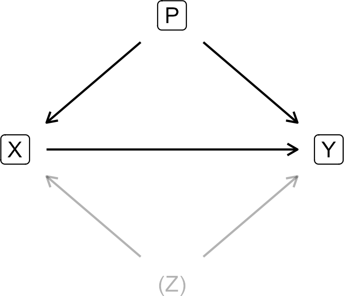
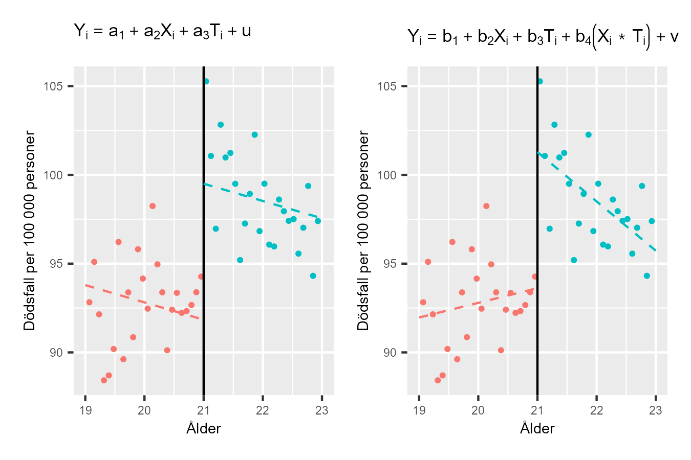

# Räkna på orsak och effekt {#k2-4-7}

### Begrepp
- **Regressionsdiskontinuitet:** Kvasiexperimentell metod där vi kan utnyttja en brytpunkt kring vilket det förekommer en slumpmässig indelning i behandlings- och kontrollgrupp. Kallas även brytpunktsanalys. Engelska: *regression discontinuity design*.

### Teori
I avsnitt [1.1](https://www.dropbox.com/scl/fi/p55pve5puznr5q1pytlp0/1-1-Orsak-och-effekt.docx?rlkey=fhscndx5n8rpsx529fb55liup&dl=0) och [1.2](https://www.dropbox.com/scl/fi/9jy8vypqisanjkto7wr3v/1-2-Experiment-och-observationsstudie.docx?rlkey=4xhcwh8s17u66tholxgf5qdaa&dl=0) introducerade vi kontrafaktisk analys och kvasiexperiment för att studera orsakssamband. I kapitel 1 introducerade vi dessa koncept teoretiskt. Nu, efter att ha arbetat med regressionsanalys med flera variabler i detta kapitel, kan vi förstå den matematiska grunden för varför detta är så viktigt.
Som vi såg i avsnitt 4-1 och 4-3: när vi lägger till eller tar bort variabler i en regressionsmodell ändras koefficienterna för de andra variablerna. Detta är inte bara ett tekniskt problem - det är kärnan i varför vi måste vara så noggranna när vi studerar orsakssamband.

#### Orsakssamband i en regressionsmodell
Säg nu, kraftigt förenklat, att vi har en teori om att en medicin $(X)$ minskar mängden sjukdomssymptom $(Y)$ hos patienter. Vi har hittat en grupp patienter som alla har lika mycket sjukdomssymptom, vilka vi delat in i en behandlingsgrupp (som får medicin) och en kontrollgrupp (som inte får medicin). För att undersöka medicinens effekt på sjukdomssymptom ställer vi upp följande regressionsmodell:
$Y = \alpha + \beta X + \epsilon$ (1)
Genom att observera samvariationen mellan medicin och sjukdomssymptom kommer estimerade $\widehat{\beta}$ att ge oss ett mått på medicinens $X$ effekt på sjukdomssymptomen $Y$. Om medicinen fungerar förväntar vi oss att $\beta$ kommer vara negativ, det vill säga att medicinen $X$ minskar symptom $Y$.
Ett problem, bland flera tänkbara, är att för att vi ska kunna tolka $\widehat{\beta}$ som ett korrekt mått på effekten av medicinen så måste vi vara säkra på att inga andra fenomen påverkar medicinen och sjukdomssymptomen.
Säg att vi till exempel vet från tidigare forskning att det finns flera andra saker som både påverkar medicinens effekt och själva sjukdomssymptomet. Det kan handla om sådant som kön, ålder med mera. Dessa saker kan vi mäta och lägga till som variabler i vår regressionsmodell. Genom att kontrollera för till exempel kön kan vi i så fall estimera medicins effekt korrekt.

#### Illustration med diagram
Men det finns även ytterligare några fenomen som vi har starka skäl att tro att de är viktiga för både medicinen och symptomen, men som vi saknar data för. Om vi saknar data så kan vi inte kontrollera för det i regressionsmodellen.
Figur 1 illustrerar ett exempel på hur den här sortens problem kan se ut. Pilen från $X$ till $Y$ beskriver det orsakssamband som vi är intresserade av. Pilar visar påverkans riktning (kausalitet). Så här ska figuren läsas:
- $X \rightarrow Y$: Medicinen påverkar symptom. Det vi vill mäta!
- $P \rightarrow X$ och $P \rightarrow Y$: Fenomen $P$ (observerbart, som ålder) påverkar både vem som får medicin och sjuka de är
- $Z \rightarrow X$ och $Z \rightarrow Y$: Fenomen $Z$ (icke-observerbart, som medfödd förmåga) påverkar både vem som får medicin och hur sjuka de är.
Om vi inte kontrollerar för $P$ och $Z$ kommer den samvariation vi observerar mellan $X$ och $Y$ att vara en blandning av (1) medicinens faktiska effekt (det vi vill mäta), (2) effekten av $P$ (kan vi fixa genom att inkludera $P$ i regressionen) och (3) effekten av Z (kan vi inte fixa).
Detta är varför randomiserade experiment är så viktiga: de \"bryter\" pilarna från $P$ och $Z$ till $X$. För att vi ska kunna uppskatta vilken effekt $X$ har på $Y$ måste vi dels fastställa att när det sker en variation i $X$, orsakad utan koppling till $Y$, så sker det även en variation i $Y$.

### Exogen variation
I detta fall bestämmer vi att behandlingsgruppen tar medicinen, vilket är den framkallade variationen i $X$. Detta kallas för exogen variation, variation i $X$ som inte orsakas av $Y$ eller av något som påverkar både $X$ och $Y$. Exempel på exogen variation i medicin $X$:
- Vi bestämmer vem som får medicin, som i ett randomiserat experiment
- Variationen i $X$ kommer från vårt experimentella upplägg
Exempel på endogen variation (dåligt om vi ska dra slutsatser om orsakssamband):
- Patienter som mår bättre väljer att ta medicin
- Variationen i $X$ beror då på något annat (hälsotillstånd) som också påverkar $Y$

### Selektionsproblemet
För att uppskatta effekten av $X$ på $Y$ korrekt måste vi även ta hänsyn till de två fenomenen $P$ och $Z$ som påverkar både $X$ och $Y$. Fenomen $P$ och $Z$ påverkar vilka som ingår i behandlingsgruppen och vilka som ingår i kontrollgruppen. Detta kallas för [*selektionsproblem*](https://en.wikipedia.org/wiki/Selection_bias) och beskrevs i [avsnitt 1-2](https://www.dropbox.com/scl/fi/9jy8vypqisanjkto7wr3v/1-2-Experiment-och-observationsstudie.docx?rlkey=4xhcwh8s17u66tholxgf5qdaa&dl=0).
Fenomen $P$ är observerbart (till exempel kön och ålder) men fenomen $Z$ syftar på något som det saknas data för och som det kanske aldrig kommer att finnas data för.
Om vi inte justerar vår analys för $P$ och $Z$ kommer de variationer vi observerar i $X$ och $Y$, liksom samvariationen mellan dem, helt eller delvis vara orsakade av $P$ och $Z$. Detta vet vi från när vi tittat på regressionsanalys med tre eller fler variabler i avsnitt [4.1](https://www.dropbox.com/scl/fi/dkav9cmen93lfv9xnh5i1/4-1-Regressionsanalys-med-tre-variabler.docx?rlkey=womzymlqr70kjry66qltgkcph&dl=0) och [4.4](https://www.dropbox.com/scl/fi/sdnc9eukta9tuiq1y6z0f/4-4-Regression-med-matriser.docx?rlkey=zmc4680olys9qe0zmn7i0vswc&dl=0).

**Figur 1: För att skatta effekten av X på Y måste vi justera för P och Z.**

{style="width:2.875in;height:2.48022in"}

::: {.fig-caption}
Förklaring: Fenomen P är observerbart och påverkar X och Y. Fenomen Z kan inte observeras eller mätas men påverkar också X och Y. P kan vi kontrollera för. Z kan vi inte kontrollera för. Vi kommer kanske aldrig kunna kontrollera för Z. Detta är ett centralt argument för vetenskapliga experiment.
Diagrammet i figur 1 kallas för en *riktad acyklisk graf* (engelska *directed acyclic graph*, *DAG*). Diagrammet beskriver ett exempel och ytterligare utmaningar av liknande slag är också tänkbara, men diskuteras ej här.
:::

#### Både förekomst och frånvaron av variabler kan påverka våra resultat
I tidigare avsnitt såg vi hur frånvaron eller närvaron av andra variabler kan påverka alla resultat i regressionsmodellen. Det är därför viktigt att vi funderar noga på hur vi designar vår undersökning.
Om vi utför ett kontrollerat experiment, till exempel delar in patienterna slumpmässigt i 2 grupper och ger ena gruppen medicin, ökar våra möjligheter att mäta effekten korrekt. Om vi har tillräckligt många patienter kommer alla andra egenskaper förutom själva behandlingen att fördela sig slumpmässigt mellan grupperna.
För att designa vår undersökning och regressionsmodell kan vi ta fram olika typer av underlag, studera andra samvariationer, pröva olika lösningar och jämföra resultat. Detta arbete är något som analytiker måste avgöra från fall till fall. Oavsett hur avancerad metod eller hur många observationer och variabler vi har finns det ingen metod för att bevisa exakt vilka variabler som bör ingå i en analys.

#### Vi kan inte använda teori i stället för data
Ibland är det frestande att tro att om vi hittar någon jättesmart teori som beskriver hur hela världen fungerar, är det i sig ett bevis för hur en regressionsmodell bör utformas. Idéer och teorier är grunden för all analys men det är i sig inget bevis för att inkludera eller exkludera just de variabler vi har till förfogande. Den här typen av svårigheter har varit välkända länge och diskuterats utförligt inom samhällsvetenskap. Två läsvärda texter på temat är [Hendry (1980)](https://www.climateaudit.info/pdf/others/hendry.1980.pdf) och [Leamer (1983)](https://uh.edu/hobby/eitm/_docs/past-lectures/2015-Lectures/Harold-Clarke/lets-take-the-con-out-of-econometrics.pdf).
Som vi gick igenom i avsnitt [1.2](https://www.dropbox.com/scl/fi/9jy8vypqisanjkto7wr3v/1-2-Experiment-och-observationsstudie.docx?rlkey=4xhcwh8s17u66tholxgf5qdaa&dl=0) är det ofta omöjligt att genomföra kontrollerade experiment inom samhällsvetenskap. Det är lätt att tro att detta medför att vi lika gärna kan uttala oss om orsakssamband utan experimentliknande metoder, eftersom ingen ändå vet. Detta är helt enkelt inte sant. Svårigheten att uttala sig om orsakssamband sänker inte kraven på samhällsvetenskap, snarare tvärtom.
I stället för experiment är samhällsvetare ofta hänvisade till kvasiexperimentella observationsstudier där behandlings- och kontrollgrupp till exempel skapas genom att analytiker lyckas identifiera en process som, utan avsikt, fördelar en tillräckligt stor mängd observationer slumpmässigt i behandling och kontroll.
Även i dessa situationer måste vi undersöka om våra antaganden i analysen är rimliga, till exempel att fördelningen mellan kontroll och behandlingen verkligen skett så gott som slumpmässigt. Detta kan vi till exempel göra genom att jämföra behandlings- och kontrollgruppens egenskaper och därigenom kontrollera att den enda viktiga skillnaden mellan grupperna är själva behandlingen.
Om observerbara egenskaper är likvärdiga kan vi ofta anta att även de icke-observerbara egenskaperna är det. Många sådana metoder bygger just på att inget fenomen ska påverka fördelningen (selektionen) till behandlings- och kontrollgruppen.

#### Brytpunktsanalys
För att studera orsak och verkan när vi studerar människor finns det flera kvasiexperimentella metoder för att identifiera behandlings- och kontrollgrupp. Ett exempel på en sådan metod är *regressionsdiskontinuitet* (engelska *regression discontinuity*), eller *brytpunktsanalys*.
Detta är en metod för att identifiera och jämföra behandlings- och kontrollgrupp i en observationsstudie. Metoden bygger på att vi kan observera variationer kring en brytpunkt med betydelse för både behandling och utfall. Små variationer kring brytpunkten kan antas vara slumpmässiga, varför denna kan användas för att dela in observationer i behandling och kontroll.
Låt oss återigen tänka oss att vi ska studera vilken effekt en utbildning har på deltagarnas framtida inkomster. Om vi jämför deltagarnas inkomster med resten av befolkningen riskerar andra icke-observerbara egenskaper hos deltagarna både förklara varför de deltog i utbildningen och deras inkomster. Vi kan därför inte uppskatta effekten på detta sätt.
Men antagning till utbildningen sker med ett intagningsprov som man måste få minst 92 poäng på för att bli antagen. Vi tänker nu att de som fick precis över och precis under 92 poäng har likvärdiga färdigheter. Några hade en dålig dag och några hade en ovanligt bra dag. De studenter som hamnade precis över 92 poäng och antogs blir vår behandlingsgrupp. De studenter som hamnade precis under 92 poäng och ej antogs blir vår kontrollgrupp.
Tanken är att studenter som fick 91 poäng och studenter som fick 93 poäng är i praktiken lika duktiga. Skillnaden på 2 poäng kan betraktas som "tur" (några hade en bra/dålig dag). Eftersom skillnaden är slumpmässig kring brytpunkten kan vi jämföra dessa två grupper nästan som i ett randomiserat experiment: Behandlingsgrupp: 93 poäng → antagen. Kontrollgrupp: 91 poäng → inte antagen. Men notera att detta fungerar endast nära brytpunkten. Vi kan inte jämföra någon med 50 poäng mot någon med 100 poäng eftersom de är för olika.
För att kontrollera om behandlings- och kontrollgruppen har likvärdiga färdigheter kan vi jämföra de relevanta egenskaper vi kan observera, som ålder, tidigare prestationer, tidigare utbildning med mera. För exempel på en studie med liknande metod, se [Rooth och Stenberg (2022)](https://www.nationalekonomi.se/wp-content/uploads/2022/09/50-6-doras.pdf).

#### Alkoholens skadeverkningar
Låt oss ta ett exempel på verklig forskning som applicerar brytpunktsanalys på ett riktigt fall. Vi ska här använda oss av [Carpenter och Dobkin (2009)](https://pmc.ncbi.nlm.nih.gov/articles/PMC2846371/?utm_source=ploomber&utm_medium=blog&utm_campaign=causal-inference-part-i) studie på alkohol och dödlighet. Att alkohol är direkt skadligt och även indirekt ökar risken för olika negativa effekter är välkänt. Samtidigt kan det vara svårt att i detalj skatta de skadliga effekterna (fenomen Y) av ökad tillgång till alkohol (fenomen $X$) eftersom människor som far illa av alkohol ofta även har andra destruktiva vanor. Vissa av dessa kan vi observera och kontrollera för (fenomen $P$). Men många dåliga vanor är av sådan art att det är svårt eller omöjligt att kontrollera för allt i analys (fenomen $Z$).
[Carpenter och Dobkin (2009)](https://pmc.ncbi.nlm.nih.gov/articles/PMC2846371/?utm_source=ploomber&utm_medium=blog&utm_campaign=causal-inference-part-i) använder sig av det faktum att i USA är åldersgränsen för att köpa alkohol 21 år. Först visar de att drickandet bland unga vuxna ökar kraftigt strax efter 21-årsdagen samtidigt som olika dödsorsaker som ofta är förknippade med alkoholkonsumtion ökar: trafikolyckor, självmord med mera.
Carpenter och Dobkin jämför därför mängden dödsfall just kring månaderna före och efter människors 21-årsdag. Alltså, vid 21-årsdagen är den största förändringen just ökad tillgång till alkohol. Och av en tragisk händelse ökar samtidigt mängden dödsfall av orsaker som ofta orsakas av just alkohol.
Låt oss nu gå igenom grunderna för den regressionsanalys som Carpenter och Dobkin använder för att mäta dessa effekter. Vi illustrerar här två exempel. Vi börjar med följande regressionsmodell:
$Y_{i} = a_{1} + a_{2}X_{i} + a_{3}T_{i} + u_{i}$ (2)
där $a_{1},a_{2}$ och $a_{3}$ är koefficienter. $Y_{i}$ är antal alkoholrelaterade dödsfall per 100 000 invånare i respektive åldersgrupp i, där varje åldersgrupp är indelad i månader: 19 år och 1 månad, 19 år och 2 månader, och så vidare.
Variabel $X$ är ålder räknat i månader. $T$ är en dummyvariabel som är $T = 0$ för de åldersgrupper som är under 21 och $T = 1$ för de åldersgrupper som har fyllt 21. $u_{i}$ är felterm för åldersgrupp i. Koefficienten $a_{3}$ som är multiplicerad med $T$ kommer i denna regressionsmodell att beskriva den effekt som 21-årsdagen har på alkoholrelaterad dödlighet.
Koefficienten $a_{2}$ i regressionsmodellen i ekvation 2 estimerar samvariationen mellan dödlighet $(Y)$ och ålder $(X)$. Men denna samvariation kan också tänkas ändras då en person fyller 21. För att kontrollera detta lägger vi till en interaktionsterm $X*T$. Vi får nu följande regressionsmodell:
$X*T:Y_{i} = b_{1} + b_{2}X_{i} + b_{3}T_{i} + b_{4}\left( X_{i}*T_{i} \right) + v_{i}$ (3)
där $b_{1},b_{2},b_{3}$ och $b_{4}$ är koefficienter $Y,X$ och $T$ är samma variabler som i regressionsmodellen i ekvation 2 och $v$ är feltermen. Interaktionstermen $b_{4}\left( X_{i}*T_{i} \right)$ estimerar förändringar i samvariationen mellan alkoholkonsumtion och dödlighet före/efter 21-årsdagen.

#### Carpenter och Dobkins resultat i diagram
De två regressionsmodellerna illustreras i figur 2 där båda diagrammen använder samma data, hämtad från [Carpenter och Dobkin (2009)](https://pmc.ncbi.nlm.nih.gov/articles/PMC2846371/?utm_source=ploomber&utm_medium=blog&utm_campaign=causal-inference-part-i).
Jämför figur 3 i \[[carpenter2009theeffect](#LyXCite-carpenter2009theeffect)\]. Data tillgängliga här: https://github.com/jrnold/masteringmetrics/blob/master/
masteringmetrics/data/mlda.rda
Den vertikala linjen mitt i respektive diagram markerar tidpunkten då personerna i undersökningen fyller 21. Till vänster om linjen visas genomsnittligt antal dödsfall för människor strax under 21 och till höger dödsfall för de som precis fyllt 21. Den högra regressionslinjen i respektive diagrammen skiftar upp vid 21 års ålder, vilket indikerar att dödligheten stiger brant efter 21-årsdagen i och med att människor har möjlighet att köpa alkohol.
I det vänstra diagrammet ser vi två regressionslinjer, där båda är estimerade med regressionsmodellen i ekvation 2. Regressionslinjen till vänster, för åldersgrupperna under 21, är ritad med $T = 0$ och lutar nedåt. För åldersgrupperna över 21, till höger i det vänstra diagrammet, är regressionslinjen ritad med $T = 1$. De båda regressionslinjerna i det vänstra diagrammet har samma lutning, eftersom vi endast estimerar en lutningskoefficient för ålder i ekvation 2.
I det högra diagrammet ser vi också två regressionslinjer som är estimerade utifrån regressionsmodellen i ekvation 3. För åldersgrupperna över 21, till höger i diagrammet, skiftar linjen upp. Lutningen ändras också. För åldersgrupperna under 21, till vänster i det högra diagrammet, syns en positiv korrelation mellan alkoholrelaterad dödlighet och ålder. För åldersgrupperna över 21 syns i stället en negativ korrelation mellan alkoholrelaterad dödlighet och ålder.

**Figur 2: Samvariationen mellan ålder och alkoholrelaterad dödlighet**

{style="width:6.32639in;height:4.21759in"}

::: {.fig-caption}
Förklaring: Brytpunktsanalys rörande alkoholrelaterade dödsfall per åldersgrupp i USA. Se brödtext för förklaring av regressionsmodellerna. Data från [Carpenter och Dobkin (2009)](https://pmc.ncbi.nlm.nih.gov/articles/PMC2846371/?utm_source=ploomber&utm_medium=blog&utm_campaign=causal-inference-part-i). Genomsnittlig alkolholrelaterad dödlighet ökat skarpt i samband med att människor fyller 21.
:::

### Sammanfattning
I detta avsnitt har vi gått igenom varför kapitel 4 spelar roll för vetenskap:
1.  Regressionsanalys är inte bara en teknisk metod - det är ett verktyg för att studera orsakssamband.
2.  För att mäta kausalitet korrekt måste vi:
    a.  Antingen göra randomiserade experiment (RCT)
    b.  Eller hitta kvasiexperimentella metoder (som brytpunktsanalys)
    c.  Eller åtminstone kontrollera för alla relevanta variabler
3.  Som vi såg här i kapitel 4 kan alla variabler som ingår eller inte ingår i en analys påverka resultaten. Detta är inte en teknisk detalj. Det är skillnaden mellan korrekta eller felaktiga slutsatser om orsak och verkan.
4.  Det finns inga direkta metoder för att objektivt bevisa vilka variabler som ska ingå. Därför behöver vi:
    a.  Stark teori
    b.  Genomtänkt forskningsdesign
    c.  Kritiskt tänkande
    d.  Vetenskaplig ödmjukhet
Detta är varför metodik och statistik inte bara handlar om matte. Detta är grunden för hur vi förstår världen.

::: {.ex-section-title}
Övningar
:::

