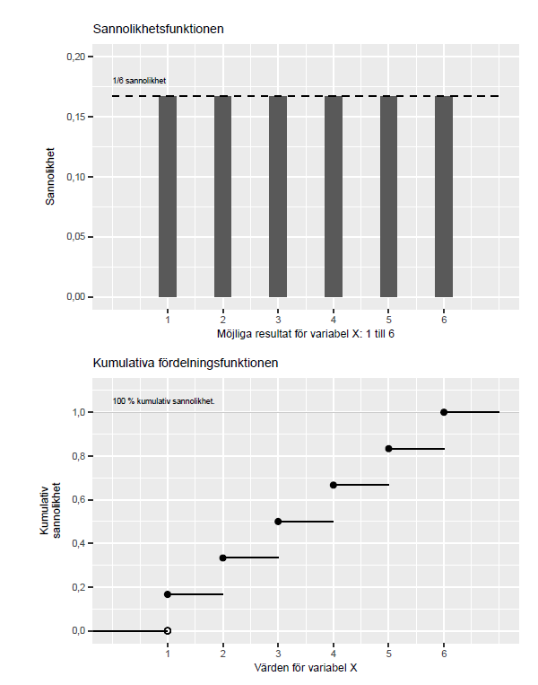

# Slumpmässiga variabler och diskreta sannolikhetsfördelningar {#k2-5-1}

### Begrepp
- **Statistik:** kallas den del av matematiken som handlar om att samla in och studera data (information). En samling data kallas ofta också för statistik.
- **Slumpmässig variabel:** En matematisk variabel som styrs av en slumpmässig process.
- **Sannolikhetsfördelning:** En fördelning av möjliga slumpmässiga utfall, definierad av en matematisk funktion.
- **Diskret sannolikhetsfördelning:** En slumpmässig variabel med en ändlig mängd möjliga utfall. Varje utfall har en sannolikhet.
- **Kontinuerlig sannolikhetsfördelning:** En sannolikhetsfördelning där en slumpmässig variabel kan anta en oändlig mängd värden. Varje enskilt utfall har noll sannolikhet, medan intervall av utfall har en sannolikhet över noll.
- **De stora talens lag:** medelvärdet av en stor samling slumpmässiga urval kommer närma sig det sanna medelvärdet.
### Teori
I [avsnitt 1.2](https://www.dropbox.com/scl/fi/9jy8vypqisanjkto7wr3v/1-2-Experiment-och-observationsstudie.docx?rlkey=4xhcwh8s17u66tholxgf5qdaa&dl=0) introducerade vi experiment och kvasiexperiment samt hur vi med hjälp av behandlings- och kontrollgrupp kan studera orsakssamband och effekter.
#### Kopplingen mellan sannolikhet och kausalitet
Säg att vi utformar ett experiment där vi vill studera effekterna av en medicin och har två patienter till vårt förfogande. Den ena patienten får medicinen (behandlingen) och den andra får inte någon medicin (kontroll).
Eftersom vi endast jämför två personer är risken stor att studiens resultat lika gärna kan vara ett resultat av slump. När vi studerar verkligheten kan vi aldrig undvika denna osäkerhet fullständigt. Men vi kan räkna på [sannolikheten](https://www.matteboken.se/lektioner/matte-1/statistik-och-sannolikhet/sannolikhet-for-en-handelse#!/) för att våra resultat är en slump och därigenom bedöma hur trovärdig vår analys är.
I detta kapitel ska vi gå igenom hur vi med hjälp av sannolikhetslära och matematiska beräkningar kan arbeta med denna typ av frågor. Delar av det som beskrivs här känner du igen från [Matte 1: Statistik och sannolikhet](https://www.matteboken.se/lektioner/matte-1/statistik-och-sannolikhet#!/), [Matte 2: Statistik](https://www.matteboken.se/lektioner/matte-2/statistik#!/) och [Matte 4: Sannolikhetsfördelning](https://www.matteboken.se/lektioner/matte-4/integraler-och-tillampningar/sannolikhetsfordelning#!/).
#### Slumpmässiga variabler och sannolikhetsfördelningar
Tidigare har vi arbetat med variabler definierade av en matematisk funktion över en domän, till exempel funktionen $y = x^{2}$ definierad över alla reella tal. Vi har arbetat med datavariabler bestående av insamlade uppgifter, observationer. När vi gick igenom regressionsanalys i tidigare avsnitt arbetade vi med variabler som vi predikterade med hjälp av regressionsmodeller.
När vi nu ska arbeta med sannolikhet och slump ska vi använda *slumpmässiga variabler*. En slumpmässig variabel är en variabel vars resultat bestäms av en slumpmässig process. Slumpmässiga variabler definieras av matematiska funktioner som beskriver sannolikheten för de värden (utfall) som variabeln kan anta.
Sannolikhetsfördelning beskriver med hjälp av en matematisk funktion alla möjliga utfall för en slumpmässig variabel. Sannolikhetsfördelningar kan vara *diskreta* och *kontinuerliga*. Diskreta sannolikhetsfördelningar har ett begränsat antal möjliga utfall, som en tärning. Kontinuerliga sannolikhetsfördelningar har ett oändligt antal möjliga utfall, som alla decimaler mellan 0 och 1.
Det finns oändligt många sannolikhetsfördelningar. För att hitta på en ny sannolikhetsfördelning behöver vi bara beskriva den. Vissa sannolikhetsfördelningar har fått kända namn, till exempel [normalfördelningen](https://www.matteboken.se/lektioner/matte-2/statistik/normalfordelning#!/). Även normalfördelningen är namnet på en oändlig mängd sannolikhetsfördelningar som alla har vissa gemensamma egenskaper.
#### Funktionerna $P$, $f$ och $F$
Funktionen $P()$ används ofta för att beskriva sannolikheten för ett utfall. Från och med nu ska vi använda funktionen $f()$ för att beskriva sannolikheten för ett specifikt värde i en slumpmässig variabel. De två funktionerna $f$ och $P$ beskriver så här långt samma sak: $f(m) = P(M = m)$.
För diskreta sannolikhetsfördelningar kallas sannolikhetsfunktionen $f$ för *probability mass function*, PMF. En annan central funktion är det som kallas för kumulativa fördelningsfunktionen (engelska *cumulative distribtuion function*, CDF), eller bara *fördelningsfunktionen*.
Fördelningsfunktionen beskriver sannolikheten att en slumpvis variabel antar ett värde lika med eller mindre än värdet $m$, vilket vi kan beskriva $P(M \leq m)$. Vi kallar fördelningsfunktionen för $F$:
$F(m) = P(M \leq m)$ (1)
Varför har vi tre olika funktioner för sannolikhet? Notera att funktionerna beskriver olika saker:
- $P()$ eller $f()$: Sannolikheten för ett specifikt utfall, till exempel exakt 3 på tärningen.
- $F()$: Den kumulativa sannolikheten, som 3 eller lägre på tärningen
#### Exempel med likformig sannolikhetsfördelning
Nu ska vi gå igenom lite matematik rörande slumpmässiga variabler och sannolikhetsfördelningar. Syftet med detta är enbart för att få en bättre förståelse för vad fenomenet innebär. Om något känns extra krångligt -- prova att hoppa över detta för nu och kanske prova att läsa det senare.
Säg att vi har en variabel $X$ som följer en diskret sannolikhetsfördelning som kan anta utfall $\{ 1,2,3,4,5,6\}$ med samma sannolikhet. När alla utfall har samma sannolikhet kallas det för att sannolikhetsfördelningen är likformig.
Fördelningsfunktionen för en likformig diskret sannolikhetsfördelning kan generellt beskrivas som:
$F(x) = P(X \leq x) = \frac{x - a + 1}{b - a + 1},\,\, x = a,a + 1,\ldots,b$ (2)
där $a$ och $b$ är lägsta respektive högsta heltalet som $X$ kan anta. I detta fall är $a = 1$ respektive $b = 6$. Fördelningsfunktionen för vår slumpmässiga variabel $X$ är:
$F(x) = P(X \leq x) = \frac{x}{6},\,\, x = 1,2,3,4,5,6$ (3)
Till exempel har vi att $F(2) = 2\text{/}6$, vilket innebär att den kumulativa sannolikheten för att få utfall 1 eller 2 är lika med 2/6. Från och med $x = 6$ och uppåt är $F(x) = 1$, det vill säga 100 %.
Den kumulativa sannolikheten $P(X \leq x)$ måste per definition vara ett värde mellan 0 och 1, mellan 0 och 100 %. Ett annat sätt att beskriva $P(X \leq x)$ är att från 100 % sannolikhet (talet 1) subtraherar vi sannolikheten för $P(X \> x)$:
$F(x) = P(X \leq x) = 1 - P(X \> x)$ (4)
För att beräkna sannolikheten $P(X \> x)$ kan vi därför ta $1 - F(x)$. För variabel $X$ är sannolikheten att få 3 till 6 poäng:
$P(X \> x) = 1 - F(2) = 1 - \frac{2}{6} = \frac{4}{6}$ (5)
Figur 1 illustrerar en likformig slumpmässig sannolikhetsfördelning, där alla värden har samma sannolikhet. Övre diagrammet visar funktion $f(x)$. Nedre diagrammet visar $F(x)$, den kumulativa sannolikheten att få ett värde lika med eller mindre än $x$.
**Figur 1: Sannolikhetsfunktion och kumulativa fördelningsfunktionen\**
{style="width:5.13329in;height:6.52784in"}
::: {.fig-caption}
Förklaring: Övre diagrammet beskriver sannolikheten 1/6 för respektive utfall i sannolikhetsfördelningen. Nedre diagrammet beskriver den kumulativa sannolikheten att få värdet på horisontella x-axeln eller mindre. Sannolikheten att få under 1 är 0. Sannolikheten att få värdet 3 är 0,5, det vill säga 50 %. Sannolikheten att få 6 eller lägre är 100 %.
:::

#### Väntevärde i stället för medelvärde
För en slumpmässig variabel kan vi inte beräkna ett medelvärde på det sätt som vi kan göra för en samling diskreta värden, som en samling tal. För en tärning kan vi inte beräkna medelvärde förrän vi kastat den. Men vi kan beräkna vad vi förväntar oss, alltså det \"genomsnitt\" vi skulle få om vi kastade oändligt många gånger. Detta kallas för väntevärde, eller förväntat värde (engelska *expected value*).
Väntevärdet för en slumpmässig variabel är summan av varje utfall multiplicerat med dess sannolikhet. Matematiskt är väntevärde en generalisering av [viktat medelvärde](https://www.matteboken.se/lektioner/matte-1/ovningsexempel/betygssnitt#!/). För en diskret slumpmässig variabel $X$ kan detta beskrivas som:
$E(X) = \sum_{i}^{n}x_{i}P\left( x_{i} \right)$ (6)
där $E()$ kallas för väntevärdesfunktionen, vilket även kan skrivas $E\lbrack X\rbrack$, $E(X)$ eller $EX$. I [avsnitt 2.1](https://www.dropbox.com/scl/fi/clzr656ksjz2ut13zw9wx/2-1-Frekvens-och-f-rdelning.docx?rlkey=4ybbva8mkt5aj3envb6sb6xu3&dl=0) introducerade vi populationens medelvärde $\mu$. Detta är samma sak som väntevärdet för populationen för den slumpmässiga variabeln $X$, det vill säga: $E(X) = \mu_{X}$.
Säg som exempel att vi har en slumpmässig variabel $X$ med utfallen 1, 2, 3, 4, 5 och 6, alla med sannolikheten 1/6. Väntevärdet för variabeln $X$ blir då:
$E(X) = x_{1}*P\left( x_{1} \right) + x_{2}*P\left( x_{2} \right) + x_{3}*P\left( x_{3} \right) + x_{4}*P\left( x_{4} \right) + x_{5}*P\left( x_{5} \right) + x_{6}*P\left( x_{6} \right)$ (7)
$= 1*\frac{1}{6} + 2*\frac{1}{6} + *\frac{1}{6} + 3*\frac{1}{6} + 4*\frac{1}{6} + 5*\frac{1}{6} + 6*\frac{1}{6} = 3,5$
#### Väntevärdet av en konstant
Väntevärdesfunktionen $E()$ är en linjär funktion. Om vi har de slumpmässiga variablerna $X$ och $Y$ så gäller följande:
$E(X + Y) = E(X) + E(Y)$ (8)
Säg nu att vi har en valfri konstant, $a$. Om vi multiplicerar väntevärdet $E(X)$ med $a$ är detta samma sak som $a$ multiplicerat med respektive enskilt värde i variabeln $X$:
$E(aX) = aE(X)$ (9)
Om vi adderar en konstant $b$ kan vi flytta ut även denna ur väntevärdesfunktionen:
$E(aX + b) = aE(X) + b$ (10)
#### Varians och standardavvikelse för slumpmässiga variabler
I [avsnitt 2.2](https://www.dropbox.com/scl/fi/1esn74n4y0c48moczz9mj/2-2-Avvikelse-varians-och-standardavvikelse.docx?rlkey=uv8lf1wj3u89yrguwkkss5ck6&dl=0) introducerade vi varians som ett sätt att mäta spridning. Vi gick igenom hur vi kan uppskatta variansen i en population genom att räkna på observationer i ett urval.
Även för slumpmässiga variabler kan vi beskriva varians, men då på ett lite annorlunda sätt. För en slumpmässig diskret variabel $X$ kan varians definieras som:
$var(X) = \sum_{i}^{n}\left( x_{i} - \mu_{X} \right)^{2}P\left( x_{i} \right)$ (11)
där $\mu_{X} = E(X)$ och $P\left( x_{i} \right)$ är sannolikheten för respektive värde $x_{i}$, där vi från ekvation 6 vet att $E(X) = \sum_{i}^{n}x_{i}P\left( x_{i} \right)$.
Standardavvikelse ges, liksom tidigare, av positiva kvadratroten av variansen:
$\sigma_{x} = s(x) = \sqrt{var(x)}$ (12)
där $\sigma$ representerar variansen i populationen.
#### Varians för en konstant
Om vi har $var(aX + b)$, där $a$ och $b$ är konstanter, får vi:
$var(aX + b) = a^{2}\text{var}(X)$ (13)
Det vill säga en konstant $a$ som multipliceras med den slumpmässiga variabeln kan flyttas ut ur variansfunktionen $var()$ och multipliceras med sig själv. Konstant $b$ försvinner. För standardavvikelse gäller att:
$s(aX + b) = \|a\|s(X)$ (14)
där $\|a\|$ är absolutvärdet av $a$. Detta innebär att om vi multiplicerar en slumpmässig variabel $X$ med en konstant $a$ så multipliceras dess varians och standardavvikelse, men det förändrar inte spridningens form (jämför [avsnitt 2.2](https://www.dropbox.com/scl/fi/1esn74n4y0c48moczz9mj/2-2-Avvikelse-varians-och-standardavvikelse.docx?rlkey=uv8lf1wj3u89yrguwkkss5ck6&dl=0)).
#### De stora talens lag
Säg nu att vi har en sexsidig perfekt balanserad tärning och kastar denna 1 000 gånger. Givet att tärningen verkligen är perfekt balanserad och fortsätter att vara så under hela processen så är sannolikheten hög att vi kommer att få ungefär lika många utfall för varje sida (1 till 6).
Medelvärdet av våra 1 000 resultat kommer att vara mycket nära 3,5, vilket är medelvärdet om varje tärningssida kommer upp exakt lika många gånger: (1+2+3+4+5+6)/6 = 3,5.
Detta fenomen kallas inom statistik för [De stora talens lag](https://sv.wikipedia.org/wiki/De_stora_talens_lag). Lagen säger att medelvärdet av en stor samling slumpmässiga urval kommer närma sig det väntevärdet (det sanna medelvärdet).
Små samlingar med värden, som till exempel 3 kast, löper större risk att avvika från medelvärdet, jämfört med samlingar med många värden.
De stora talens lag är ingen fysisk lag som måste gälla i varje verkligt exempel. Till exempel, om vi skulle samla ihop 1 000 olika perfekt balanserade tärningar och slå varje tärning 1 000 gånger, så skulle några få av dessa resultat avvika kraftigt från medelvärdet.
Och slår vi tillräckligt många tärningar kommer vi till slut även få de mest extrema resultaten, som till exempel 1 000 kast med värdet 6 varje gång och 1 000 kast med värdet 1 varje gång.
Mer formaliserat kan stora talens lag formuleras på följande sätt: säg att vi har en oändlig sekvens av slumpmässiga variabler $X_{1},X_{2},\ldots,X_{n}$ som har samma väntevärde $\mu$:
$E\left( X_{1} \right) = E\left( X_{2} \right) = \ldots = \mu$ (15)
Medelvärdet för $n$ av dessa variabler är:
$\overline{X_{n}} = \frac{1}{n}\sum_{i}^{n}X_{i}$ (16)
Stora talens lag kan då uttryckas som att följande [gränsvärde](https://www.matteboken.se/lektioner/matte-3/algebraiska-uttryck/gransvarde#!/) är 1 då $n$ går mot oändlighet:
$\lim_{n \rightarrow \infty}{P\left( \left\| \overline{X_{n}} - \mu \right\| \< \epsilon \right)} = 1$ (17)
där $\left\| \overline{X_{n}} - \mu \right\|$ är absolutbeloppet av medelvärdet $\overline{X_{n}}$ minus väntevärdet $\mu$. Funktionen $P()$ beskriver sannolikheten för ett utfall. Termen $\epsilon$ är ett valfritt positivt tal, till exempel ett mycket lågt värde nära 0.
Hela ekvationen kan läsas som att sannolikheten för att $\left\| \overline{X_{n}} - \mu \right\|$ är mindre än $\epsilon$ närmar sig 100 % då antalet slumpmässiga variabler $X_{i}$ växer till oändligt många, det vill säga $n \rightarrow \infty$. Ett annat sätt att beskriva detta är att skillnaden mellan $\overline{X_{n}}$ och $\mu$ närmar sig 0 och denna skillnad kommer att vara mindre än det låga värdet $\epsilon$.

::: {.ex-section-title}
Övningar
:::

---

::: {.next-section-link}
[→ Nästa avsnitt: **Kontinuerliga sannolikhetsfördelningar**](k2-5-2.html)
:::

