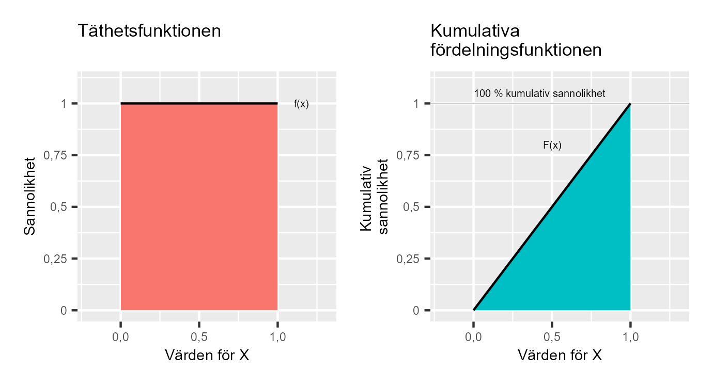
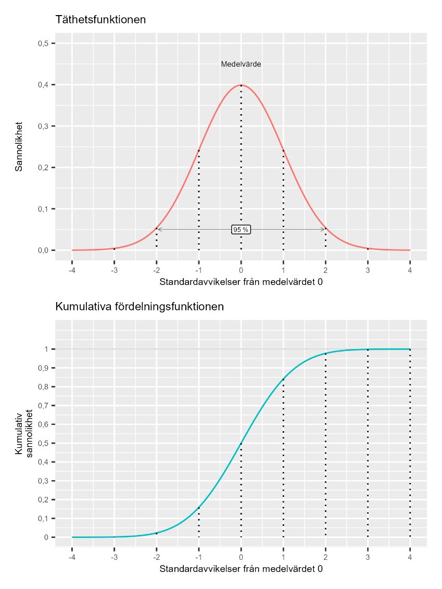

# Kontinuerliga sannolikhetsfördelningar {#k2-5-2}

### Begrepp
- **Täthetsfunktion:** Beskriver sannolikheten för enskilda utfall för en kontinuerlig slumpmässig variabel. Betecknas här $f$.
- **Kumulativa fördelningsfunktionen:** Beskriver sannolikheten för intervall för en kontinuerlig slumpmässig variabel. Betecknas här $F$.
- **Likformig kontinuerlig sannolikhetsfördelning:** Alla utfall har samma sannolikhet.
- **Standardnormalfördelningen:** En normalfördelning med medelvärdet 0 och standardavvikelse 1. Betecknas $N(0,1)$. Kallas även för standardiserad normalfördelning eller Z-fördelning.

### Teori
Som vi beskrev i föregående avsnitt kan kontinuerliga sannolikhetsfördelningar anta alla möjliga värden inom ett intervall och har därför ett oändligt antal möjliga utfall. I [matte 2](https://www.matteboken.se/lektioner/matte-2/statistik/normalfordelning#!/) och [matte 4](https://www.matteboken.se/lektioner/matte-4/integraler-och-tillampningar/sannolikhetsfordelning#!/) introduceras kontinuerliga sannolikhetsfördelningar och bland annat normalfördelningen.

#### Sannolikhet och kumulativ sannolikhet
För en diskret variabel använder vi en *sannolikhetsfunktion* för att beskriva sannolikheten för enskilda utfall. Motsvarande funktion som beskriver sannolikheten för möjliga utfall i en kontinuerlig variabel kallas för *täthetsfunktion* (engelska *probability density function*), vilken vi förkortar $f$.
För att beräkna den kumulativa sannolikheten för en kontinuerlig slumpmässig variabel använder vi en *kumulativ fördelningsfunktion*, som vi kallar $F$. Det vill säga, samma förkortningar som vi använde i föregående avsnitt för att beskriva motsvarande funktioner för diskreta sannolikhetsfördelningar.
För en slumpmässig kontinuerlig variabel $X$ beskriver täthetsfunktionen $f(x)$ sannolikheten för ett specifikt utfall $X = x$, medan kumulativa fördelningsfunktionen $F(x)$ beskriver sannolikheten att $X$ antar ett värde lägre eller lika med $x$.

#### Ett exempel med diagram
Säg att vi har en kontinuerlig sannolikhetsfördelning $X$ där alla värden mellan 0 och 1 har samma sannolikhet. Det vill säga, vi har samma sannolikhet att få någon av alla de oändligt många decimaler som finns mellan 0 och 1. Om varje sådant värde mellan 0 och 1 hade en sannolikhet \> 0, skulle summan bli oändligt stor. I stället är sannolikheten för ett specifikt värde inom ett kontinuerlig intervall (med ett oändligt antal värden), till exempel 0,0934720630257, definierat till noll.
Däremot finns det en positiv sannolikhet att få ett värde inom ett intervall. Till exempel är sannolikheten för att $X$ ska anta ett värde mellan 0 och 0,5 lika med 50 %, eftersom det motsvarar hälften av sannolikhetsfördelningen. Det är denna sannolikhet vi får av kumulativa fördelningsfunktionen $F(x)$.
Alltså: sannolikheten att få ett specifikt värde, som 0,5, är noll. Sannolikheten för att få ett värde inom ett intervall, som 0,4 -- 0,6, vilket här motsvarar 20 % av intervallet, är just 20 %.
Figur 1 illustrerar täthetsfunktionen och kumulativa fördelningsfunktionen för den likformiga kontinuerliga sannolikhetsfördelningen $X$, där alla utfall mellan 0 och 1 har samma sannolikhet.
Det vänstra diagrammet illustrerar täthetsfunktionen $f$ och det högra diagrammet kumulativa fördelningsfunktionen $F$. Sannolikheten för att $X$ antar ett värde mellan 0 och 0,5 är 0,5, vilket vi kan se i det högre diagrammet genom att jämföra 0,5 på den horisontella axeln ($x$-värdet) och den kumulativa sannolikheten på vertikala axeln. Det vill säga:

$$F(x = 0,5) = P(X \leq 0,5) = 0,5$$

**Figur 1: Täthetsfunktionen och kumulativa fördelningsfunktionen för en likformig kontinuerlig sannolikhetsfördelning**

::: {.fig-caption}
Förklaring: Vänstra diagrammet beskriver sannolikheten för varje utfall mellan 0 och 1. Högra diagrammet beskriver kumulativa sannolikheten att få ett värde på horisontella x-axeln eller lägre. Sannolikheten att få ett värde under 0 är noll. Sannolikheten att få ett värde mellan 0 och 0,5 är 0,5, det vill säga 50 %. Sannolikheten att få värdet 1 eller lägre är 100 %.
:::

#### Väntevärde för kontinuerliga variabler
I föregående avsnitt introducerade vi väntevärde för diskreta slumpmässiga variabler som summan av utfall multiplicerat med deras sannolikhet, $E(X) = \sum_{}^{}{xP(x)}$. Väntevärdet för en kontinuerlig slumpmässig variabel är på liknande sätt summan av utfall multiplicerat med sannolikheterna.
Säg att vi har en slumpmässig likformig kontinuerlig variabel $X$, vars lägsta respektive högsta värden är $a$ och $b$. Eftersom vi nu ska summera ett kontinuerligt intervall kan vi använda [integraler](https://www.matteboken.se/lektioner/matte-3/integraler?gad_source=1&gclid=CjwKCAiAwaG9BhAREiwAdhv6Y2KYZCxYMa4BwTrcLl7ZKGEB3v3OAesqY9bL4uQRR9bVbVEpx1Ls0BoCJyQQAvD_BwE#!/):

$$E(X) = \int_{a}^{b}{xf(x)dx} \tag{1}$$

vilket ska läsas som att vi över intervallet $a$ till $b$ summerar alla möjliga utfall $x$ multiplicerat med sannolikheten för respektive värde $f(x)$.

#### Varians för kontinuerliga sannolikhetsfördelningar
Varians för en kontinuerlig slumpmässig variabel $X$ kan beskrivas:

$$var(X) = E\left( \left( X - \mu_{X} \right)^{2} \right) = \sigma_{X}^{2} \tag{2}$$

Om vi skriver ut definitionen av väntevärdet från ekvation 1 får vi:

$$E\left( \left( X - \mu_{X} \right)^{2} \right) = \int_{- \infty}^{\infty}\left( X - \mu_{X} \right)^{2}f(x)dx \tag{3}$$

Standardavvikelsen är, liksom för diskreta variabler, kvadratroten av variansen:

$$\sigma_{X} = \sqrt{var(X)} = \sqrt{\sigma_{X}^{2}} \tag{4}$$

Betingat väntevärde för kontinuerliga slumpmässiga variabler $X$ och $Y$ skrivs:

$$E\left( Y \middle\| X \right) = \int_{- \infty}^{\infty}{\int_{- \infty}^{\infty}{xyf(x,y)dxdy}} \tag{5}$$

där $f(x,y)$ är den gemensamma sannolikhetsfördelningen. Lagen om totalt väntevärde gäller även för kontinuerliga fördelningar, $E\left( E\left( X \middle\| Y \right) \right) = E(X)$, liksom regeln att $E\left( XY \middle\| X \right) = XE\left( Y \middle\| X \right)$.

#### Normalfördelningen
Ett exempel på en kontinuerlig sannolikhetsfördelning är det som kallas för normalfördelningen. Se [matte 2](https://www.matteboken.se/lektioner/matte-2/statistik/normalfordelning#!/) och [matte 4](https://www.matteboken.se/lektioner/matte-4/integraler-och-tillampningar/sannolikhetsfordelning#!/).
En normalfördelning som har medelvärde 0 och standardavvikelse 1 kallas för *standardiserad normalfördelning, standardnormalfördelningen* eller *Z-fördelningen*. Vi stöter sällan på några verkliga data som av naturliga skäl följer en normalfördelning med medelvärde 0 och standardavvikelse 1. Däremot kan vi räkna om en samling värden så att dessa får medelvärde 0 och standardavvikelse 1, vilket kallas för att standardisera. För att standardisera variabel $X$ tar vi:
Standardiserade $X = Z = \frac{X_{i} - \overline{X}}{s_{X}}$ (6)
där $X_{i} - \overline{X}$ innebär att vi subtraherar medelvärdet $\overline{X}$ från varje värde $X_{i}$ och dividerar med estimerad standardavvikelse $s_{X}$.
Genom att omvandla vilken normalfördelning som helst till medelvärde 0 och standardavvikelse 1 kan vi använda samma tabell och matematiska funktion för alla normalfördelningar. Detta är mycket praktiskt.
Standardiserade normalfördelningar används ofta och kallas därför ibland för variabel $Z$. Denna sannolikhetsfördelning har flera kända sannolikhetsmått utifrån dess standardavvikelser, vilka ofta används i statistisk analys. Figur 2 illustrerar detta, där det övre diagrammet beskriver standardnormalfördelningens täthetsfunktion $f$ och det nedre diagrammet beskriver kumulativa fördelningsfunktionen $F$.
I det övre diagrammet är några av standardavvikelserna under och över medelvärdet 0 markerade. Kumulativa fördelningsfunktionen $F(Z \leq z)$ beskriver liksom tidigare hur stor andel av alla värden i variabel $Z$ som är mindre eller lika med utfall $z$ (ett enskilt värde i $Z$).
Eftersom standardnormalfördelningen även kallas $Z$-fördelningen beskrivs denna typ av sannolikheter ofta som just $Z$-värden (engelska *z-score*).
Standardiserade normalfördelningen är så välanvänd att det finns flera färdigberäknade sannolikheter från denna fördelning som ofta används i statistisk analys. Några av dessa visas i figur 2, där vi i det övre diagrammet bland annat kan se att 95 % av fördelningen täcks av avståndet från -1,96 standardavvikelser till +1,96 standardavvikelser från medelvärdet.

**Figur 2: Standardiserade normalfördelningens täthetsfunktion** $\mathbf{f(z)}$ **och kumulativa fördelningsfunktion** $\mathbf{F(Z \leq z)}$**.**

::: {.fig-caption}
Förklaring: Övre diagrammet illustrerar täthetsfunktionen $f(z)$, där vertikala axeln anger sannolikheten för ett specifikt värde i standardiserade normalfördelningen. Nedre diagrammet illustrerar kumulativa fördelningsfunktionen $F(Z \leq z)$, som beskriver sannolikheten för värdet $z$ eller lägre.
:::

::: {.ex-section-title}
Övningar
:::

---

::: {.next-section-link}
[→ Nästa avsnitt: **Statistisk analys 1**](k2-5-3.html)
:::

