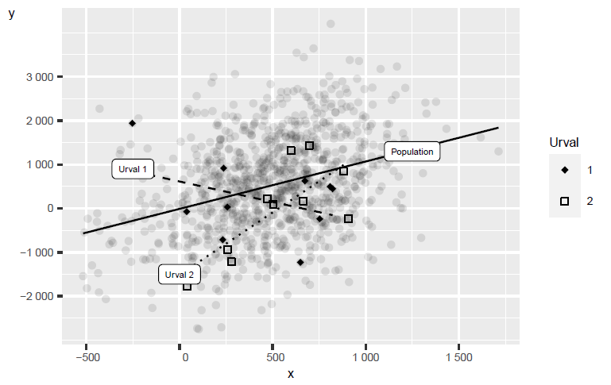
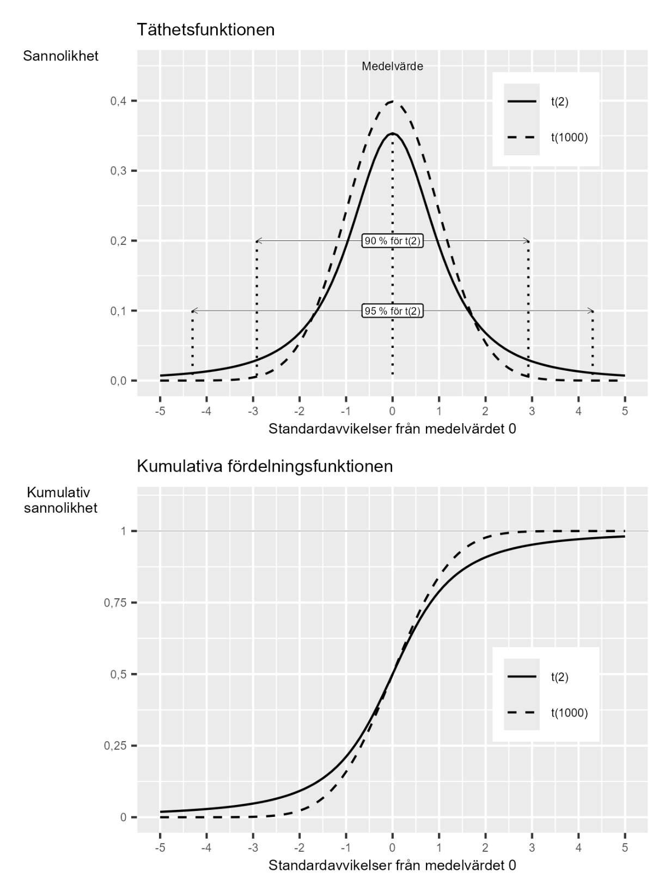

# Regressionsanalys med sannolikhet {#k2-5-5}

### Begrepp
- **T-fördelningen:** Sannolikhetsfördelning som liknar standardnormalfördelningen. Används ofta för statistiska test rörande koefficienterna i en regressionsmodell. T-fördelningens form beror på antal frihetsgrader.
- **T-test:** Statistiskt test som använder t-fördelningen.
- **Standardfel för regressionsmodellens koefficienter:** Mått på osäkerheten i regressionsmodellens estimerade koefficienter.
- **Statistiskt test för regressionsmodellens koefficienter:** Utgår ofta (men ej nödvändigtvis) från nollhypotesen $H_{0}:b = 0$ för populationens koefficient $b$. Beräkna t-värde med $t = \frac{\widehat{b}}{s_{\widehat{b}}}$ där $s_{\widehat{b}}$ är estimerat standardfel för estimerade koefficienten. Jämför beräknade $t$ med kritiska $t^{*}$ i t-fördelningen, beroende på vald signifikansnivå.
- **Konfidensintervall för regressionsmodellens koefficienter:** Kan beräknas som $\widehat{b} \pm t_{k,\alpha}*{\widehat{s}}_{\widehat{b}}$, där $t_{k,\alpha}$ beror på frihetsgrader $k$ och signifikansnivå $\alpha$. $\widehat{s}$ är uppskattat standardfel för koefficient $\widehat{b}$.
- **Statistisk signifikant:** Ett resultat är statistiskt signifikant om det statistiska testet indikerar att vi, utifrån vald signifikansnivå, bör förkasta nollhypotesen $H_{0}$. Om testet indikerar att vi inte bör förkasta $H_{0}$ säger man att resultatet inte är statistiskt signifikant.

### Teori
I detta avsnitt ska vi kombinera vad vi lärt oss om statistisk analys med regressionsanalys.

#### Med urvalsdata estimerar vi regressionsmodellen
Med hjälp av urvalsdata vill vi estimera koefficienterna $a$ och $b$ en regressionsmodell som existerar i en population:

$$Y = a + bX + V \tag{1}$$

där *Y* och *X* är variabler och *V* är feltermen. Vi vill finna värden som är så nära som möjligt populationsvärdena.
Figur 1 illustrerar detta med påhittade data för två normalfördelade variabler $Y$ och $X$. Inspirerat av Robert Östlings undervisningsmaterial:\
www.sites.google.com/view/robertostling/home/teaching
De grå prickarna är populationen. I populationen existerar det en positiv samvariation mellan $Y$ och $X$. Den heldragna svarta linjen är regressionslinjen för populationen.
Från populationen har vi tagit två slumpmässiga urval på några observationer, markerade som "urval 1" och "urval 2", och estimerat en regressionslinje per urval. Regressionslinjen för urval 1 är den streckade linjen med negativ lutning. Regressionslinjen för urval 2 har en positiv lutning. Inget av de två urvalen ger en korrekt bild av populationens samvariation.
Bilden illustrerar hur vi i praktiken arbetar med analys när vi har tillgång till data. I regel har vi inte populationsdata. Ibland har vi en stor mängd observationer och många variabler. Men ofta vill vi även uttala oss om vad som kommer hända i framtiden -- vilket vi per definition inte har data på än. För att detta arbete ska bli så bra som möjligt behöver vi förstå statistisk analys och teorierna bakom statistiska test.

**Figur 1: Samvariationen i population och urval**

::: {.fig-caption}
Förklaring: De grå prickarna är populationen. I populationen finns en positiv samvariation mellan $Y$ och $X$, vilket illustreras av den heldragna svarta linjen. Från populationen har vi tagit två mindre slumpmässiga urval, vars samvariation illustreras med den streckade och den prickiga linjen.
:::

#### Hypoteser för vår regressionsmodell
Nu ska vi gå igenom hur vi kan formulera statistiska test och pröva hypoteser för koefficienterna i regressionsmodellen i ekvation 1. För de båda koefficienterna $a$ och $b$ kan vi ställa upp varsitt statistiskt test och formulera varsin noll- samt alternativhypotes.
Vi fokuserar här på lutningskoefficienten $b$. Ofta är vi mer intresserade av $b$ än $a$, eftersom vårt $b$ beskriver den huruvida det finns någon samvariation mellan variablerna $X$ och $Y$.
Ett vanligt sätt att formulera nollhypotesen för $b$ är att testa om det förekommer någon samvariation överhuvudtaget mellan variablerna, positiv eller negativ. Det vill säga om $b$ (i populationen) är skild från noll:

$$H_{0}:b = 0 \tag{2}$$

$H_{1}:b \neq 0$
Proceduren går till så att vi först estimerar regressionsmodellen och koefficienterna, $\widehat{a}\ \text{och}\ \widehat{b}$, och därefter utför ett statistiskt test. Det vi beräknar då är sannolikheten för att nollhypotesen är falsk och bör förkastas. Ett annat sätt att beskriva detta är att vi beräknar sannolikheten för om vårt resultat (estimerade $\widehat{b}$) lika gärna kunde ha uppstått av slump.

#### T-fördelningen
För att pröva sannolikheten för att $b = 0$ ska vi använda en sannolikhetsfördelning som kallas för t-fördelningen, även kallad [Student t:s fördelning](https://sv.wikipedia.org/wiki/Students_t-f%C3%B6rdelning). T-fördelningen liknar standardnormalfördelningen.
Användningen av t-fördelningen bygger på hur observationerna fördelar sig kring regressionslinjen. I vår regressionsmodell $Y = a + bX + V$ har vi feltermen $V$, vilket representerar den vertikala skillnaden i populationen mellan varje observation och regressionslinjen. Estimerade versionen av feltermerna kallas för residualerna $\widehat{V}$. Ett vanligt antagande vid regressionsanalys är att feltermerna följer en normalfördelning.
Detta innebär inte nödvändigtvis att alla urval vi använder för regression följer en normalfördelning. För att kontrollera detta kan vi studera hur residualerna är fördelade, men det ryms inte här. Vi antar lite förenklat att residualerna ungefär följer en normalfördelning, att residualerna är *approximativt normalfördelade*.
Varför antar vi normalfördelning? Många statistiska test (inkl. t-test) bygger på att residualerna är normalfördelade. Men i praktiken: Med tillräckligt stora urval $(n \> 30)$ fungerar testen ändå bra även om fördelningen inte är perfekt normal ([länk](https://en.wikipedia.org/wiki/Central_limit_theorem) för vidare läsning). Vi kan kontrollera antagandet genom att jämföra residualerna till exempel i diagram. Om residualerna är mycket icke-normala finns andra metoder, vilket inte ryms att beskriva här. Här antar vi normalfördelning. I verklig forskning måste det kontrolleras.
För att utföra ett statistiskt test och pröva våra hypoteser om lutningskoefficient $b$ säger vi därför här att $b$ följer det som kallas för t-fördelningen. T-fördelningen är en sannolikhetsfördelning som liknar standardnormalfördelningen. T-fördelningens form beror på antal *frihetsgrader*.
[Frihetsgrader](https://www.statistiskordbok.se/ord/frihetsgrader/) syftar inom statistik på antal parametrar i en beräkning som tillåts variera. Vår regressionsmodell i ekvation 1 har två koefficienter vi vill estimera och sedan utföra ett t-test för. Antal frihetsgrader är i detta fall lika med antal observationer minus de två koefficienterna $a$ och $b$: $N - 2$.
Har vi tillräckligt många frihetsgrader blir t-fördelningen identisk med standardnormalfördelningen. Figur 2 illustrerar två exempel på t-fördelningar med olika antal frihetsgrader: 2 respektive 1 000 frihetsgrader. Övre diagrammet visar täthetsfunktionen. Nedre diagrammet visar kumulativa sannolikhetsfunktionen. Jämför standardnormalfördelningen i [avsnitt 5.2](https://www.dropbox.com/scl/fi/wi8c30n2yna36a7zbiyoh/5-2-Kontinuerliga-sannolikhetsf-rdelningar.docx?rlkey=rmkxixrrun7q0rqeg82lk2kky&dl=0).

#### T-test
Med hjälp av t-fördelningen kan vi nu utföra ett statistiskt test som kallas för t-test. För vårt statistiska test behöver vi även välja signifikansnivå, till exempel $\alpha = 0,05$ (jämför [avsnitt 5.4](https://www.dropbox.com/scl/fi/zgjhgsqmkmnetk8xr2be1/5-4-Statistisk-analys-2.docx?rlkey=i7dzeoowrf1rh2oritsv8fl5n&dl=0)). I det övre diagrammet i figur 2 är avstånden i standardavvikelser från medelvärdet 0 markerade för 90 respektive 95 % av fördelningen.
T-fördelningen är, liksom normalfördelningen, jämnt fördelad kring medelvärdet. Vi kan använda både en- och tvåsidiga statistiska test. Det vanligaste vid regressionsanalys är tvåsidiga test. Som vår nollhypotesen är formulerad använder vi ett tvåsidigt test. Både negativa och positiva avvikelser i estimerade $\widehat{b}$ kan därför resultera i att vi förkastar nollhypotesen $H_{0}$.

**Figur 2: T-fördelningens täthetsfunktion och kumulativa sannolikhetsfunktion.**

::: {.fig-caption}
Förklaring: Diagrammen visar tre exempel på t-fördelningen med olika antal frihetsgrader: 2 och 1 000. Övre diagrammet visar täthetsfunktionen, där båda fördelningarna har medelvärdet 0. I det övre diagrammet är de avstånd från medelvärdet som täcker 90 respektive 95 % av t(2)-fördelningen. Nedre diagrammet visar kumulativa sannolikhetsfunktionen för de två t-fördelningarna.
:::

#### Statistiskt test för $b$
För att pröva hypoteserna $H_{0}:b = 0$ och $H_{1}:b \neq 0$ kan vi, utifrån antaganden om feltermernas fördelning, använda ett tvåsidigt t-test där t -värdet skattas med följande ekvation:

$$t = \frac{\widehat{b} - b_{0}}{s_{\widehat{b}}} \tag{3}$$

I täljaren har vi $b_{0}$, vilket är det hypotetiska värde som vi prövar $b$ mot utifrån vår nollhypotes, det vill säga $b_{0} = 0$. Vi kan därför stryka $b_{0}$ i ekvation 3 och skriva:

$$t = \frac{\widehat{b} - b_{0}}{s_{\widehat{b}}} = \frac{\widehat{b}}{s_{\widehat{b}}} \tag{4}$$

I nämnaren har vi $s_{\widehat{b}}$, estimerat standardfel för $\widehat{b}$. Detta innebär att för att utföra detta statistiska test behöver vi veta standardfel (eller variansen) för estimatorn $\widehat{b}$, vilket är en uppskattning av osäkerheten i vårt estimat. Variansen för estimatorn $\widehat{b}$ kan definieras som:

$$var(\widehat{b}) = \frac{\sigma_{V}^{2}}{\sum_{i}^{}\left( x_{i} - \bar{x} \right)^{2}\mspace{2mu}} \tag{5}$$

I nämnaren har vi observationerna för variabel $x$. Feltermernas varians i populationen $\sigma_{V}^{2}$ är i regel okänd men vi kan estimera denna med våra urvalsdata som *medelkvadratsumman för residualerna* (MSR), vilket vi kan skriva som ${\widehat{\sigma}}_{\widehat{V}}^{2}$ eller ${\widehat{s}}_{\widehat{V}}^{2}$ :

$$MSR = {\widehat{\sigma}}_{\widehat{V}}^{2} = {\widehat{s}}_{\widehat{V}}^{2} = \frac{\sum_{i}^{}{\widehat{v}}_{i}^{2}\mspace{2mu}}{n - p} = \frac{\sum_{}^{}\left( y_{i} - {\widehat{y}}_{i} \right)^{2}}{n - p} \tag{6}$$

där $n - p$ är antal frihetsgrader: $n$ är antal observationer och $p$ är antal koefficienter (parametrar i vår beräkning). I detta fall har vi två, $a$ och $b$, vilket ger $p = 2$.
Om vi byter ut populationsvärdet $\sigma_{V}^{2}$ i definitionen för $var(\widehat{b})$ mot estimerade ${\widehat{s}}_{\widehat{V}}^{2}$ får vi estimerade variansen för estimatorn $\widehat{b}$:

$$var\left( \widehat{b} \right) = {\widehat{s}}_{\widehat{V}}^{2}\frac{1}{\sum_{i}^{}\left( x_{i} - \bar{x} \right)^{2}\mspace{2mu}} = \frac{\sum_{}^{}\left( y_{i} - {\widehat{y}}_{i} \right)^{2}}{(n - p)\sum_{}^{}\left( x_{i} - \bar{x} \right)^{2}} \tag{7}$$

Kvadratroten av detta är standardfelet för $\widehat{b}$.

#### Ett exempel med regressionsanalys med t-test
Nu ska vi använda några observationer för att illustrera hur vi kan använda t-testet och $t = \widehat{b}/s_{\widehat{b}}$ för att pröva nollhypotesen $H_{0}:b = 0$ mot alternativhypotesen $H_{1}:b \neq 0$.
Detta exempel syftar enbart till att illustrera metoden. För att göra det mer lättöverskådligt ska vi endast använda de fyra observationerna för $X$ och $Y$ från avsnitt [2.3](https://www.dropbox.com/scl/fi/357utiljgf7iuk78jxhtv/2-3-Samvariation-1.docx?rlkey=ewtjvwrihoflt8tlvf8dccppo&dl=0) och [2.4](https://www.dropbox.com/scl/fi/uzqiucdxx5eaka1hgni5z/2-4-Samvariation-2.docx?rlkey=1ru7jf53mujl9y82mfzzkf7b2&dl=0), där vi såg att $\widehat{b} = 0,5$ och $\widehat{a} = 1$.

**Tabell 1. Fyra observationer för X och Y**

<table class="table table-bordered" style="width:39%;">
<colgroup>
<col style="width: 16%" />
<col style="width: 10%" />
<col style="width: 12%" />
</colgroup>
<thead>
<tr>
<th>Observation <em>i</em></th>
<th style="text-align: center;">\(X\)</th>
<th style="text-align: center;">\(Y\)</th>
</tr>
</thead>
<tbody>
<tr>
<td>\(1\)</td>
<td style="text-align: center;">\(3\)</td>
<td style="text-align: center;">\(3\)</td>
</tr>
<tr>
<td>\(2\)</td>
<td style="text-align: center;">\(4\)</td>
<td style="text-align: center;">\(2\)</td>
</tr>
<tr>
<td>\(3\)</td>
<td style="text-align: center;">\(6\)</td>
<td style="text-align: center;">\(5\)</td>
</tr>
<tr>
<td>\(4\)</td>
<td style="text-align: center;">\(7\)</td>
<td style="text-align: center;">\(4\)</td>
</tr>
</tbody>
</table>
För beräkningen av $t$ vet vi att täljaren är $\widehat{b} = 0,5$. Till nämnaren vill vi estimera ${\widehat{s}}_{\widehat{b}}$ enligt ovan. Från tidigare beräkningar med dessa fyra observationer vet vi att $\sum\left( y_{i} - \widehat{y} \right)^{2} = 2,5$ och $\sum\left( x_{i} - \bar{x} \right)^{2} = 10$. Vi har fyra observationer $(n = 4)$ och två koefficienter ( $p = 2$ ), varför $n - p = 4 - 2 = 2$. Detta ger följande estimat av ${\widehat{s}}_{\widehat{b}}$ :

$${\widehat{s}}_{\widehat{b}} = \left( \frac{\sum_{}^{}\left( y_{i} - {\widehat{y}}_{i} \right)^{2}}{(n - 2)\sum_{}^{}\left( x_{i} - \bar{x} \right)^{2}} \right)^{1/2} = \left( \frac{2,5}{2*10} \right)^{1/2} \approx 0,354 \tag{8}$$

Vi sätter nu in även detta i ekvation 4 för att estimera vårt $t$-värde:

$$t = \frac{\widehat{b}}{{\widehat{s}}_{\widehat{b}}} = \frac{0,5}{\left( \frac{2,5}{2*10} \right)^{1/2}} \approx 1,414 \tag{9}$$

För t -värdet har vi $k = n - p = 4 - 2 = 2$ frihetsgrader. Eftersom vi har ett tvåsidigt t-test jämför vi huruvida vårt skattade $\|t\| \> t^{*}$, där $t^{*}$ är kritiska t-värdet. Vi väljer signifikansnivå $\alpha = 0,05$, vilket för ett tvåsidigt test tar $\alpha/2 = 0,025$ på vardera sida om sannolikhetsfördelningens medelvärde.
Vårt beräknade $t = 1,4$ kan vi jämföra mot figur 2 ovan och det övre diagrammet, där vi ser att $t^{*} = 4,303$, för t-fördelningen med 2 frihetsgrader. Vårt beräknade $\|t\|$ måste därför vara högre än detta värde för att förkasta $H_{0}$ vid $\alpha = 0,05$. Eftersom så inte är fallet förkastar vi inte $H_{0}$, som säger att $b = 0$. Ett annat sätt att beskriva detta är att vårt estimerade $\widehat{b}$ *inte är* *statistiskt signifikant*.
Vad betyder detta praktiskt? Med endast 4 observationer och $\widehat{b} = 0,5$ kan vi inte säga att sambandet är statistiskt skilt från noll. Vi skulle behöva fler observationer eller en större effekt för att nå signifikans.

### Hur det brukar gå till
Om vi estimerar en regressionsmodell med minstakvadratmetoden i ett datorprogram rapporteras ofta resultaten av t-test för alla koefficienter i regressionsmodellen utifrån nollhypoteser att respektive koefficient är 0.
Det är viktigt att förstå vad det statistiska testet innebär för vår regressionsanalys. Säg att vi estimerar $\widehat{b} \> 0$, utför ett statistiskt test och finner att vi inte kan avfärda $H_{0}:b = 0$ som falsk, givet vald signifikansnivå $\alpha$.
Detta indikerar att estimatet $\widehat{b} \> 0$ lika gärna kan vara resultatet av en slumpmässig process och vi har därför ingen anledning att tro att populationens $b \neq 0$, oavsett hur stort eller litet värde för $\widehat{b}$ vi estimerade.
Om vi, som exempel, estimerade en regressionsmodell för att studera om förändringar i $X$ orsakar förändringar i $Y$ (ett kausalt samband) skulle vi alltså inte ha anledning att tro att det finns ett orsakssamband mellan $X$ och $Y$, oavsett vår lutningskoefficient.

#### Regressionsanalys med konfidensintervall
För de estimerade koefficienterna i vår regressionsanalys kan vi även uppskatta ett konfidensintervall (se [avsnitt 5.3](https://www.dropbox.com/scl/fi/12fiw2s4633qjt0d1s0zw/5-3-Statitsisk-analys.docx?rlkey=b4urprsp85hxcdp6jm3z9vaw7&dl=0)). För regressionsmodellen $Y = a + bX + V$ och observationerna $x =$ $\{ 3,2,5,4\}$ och $y = \{ 3,4,6,7\}$ fann vi i beräkningarna ovan följande resultat:

$$\begin{matrix} \widehat{a} = 1 & \widehat{b} = 0,5 \\ {\widehat{s}}_{\widehat{a}} = 1,854 & {\widehat{s}}_{\widehat{b}} = 0,354 \end{matrix} \tag{10}$$

Ett sätt att estimera konfidensintervall för $\widehat{a}$ är då att beräkna följande:
Konfidensintervall för koefficient $b$: $\widehat{b} \pm t_{k,\alpha}*{\widehat{s}}_{\widehat{b}}$ (11)
där $t_{k,\alpha}$ är kritiska t-värdet beroende på antal frihetsgrader $k = 2$ och signifikansnivå $\alpha$. Låt oss nu skatta ett $95\%$ konfidensintervall. Vi sätter i så fall $\alpha = 0,05$. Värdet för $t_{k,\alpha}$ hämtar vi från figur 2 ovan: 4,303 (samma som kritiska $t^{*}$ i exemplet ovan). Detta ger följande konfidensintervall:

$$\widehat{b} \pm t_{k,\alpha}*{\widehat{s}}_{\widehat{b}} = 0,5 \pm 4,3*0,354 \approx 0,5 \pm 1,52 \tag{12}$$

Konfidensintervallet visar inom vilka gränser som $95\ \%$ av koefficienternas estimat skulle befinna sig vid upprepade urval. För $\widehat{b}$ är konfidensintervallets nedre och övre gräns cirka $- 1,02$ samt 2,02.

::: {.ex-section-title}
Övningar
:::

---

::: {.next-section-link}
[→ Nästa avsnitt: **T-test för regression med flera variabler**](k2-5-6.html)
:::

