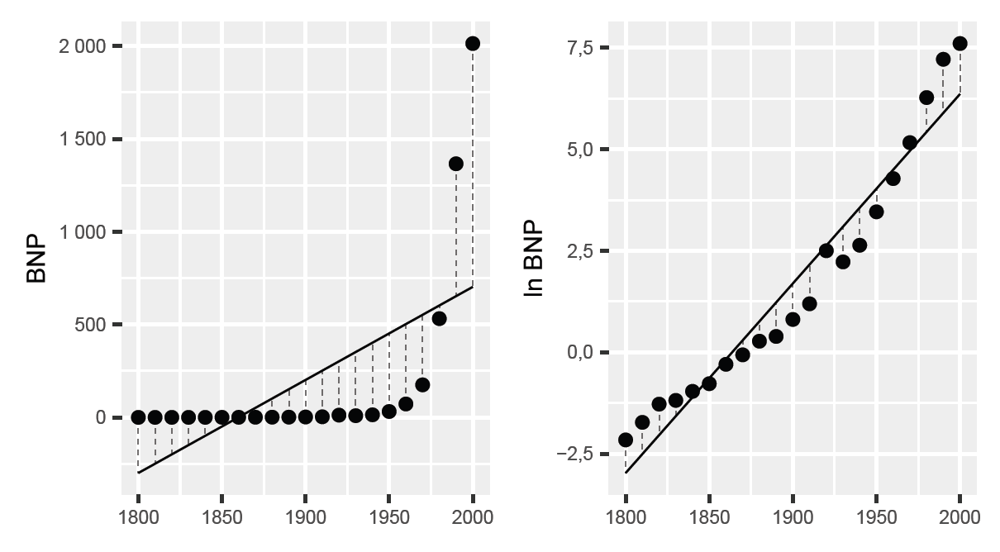
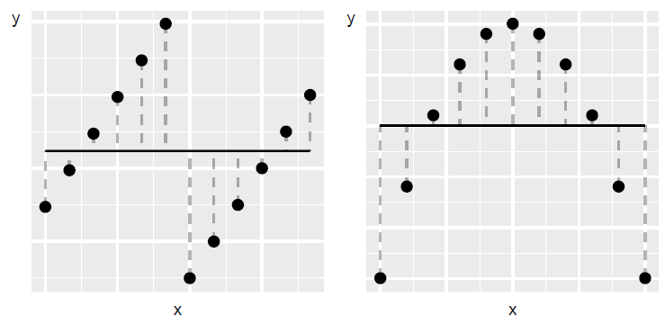
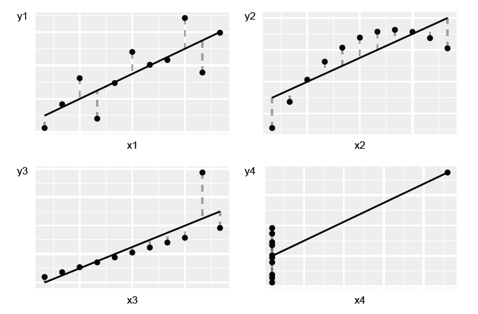

# Vad är egentligen regressionsanalys? {#k2-5-7}

### Begrepp
*Inga nya begrepp i detta avsnitt.*

### Teori
Vi började denna kurs med att studera orsakssamband (kapitel 1), där vi gick igenom kontrafaktisk analys, behandling och kontroll samt experiment och observationsstudier. I kapitel 2 och 3 gick vi igenom hur vi kan mäta och jämföra samvariation, introducerade kovarians och korrelation samt regressionsanalys med minstakvadratmetoden.
I kapitel 4 utökade vi regressionsanalysen till flera variabler för att kunna konstanthålla andra faktorer, använda dummyvariabler och interaktion, samt utföra regressionsanalys med matriser, vilket gav oss en generalisering av minstakvadratmetoden för valfritt antal variabler och observationer. Vi har gått igenom hur regressionsanalys är nära förknippat med analys av orsakssamband.
I kapitel 5 har vi introducerade analys under osäkerhet och hur vi kan hantera detta genom att arbeta med sannolikhetsfördelningar, statistiska test, punktestimat samt skatta konfidensintervall. Vi har även gått igenom hur vi kan kombinera regressionsanalys med sannolikhet.
I detta sista avsnitt ska vi nu reflektera över vad som egentligen är poängen med allt detta?

### Från mönster till kausalitet
I denna kurs har vi utgått från att vi ska använda regressionsanalys för att förstå orsakssamband. Men som vi gått igenom flera gånger är själva orsakssambandet något vi lägger till som en tolkning.
Regressionsanalysen är i grund och botten en metod för att spåra mönster i information (data). Vi berörde detta i [avsnitt 2.3](https://www.dropbox.com/scl/fi/357utiljgf7iuk78jxhtv/2-3-Samvariation-1.docx?rlkey=ewtjvwrihoflt8tlvf8dccppo&dl=0), där vi även kort gick igenom andra metoder för att studera samvariation.
Men kombinerat med rätt forskningsdesign, med kontroll och behandling, är dock regressionsanalys ett kraftfullt verktyg för att studera orsak och verkan.

#### Linjära associationer
I denna kurs har vi gått igenom hur vi kan estimera regressionsmodeller med minstakvadratmetoden. Det vi gör då är att estimera *linjära regressionsmodeller*.
Linjära regressionsmodeller prövar om den genomsnittliga relationen mellan två eller flera variabler kan beskrivas med en linjär ekvation. Genom att estimera regressionsmodellen, utföra statistiska test och jämföra hur regressionslinjen blir jämfört med data, kan vi se om regressionsmodellen ger en godtagbar linjär approximation (en ungefärlig bild) av verkligheten (de data vi studerar).
Det kan vara svårt att pröva om en regressionsmodell är en bra linjär approximation av data. Ett första steg kan vara att inspektera data i till exempel ett punktdiagram eller histogram, och jämföra olika spridningsmått. Vi kan både jämföra hur den förklarade variabeln samvarierar med våra förklarande variabler, och jämföra hur residualerna fördelar sig kring en regressionslinje.
Att en regressionsmodell är linjär innebär att alla koefficienter i modellen har exponent 1. Följande modeller är inte linjära:

$$\begin{matrix} Y & \ = a + \frac{1}{b}X + e \\ logZ & \ = \alpha + \beta D + \epsilon \end{matrix} \tag{1}$$

I den första regressionsmodellen har vi $\frac{1}{b} = b^{- 1}$. I den andra modellen har vi att $log\left( Z_{1} + Z_{2} \right) \neq log\left( Z_{1} \right) + log\left( Z_{2} \right)$, där $Z_{1}$ och $Z_{2}$ är två valfria värden i variabel $Z$. Detta innebär att modellen inte är linjär.
Linjära regressionsmodeller har många fördelar. Det är till exempel ofta relativt enkelt att tolka vad varje koefficient i modellen innebär. Det kan snabbt bli mer komplicerat om vi arbetar ickelinjär samvariation.
Men det finns även nackdelar med linjära regressionsmodeller -- eftersom de enbart kan användas för att fånga just linjär samvariation. Risken finns då att vi missar samvariation som existerar i data men som inte är linjär.

#### BNP och logaritmerad BNP
Även om modellen BLIR ickelinjär i originalskala, kan vi ofta estimera den med minstakvadratmetoden genom att transformera variablerna först.
Ett sätt att illustrera detta är att jämföra BNP för Sverige var tionde år under perioden 1800--2000, se tabell 1 med årtal, BNP och logaritmerad BNP. I figur 1 illustreras den linjära trenden över tid för BNP respektive $ln(BNP)$ i varsitt diagram.
I det vänstra diagrammet är trenden skattad utifrån följande regressionsmodell:

$$Y_{t} = a + b\text{Å}R_{t} + V_{t} \tag{2}$$

där $Y_{t}$ är BNP år $t,\text{Å}R_{t}$ är en variabel för årtalen $1800,1810,\ldots,1990$, 2000. Bokstäverna $a$ och $b$ är koefficienterna och $V_{t}$ är feltermen. I det högra diagrammet har vi estimerat regressionsmodellen:

$$\ln Y_{t} = c + d\text{Å}R_{t} + U_{t} \tag{3}$$

där $lnY_{t}$ är logaritmerad BNP år $t,c$ och $d$ är koefficienterna och $U_{t}$ är feltermen.
En linjär modell passar relativt dåligt när vi använder nominell BNP i kronor, vilket vi kan se i det vänstra diagrammet. Datapunkterna i diagrammet är placerade ungefär i formen av ett liggande $L$. Utvecklingen är exponentiell och inte linjär.
Regressionslinjen fångar visserligen den positiva utvecklingen men ger inte en representativ bild av den långsiktiga trenden i BNP. Under åren 1800---1850, till vänster i diagrammet, är regressionslinjen under 0.
Detta innebär att regressionsmodellen predikterar att BNP var negativ alla år före 1850. Eftersom BNP är ett mått på allting som produceras, köps och säljs, i ett samhälle så är detta inte möjligt.
Den linjära modellen fångar dock den långsiktiga trenden i logaritmerad BNP relativt väl, vilket syns i det högra diagrammet där punkterna följer regressionslinjen för alla åren 1800--2000.

**Tabell 1: BNP och logarimterad BNP**

<table class="table table-bordered" style="width:89%;">
<colgroup>
<col style="width: 14%" />
<col style="width: 14%" />
<col style="width: 14%" />
<col style="width: 3%" />
<col style="width: 14%" />
<col style="width: 14%" />
<col style="width: 14%" />
</colgroup>
<thead>
<tr>
<th style="text-align: right;"><strong>År</strong></th>
<th style="text-align: right;"><strong>BNP</strong></th>
<th style="text-align: right;"><strong>ln(BNP)</strong></th>
<th><strong> </strong></th>
<th style="text-align: right;"><strong>År</strong></th>
<th style="text-align: right;"><strong>BNP</strong></th>
<th style="text-align: right;"><strong>ln(BNP)</strong></th>
</tr>
</thead>
<tbody>
<tr>
<td style="text-align: right;">\(1800\)</td>
<td style="text-align: right;">\(115\)</td>
<td style="text-align: right;">\(4{,}7\)</td>
<td> </td>
<td style="text-align: right;">\(1910\)</td>
<td style="text-align: right;">3 302</td>
<td style="text-align: right;">\(8{,}1\)</td>
</tr>
<tr>
<td style="text-align: right;">\(1810\)</td>
<td style="text-align: right;">\(178\)</td>
<td style="text-align: right;">\(5{,}2\)</td>
<td> </td>
<td style="text-align: right;">\(1920\)</td>
<td style="text-align: right;">12 200</td>
<td style="text-align: right;">\(9{,}4\)</td>
</tr>
<tr>
<td style="text-align: right;">\(1820\)</td>
<td style="text-align: right;">\(278\)</td>
<td style="text-align: right;">\(5{,}6\)</td>
<td> </td>
<td style="text-align: right;">\(1930\)</td>
<td style="text-align: right;">9 271</td>
<td style="text-align: right;">\(9{,}1\)</td>
</tr>
<tr>
<td style="text-align: right;">\(1830\)</td>
<td style="text-align: right;">\(306\)</td>
<td style="text-align: right;">\(5{,}7\)</td>
<td> </td>
<td style="text-align: right;">\(1940\)</td>
<td style="text-align: right;">13 979</td>
<td style="text-align: right;">\(9{,}5\)</td>
</tr>
<tr>
<td style="text-align: right;">\(1840\)</td>
<td style="text-align: right;">\(382\)</td>
<td style="text-align: right;">\(5{,}9\)</td>
<td> </td>
<td style="text-align: right;">\(1950\)</td>
<td style="text-align: right;">31 827</td>
<td style="text-align: right;">\(10{,}4\)</td>
</tr>
<tr>
<td style="text-align: right;">\(1850\)</td>
<td style="text-align: right;">\(461\)</td>
<td style="text-align: right;">\(6{,}1\)</td>
<td> </td>
<td style="text-align: right;">\(1960\)</td>
<td style="text-align: right;">72 272</td>
<td style="text-align: right;">\(11{,}2\)</td>
</tr>
<tr>
<td style="text-align: right;">\(1860\)</td>
<td style="text-align: right;">\(743\)</td>
<td style="text-align: right;">\(6{,}6\)</td>
<td> </td>
<td style="text-align: right;">\(1970\)</td>
<td style="text-align: right;">175 222</td>
<td style="text-align: right;">\(12{,}1\)</td>
</tr>
<tr>
<td style="text-align: right;">\(1870\)</td>
<td style="text-align: right;">\(938\)</td>
<td style="text-align: right;">\(6{,}8\)</td>
<td> </td>
<td style="text-align: right;">\(1980\)</td>
<td style="text-align: right;">531 884</td>
<td style="text-align: right;">\(13{,}2\)</td>
</tr>
<tr>
<td style="text-align: right;">\(1880\)</td>
<td style="text-align: right;">1 314</td>
<td style="text-align: right;">\(7{,}2\)</td>
<td> </td>
<td style="text-align: right;">\(1990\)</td>
<td style="text-align: right;">1 365 700</td>
<td style="text-align: right;">\(14{,}1\)</td>
</tr>
<tr>
<td style="text-align: right;">\(1890\)</td>
<td style="text-align: right;">1 477</td>
<td style="text-align: right;">\(7{,}3\)</td>
<td> </td>
<td style="text-align: right;">\(2000\)</td>
<td style="text-align: right;">2 013 311</td>
<td style="text-align: right;">\(14{,}5\)</td>
</tr>
<tr>
<td style="text-align: right;">\(1900\)</td>
<td style="text-align: right;">2 245</td>
<td style="text-align: right;">\(7{,}7\)</td>
<td> </td>
<td style="text-align: right;"> </td>
<td style="text-align: right;"> </td>
<td style="text-align: right;"> </td>
</tr>
</tbody>
</table>

::: {.fig-caption}
Förklaring: Data från [www.historia.se](http://www.historia.se).
:::

**Figur 1: BNP och logaritmerad BNP**

Förklaring. Data från [www.historia.se](http://www.historia.se), samma som i tabell 1.

### Varför fungerar logaritm för BNP?
BNP växer exponentiellt: Varje år ökar BNP i genomsnitt med en viss procentsats, inte ett fast belopp i kronor. Exponentiell tillväxt kan beskrivas matematiskt med följande ekvation:

$$Y_{t} = Y_{0}*\ e^{rt} \tag{4}$$

där $Y_{t}$ är BNP valfritt år $t$. $Y_{0}$ är BNP år noll (startåret). Faktorn $e^{rt}$ är Eulers tal $e$. Exponenten $rt$ är tillväxttakten $r$ multiplicerad med antal år $t$. Tar vi naturliga logaritmen av detta uttryck får vi:

$$\ln\left( Y_{t} \right) = ln\left( Y_{0} \right) + rt \tag{5}$$

När vi tar naturliga logaritmen av BNP blir den exponentiella tillväxten linjär, vilket gör att vår linjära regressionsmodell fungerar. Detta är vanligt för många ekonomiska variabler som växer kjust procentuellt.

#### En regressionsmodell fångar inte allt
Låt oss gå igenom ett exempel till, men denna gång med påhittade data. Figur 2 beskriver två diagram där prickarna återigen visar kombinerade värden av variablerna $x$ och $y$. De räta linjerna är regressionslinjer beräknade utifrån minstakvadratmetoden för regressionsmodeller av typen:

$$y = a + bx + v \tag{6}$$

Nu är linjerna horisontella, vilket innebär att lutningskoefficienterna är lika med 0 i båda fallen. När $x$ ökar är detta inte associerat med någon förändring i variabel $y$.
Men när vi tittar på diagrammen i figuren kan vi tydligt se att prickarna i de båda diagrammen samvarierar i olika mönster. I det vänstra diagrammet är relationen mellan variablerna tydligt positiv, men endast om vi studerar observationerna som två grupper.
I det högra diagrammet syns en ickelinjär samvariation när vi tittar på alla observationer. Tittar vi enbart på den vänstra halvan av diagrammet syns en positiv samvariation, medan punkterna i den högra halvan av diagrammet har en negativ samvariation.
Nu är data påhittade men om dessa punkter representerade någon typ av verklig information skulle det till exempel kunna vara en indikation på ett kausalt samband -- som vår linjära regressionsmodell alltså missar.
Detta innebär inte att regressionsanalys är dåligt. Men vi måste vara noga med hur vi formulerar våra regressionsmodeller. Vi måste inspektera data både genom att beräkna resultat och jämföra dom i diagram och tabeller. Om associationen mellan variabler inte är linjär kan vi behöva transformera variablerna (till exempel ta naturliga logaritmen) eller ändra i vår regressionsmodell. Vi kan till exempel behöva lägga till kvadratiska termer i vår regressionsmodell eller använda andra metoder, vilket inte ryms att gå igenom här.

**Figur 2: Två exempel på mönster som inte fångas av vår regressionsmodell**

::: {.fig-caption}
Förklaring: Prickarna i diagrammen följer tydliga mönster. Regressionslinjerna i diagrammen är de svarta horisontella linjerna i diagrammen, ritade med regressionsmodellen $Y = a + bX + V$. Lutningskoefficient $b$ är 0. Regressionslinjerna i diagrammen indikerar ingen association mellan $X$ och $Y$, trots att det finns en form av samvariation.
:::

#### Linjära regressioner är ändå väldigt användbara
Utifrån ovanstående beskrivning kanske vissa får känslan att det är meningslöst med linjära regressioner. Men ickelinjära regressionsmodeller är inte heller en universallösning.
På samma sätt som vi riskerar att missa viktiga delar när vi använder linjära regressionsmodeller riskerar vi att missa viktiga slutsatser om vi enbart använder ickelinjära regressionsmodeller.
Linjära regressioner är mycket användbara -- till rätt typ av problem. Många gånger är vi intresserade av samvariationen inom ett avgränsat område, där just den linjära samvariationen är det intressanta.

#### Vi behöver både diagram och beräkningar
Det är även viktigt att studera data noga på flera sätt, både i diagram och beräkningar, även när vi faktiskt finner samvariation. Ett sätt att illustrera detta ges i figur 3.
Figur 3 visar fyra exempel där kombinerade värden för variablerna X (horisontella axeln) och Y (vertikala axeln) är uppritade. y-variabeln och x-variabeln samma medelvärde: $\overline{Y} = 7,5$ och $\overline{X} = 9$. Koefficienterna $a$ och $b$ i regressionsmodellen $Y = a + bX + V$ som ritar ut regressionslinjerna i respektive diagram har samma värden i alla fyra diagrammen: $\widehat{a} = 3$ och $\widehat{b} = 0,5$. Linjerna lutar upp mot höger i respektive diagram, vilket ges av att $\widehat{b} \> 0$.
I alla fyra diagrammen kan vi alltså med hjälp av minstakvadratmetoden finna en positiv samvariation som i regressionsmodellen ser lika ut. Exemplet illustrerar att trots att mönstren i de fyra diagrammen skiljer sig kraftigt åt kan beräknade resultat lätt ge intryck av att olika samlingar med data har mer gemensamt än de egentligen har.
Dessa fyra diagram presenterades första gången 1973 av den brittiske statistikern Francis John Anscombe ([Anscombe, 1973](https://www.lithoguru.com/scientist/statistics/Anscombe_Graphs%20in%20Statistical%20Analysis_1973.pdf)). Exemplen illustrerar vikten av att både räkna på samvariation och studera data i diagram.
Trots att punkterna i diagrammen är placerade i olika mönster kan vi få samma positiva linjära samvariation i alla fyra exempel. I det övre vänstra diagrammet kan vi se att punkterna ligger utspridda längs med den diagonala linjen upp mot högra hörnet i diagrammet. I det övre högra diagrammet ligger punkterna i en konkav båge, upp mot diagrammets högra hörn.
Punkternas mönster är tydligt ickelinjärt, men vi kan ändå beräkna en linjär positiv samvariation. I det nedre vänstra diagrammet ligger alla punkter utom en på en rak linje. I det nedre högra diagrammet ligger alla punkter utom en på en vertikal linje.

**Figur 3: Fyra exempel på data där regressionsmodellen** $\mathbf{Y = a + bX + V}$ **ger samma resultat**

::: {.fig-caption}
Förklaring: De fyra diagrammen beskriver påhittade data presenterade i [Anscombe 1973](https://www.lithoguru.com/scientist/statistics/Anscombe_Graphs%20in%20Statistical%20Analysis_1973.pdf).
:::

### Vad är egentligen regressionsanalys?
Regressionsanalys är ett verktyg för att mäta samvariation och en grund för kausal inferens, när den kombineras med bra forskningsdesign. Regressionsanalys är ett sätt att testa teorier om hur världen fungerar men som samtidigt kräver både matematisk precision och kritiskt tänkande.
Regressionsanalys är inte matte för mattens skull. Detta är grunden för hur vi kan lära oss något pålitligt om orsak och verkan i en komplex värld. Utan dessa metoder skulle vi vara begränsade till anekdoter och gissningar. Med dessa metoder kan vi utvärdera om mediciner fungerar, studera effekter av politiska beslut och förstå ekonomiska samband.
Som detta avsnitt förhoppningsvis illustrerar är ett analytiskt verktyg aldrig bättre än analytikern som använder metoden. Regressionsanalys måste därför användas med kritisk reflektion och ödmjukhet om metodens begränsningar. Allt detta är grunden för vetenskapligt tänkande.

::: {.ex-section-title}
Övningar
:::

